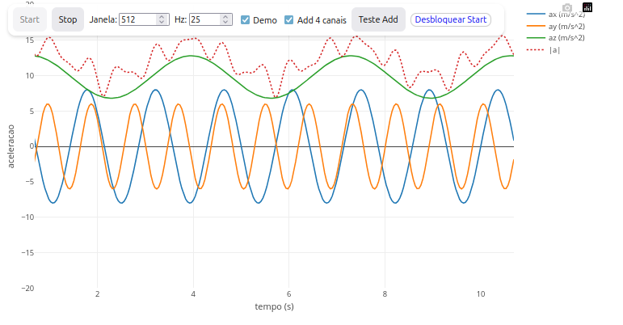
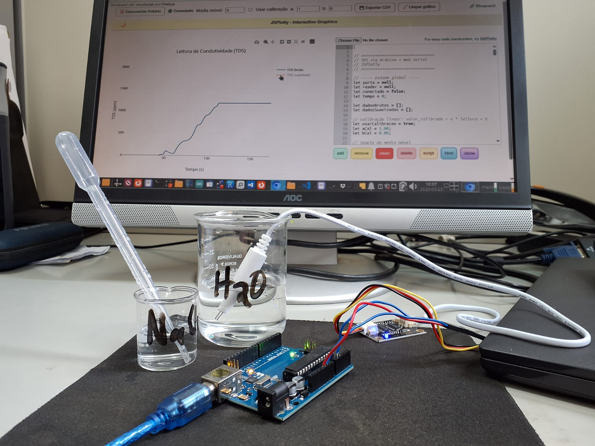
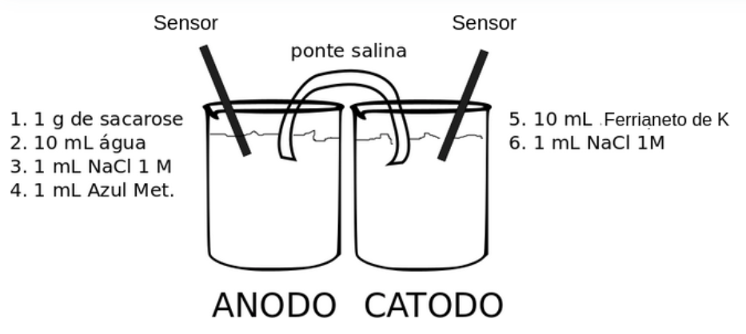
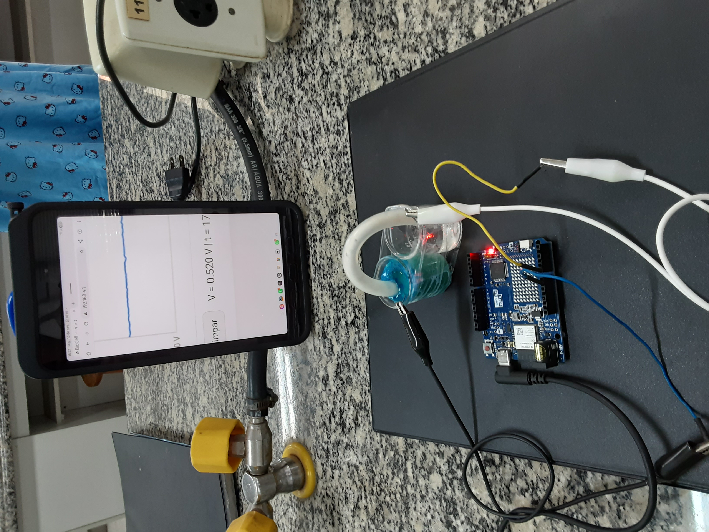

|       Nos mesmos moldes da seção @sec-virtual anterior, segue uma descrição para uso prático do JSPlotly em interfaceamento com celular e placa microcontroladora Arduino.
\

## Celular - Aquisição de dados de sensores

|   *JSPlotly* foi inicialmente concebido para a construção de *objetos virtuais de aprendizagem* interativos. Contudo, é possível integrá-lo a diferentes interfaces para aquisição de dados do mundo real.  O exemplo que segue ilustra como alvo a resposta para um *acelerômetro*, sensor de posicionamento de um dispositivo móvel (acelerômetro).

[](bioquanti/celular_JSPlotly.html){target="_blank"}
\

#### Sugestão: {.unnumbered}

```{r, eval=FALSE}
1. Como o aplicativo é para o posicionamento "x, y e z" de um dispositivo móvel, experimente alterar a posição de seu celular/tablet no espaço.
```


\

## Arduino - Aquisição de dados de condutivimetria

#### BNCC: EM13CNT201, EM13CNT308, M13CNT301, M13CNT302 {.unnumbered}


|   O exemplo abaixo ilustra uma aplicação para aquisição/controle em tempo real por navegador para uso de placa *Arduino* ou *ESP32*, elevando exponencialmente a aplicação do *JSPlotly* para experimentação real e *projetos STEAM experimentais*.

|   O *setup* apresenta uma leitura de dados de condutividade em solução aquosa contendo teores crescentes de NaCl (0 a 5% p/v). Foi utilizado uma placa Arduino Uno R3 com conexão *Web Serial* por USB a notebook rodando um aplicativo autônomo para *JSPlotly*. A condutividade foi obtida por um sensor TDS comercial (*sólidos dissolvidos totais*) com excitação por potencial alternado de onda quadrada (PWM) para minimizar efeitos de polarização, e *script* adaptado do fabricante. O sensor TDS opera em faixa de 3,3 a 5,0 V (input) com saída de 0 a 2,3 V, e corrente de 3 a 6 mA.
\

[](bioquanti/condutiv_JSPlotly.html){target="_blank"}
*Exemplo de aplicação de JSPlotly para interfaceamente com Arduino. O gráfico apresenta medidas de condutividade em meio aquoso com medidor TDS para teores crescentes de NaCl (sonda no canto esquerdo). Clique na imagem para obter o aplicativo JSPlotly autônomo para condutividade.*
\

**Instruções:**

1. Para conexão *Web Serial* é necessário instalação de *Python* ao computador (Windows ou Linux), e *setup* de servidor local. Para Windows baixe e instale o arquivo oficial para [Python](https://www.python.org/downloads/windows/), lembrando-se de clicar em *Add Python to PATH*, e digite os comandos no CMD dentro da pasta do aplicativo autônomo. Segue a orientação para Linux:

- 1. Conecte o Arduino e componentes (sonda TDS, recipiente com água e sal);
- 2. Copie, cole e rode o *script* do distribuidor para TDS na IDE do Arduino conectado ([exemplo 1](https://www.usinainfo.com.br/blog/projeto-sensor-condutividade-solo-thc-s-com-arduino/?srsltid=AfmBOorI1tfAWdSpnYiK34zbl7j35A4mNUXBKcDbV6OoAf4A-rkTrlu3), [exemplo 2](https://wiki.dfrobot.com/gravity__analog_tds_sensor___meter_for_arduino_sku__sen0244?gad_source=1&gad_campaignid=834127384&gclid=Cj0KCQiA-YvMBhDtARIsAHZuUzIgeSprXZrRIVB7ss58n1pBZcm5kST1Zu1kPP_q3rQK9v-ExIRUljwaAmgwEALw_wcB) );
- 3. Feche a IDE do Arduíno;
- 4. Abra um Terminal na pasta do aplicativo autônomo do *JSPlotly* para Arduino (*condutiv_JSPlotly.html*; clicar na imagem);
- 5. Digite: *python3 -m http.server*
- 6. Abra o html autônomo do circuito no Chrome (nunca no Firefox);

|   A leitura deverá iniciar em instantes. Caso não ocorra, verifique se a taxa de transferência para a IDE do Arduino confere com a do aplicativo (115200 bauds).
\


### Sugestão: {.unnumbered}

```{r, eval=FALSE}
1. Como o aplicativo é escrito no JSPlotly, é possível personalizá-lo para diversas situações, como taxa de tranferência de dados, traços (tipo, cores, espessura), tipo de gráfico, entre outros.
```
\


## Biocélula a Combustível Interfaceada com Arduino (serial ou IoT)

      Este protocolo objetiva avaliar a operação de uma biocélula a combustível conectada com placas Arduino. Esse dispositivo permite verificar a geração de eletricidade a partir do fluxo de elétrons que são gerados pela oxidação de uma fonte de carbono pelo metabolismo celular, onde participam ativamente mediadores endógenos (NADH, por exemplo) e exógenos (azul de metileno). Para o modo Wifi é necessário um módulo adicional homônimo, ou uso de placa condizente (ex: Arduino Uno R4 Wifi, ESP32).

### Célula eletroquímica

1. De posse da célula eletroquímica montada com 2 béqueres unidos, conforme a figura abaixo, adicione sequencialmente os compostos 1 a 6 em cada câmara (anodo, catodo), conforme o esquema que segue. Nota: antes de adicionar o azul de metileno, garanta a dissolução da sacarose.





1. Introduzir um sensor de aço inox em cada béquer.
2. Com auxílio do par de cabos e jacarés, conectar os sensores ao Arduino conforme segue:
3. Sensor do anodo (biocélula) - GND (Arduino);
4. Sensor do catodo (biocélula) - Terminal A0 (Arduino)
5. Submergir as extremidades da ponte salina, uma em cada câmara da biocélula.


### Conexão por Wifi com celular Android/iOS 

1. Conectar o Arduino
2. Carregar o sketch
3. Abrir o Serial Monitor
4. Opcional: apertar Reset por ~2s no Arduino
5. Acessar a rede específica no celular
   Em Wifi, escolher Biocel-no. da placa Arduino (Ex: Biocell-02)
   Senha: 12345678
6. Abrir o link http://192.168.4.1

|       A figura abaixo ilustra a obtenção do potencial gerado pela biocélula a combustível.


{width="50%"}


