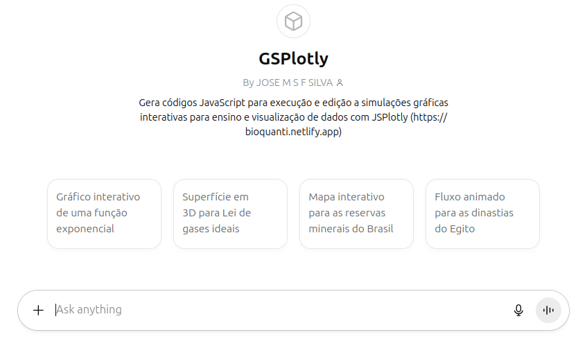
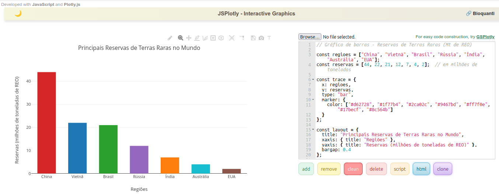

|   Como visto nas seções anteriores, o *JSPlotly* trabalha com códigos de programação ! São comandos escritos em linguagem *JavaScript*, a qual é interpretada junto a máquinas homônimas de navegadores modernos (ex: Chrome, Firefox, Safari, Opera, Edge, etc). Agora...convenhamos...além de amantes das *Ciências da Computação*, quem gosta de códigos de programação ?!

|   Pensando nisso foi desenvolvido junto ao aplicativo um *gerador de códigos pro JSPlotly por assistente de inteligência artificial (IA)* !!! Isso quer dizer que [**você não precisa saber nada sobre programação !!!**]{.orange}.
\

|   Quer fazer o um teste ? 
\

|   Clique no link do [GSPlotly](https://chatgpt.com/g/g-6819fbb8d2d08191bf7d50a3dbeadb0d-gsplotly?model=gpt-4o) (*G* para *gerador*) ou na imagem abaixo, e peça ao gerador para construir alguma coisa...digamos....

|   [..."faça um gráfico de barras sobre as principais regiões de terras raras"...]{.note}
\

::: #fig-gsplotly
[{#fig-gsplotly}](https://chatgpt.com/g/g-6819fbb8d2d08191bf7d50a3dbeadb0d-gsplotly){target="_blank"}
:::
\


|   Observe que o *GSPlotly* fornece o código *JavaScript* quase que instantaneamente, e ainda por cima dá algumas dicas pra melhoria do próprio código !

|   Agora é só copiar o código pelo ícone que aparece no canto superior direito (*"copy code"*) e rodar no *JSPlotly*.  Para isso:

1. Copie o código;
2. Clique em *delete* no *JSPlotly* abaixo;
3. Cole o código;
4. Clique em *add*.


```{=html}
<div style="margin:1rem 0; padding-right:16px;">
  <iframe src="https://bioquanti.netlify.app/pt/nivel/superior/jsplotly/jsplotly"
          width="100%" height="760"
          style="border:0;border-radius:10px;"></iframe>
</div>
```
\


|   Se deu tudo certo, você deverá ver algo parecido com a imagem *interativa* abaixo:
\

[{#fig-terrasraras}](figs/terrasraras.html){target="_blank"}

\


## Algumas dicas para uma *"boa conversa"* com o *GSPlotly*

<!-- |   Elaborar um gráfico, mapa, animação, simulação, sonorização, e mesmo um game inteiro no *JSPlotly*  com auxílio de um bot de IA como o *GSPlotly* é plenamente possível (vide os objetos virtuais disponíveis para [ensino básico](https://bioquanti.netlify.app/pt/nivel/basico/jsplotly/jsplotly_bas) ou [ensino superior](https://bioquanti.netlify.app/pt/nivel/superior/jsplotly/jsplt_bioq) no site *Bioquanti*). Contudo, há objetos virtuais mais simples (um gráfico, por exemplo) e mais complexos (um objeto multimídia, por exemplo) e, para isso, faz-se necessário um *"toma lá dá cá"* entre você e o assistente de IA, dependendo do grau de complexidade do objeto virtual pretendido. -->

|   Algumas rápidas orientações para que essa comunicação ou *engenharia de prompts* seja eficiente são sugeridas abaixo.

\

<div class="text-item">
1. Fundamentalmente, não desista da 1a. vez !! Por vezes a IA não entrega o que se deseja de primeira, exigindo uma troca de informações entre o usuário e o bot para que se atinja o objetivo do primeiro;

2. Se a IA não lhe devolver o que deseja nas primeiras tentativas, comece com algo mais simples;

3. Se mesmo o simples não resolver, reduza a complexidade do pedido. Separe o problema em partes, e tente a solução para a parte mais básica do problema; só depois de conquistada (testada no JSPlotly), solicite à IA a solução para uma nova parte a acrescentar junto a que foi bem sucedida. (sem trocadilhos, isso é "parte" do chamado "pensamento computacional"...ou...."dividir para conquistar"!);

4. Experimente oferecer o código que ainda não está a seu gosto para outro assistente de IA, para correção ou melhorias. Você pode fazê-lo simplesmente copiando o código e colando-o no outro bot de IA, ou por carregamento nesse após salvá-lo como arquivo no JSPlotly com o botão "script".

5. Aprenda a conhecer linguagem aos poucos. Isso lhe dará maior autonomia e segurança, tanto pra lidar com bots de IA, como para corrigir e aprimorar códigos "sem auxílio da IA". E mesmo para "desenvolver novos códigos sozinho" !!!
</div>


