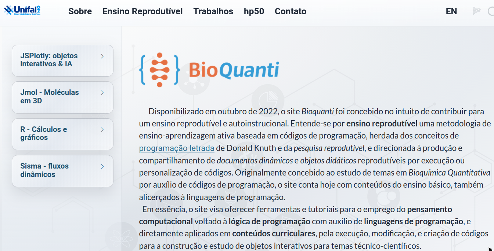
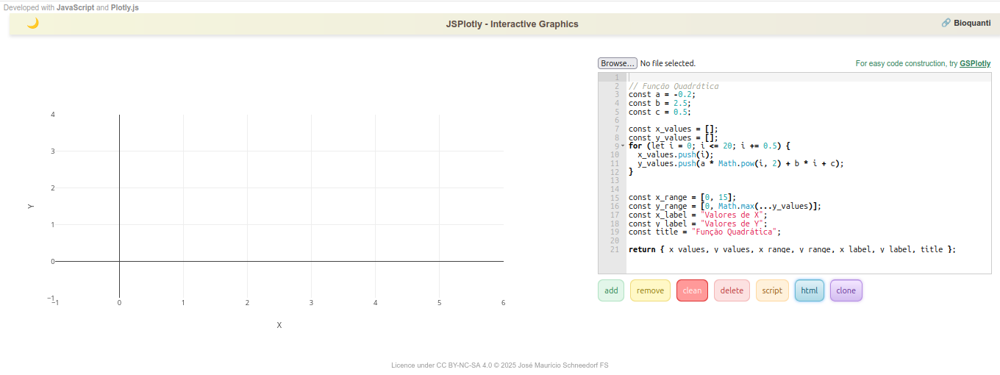

<!-- ## Ensino reprodutível: cliques de mouse *versus* linhas de comando
\

|       Qualquer programa de computador que você já tenha usado, ou mesmo de dispositivos móveis, tem sua *usabilidade* centrada na facilidade do emprego de cliques e arrastes com *mouse*, *touchpad*, e mesmo os dedos (telas capacitivas). Isso facilita muito as ações rápidas pretendidas. Exemplificando para editores de texto, é comum se clicar num ícone de formatação (itálico, negrio, por ex) ou mesmo digitar seu atalho, para concluir o que se deseja no texto. Simples, prático, e rápido. Dessa mesma forma, pode-se utilizar o JSPlotly.
\

|   Entretanto, a base de construção e edição do programa é a linguagem [JavaScript](https://developer.mozilla.org/pt-BR/docs/Web/JavaScript). Isso quer dizer que os objetos interativos são criados por linguagem de programação, consonante com a proposta de reprodutibilidade em ensino e pesquisa. 
\

|   Então cabe aqui uma simples pergunta:
\

<div class="text-item">

*Por que usar linhas de comando quando se pode usar cliques de mouse ?*

</div>


|       Para auxiliar na resposta, exemplifiquemos com o uso de uma planilha eletrônica, como o *Excel* do pacote MS-Office, ou o *Calc* do pacote *Libreoffice*, ou o *Planilhas* da suite Google. Suponha que você deseje fazer um gráfico simples, pegando duas colunas, cada qual para uma variável (independente ou *x*, e dependente, ou *y*). O usual seria clicar em um ítem de menu para gráficos, selecionar as colunas desejadas em campos específicos da janela que se abre, selecionar o tipo de gráfico, clicar em *avançar* ou algum termo similar, selecionar outras características (etiquetas ou nomes nos eixos *x* e *y*, por ex), e finalmente clicar em *concluir* (ou *OK*, ou termo de significado similar). Simples, rápido, e prático.


|       Mas (sempre tem um "mas")...e se você precisasse, além de construir o gráfico, realizar ações adicionais, como obter o ajuste linear dos dados, apresentar a reta resultante com determinada cor e estilo, inserir a equação de reta em um ponto específico do gráfico, colocar um título, e alterar o símbolo dos pontos, tanto o tipo, quanto o tamanho e a cor. Ufa !!!

|       Sem problema, também...desde que você tenha um bom tutorial ao lado, claro ! Ou que já esteja familiarizado com o programa da planilha, menus e ações pertinentes aos vários cliques de mouse que serão necessário para se obter um belo gráfico de regressão linear ao final.

|       Agora...mais uma pequena variável a inserir ao exemplo levantado: suponha que não seja você a construir o gráfico, mas um aluno(a)(a) de sua disciplina, e que não fora treinado nem no uso da planilha, e nem nos cálculos pretendidos !

|       Perceba que agora haverá um certo desconforto, posto que:


1.  O aluno(a) não possui conhecimento prévio no uso da planilha;
2.  O aluno(a) não possui conhecimento prévio nos cálculos pretendidos;
3.  Você terá que treinar o aluno(a), ou oferecer-lhe um *guia* de treinamento correlato;
4.  Caso já tenha ocorrido o treinamento, mas não se tenha o *guia* em mãos, tanto você como aluno(a) dependerão da *capacidade de retenção de memória* para efetivar com sucesso a empreita.

|       Agora, e se as orientações para a execução do produto final estivessem, não num *guia* para a repetição de clique de *mouse*, mas sim num pequeno texto contendo tanto os comandos em sequência como os comentários explicativos de cada ação individual, e que quando inserido no programa gerasse o gráfico já todo formatado, colorido, e com o ajuste linear e os parâmetros do resultado ?

## Vantagens do uso de linhas de comando sobre o uso de cliques de *mouse*

|       Pelo exemplo hipotético acima, perceba que um pequeno texto contendo as linhas de comando em sequência e os comentários referentes a esses permitem:

* que o produto final seja **reproduzível** e não contenha  erros;
que o produto final seja elaborado sem prévio conhecimento do aluno(a); basta executar o código no programa;
* que o produto final seja elaborado independentemente da memória dos envolvidos (sequência de cliques, por ex);
* uma quantidade virtualmente infinita de ações sequenciais, sem necessidade de se decorar a ordem dos cliques de *mouse*;
* o aprendizado de cada comando utilizado em linguagem humana, posto que existem comentários do autor para cada linha;
* que o produto possa ser modificado para gerar um objeto diferente ao final (alteração de cor, etiquetas de eixos, outro título, por ex)
* que se **reproduza** o mesmo gráfico, só que com outro conjunto de dados (*x* e *y*);
* que o aprendiz experimente outros comandos para agregar formatações e/ou cálculos distintos ao produto;
* que você ou o aluno(a) consigam **reproduzir** o produto sem recorrer à memória e até por séculos depois, se as previsões de extinção em massa não vingarem;
* que qualquer pessoa consiga *reproduzir* o objeto, independentemente de seu grau de instrução técnica ou de operabilidade do programa;
* enfim, que se consiga ensinar determinado conteúdo de modo reprodutível...ou...**Ensino Reprodutível**.
* \ -->


|   *JSPlotly* é um ambiente baseado em JavaScript para criação de visualizações científicas interativas e objetos programáveis diretamente no navegador. Na prática, um aplicativo pra criar objetos virtuais para ensino-aprendizagem e pesquisa. Com ele é possível criar gráficos 2D e 3D, tabelas, diagramas, fluxogramas, realizar cálculos, produzir objetos tridimensionais, animações, simulações, jogos, sonorização, objetos multimídia (animação+som), e prototipagem experimental (dispositivos móveis, placas microcontroladoras).  

|   Ainda que possibilite isso tudo (e um pouco mais...), apresenta-se como um pequeno arquivo HTML pra ser carregado em qualquer navegador de internet. Assim, *JSPlotly* não depende de sistema operacional (Windows, Linux, Android, iOS) e nem de dispositivo (desktop, notebook, tablet, celular). Por ser pequenino e com atributo HTML, pode-se compartilhar o programa e o objetos produzidos por qualquer meio físico ou digital, incluindo redes sociais. 


|   O *JSPlotly* é livre !!! Tanto pra baixá-lo como para personalizá-lo, e garantido por sua [licença CC BY-NC 4.0](https://creativecommons.org/licenses/by-nc/4.0/). Assim, você pode utilizá-lo, copiá-lo, distribui-lo e mesmo adaptá-lo para *fins não comerciais*, desde que mencione o autor.

\

## O site *Bioquanti*

|   O aplicativo, suas características, seu modo de uso e *mais de uma centena de objetos de aprendizagem interativos* estão abertamente disponíveis junto ao website [Bioquanti](https://bioquanti.netlify.app/). O site é uma iniciativa para propagar a ideia de se utilizar código de programação voltados para a construção de objetos didáticos para conteúdos curriculares, tanto para o ensino básico como para o ensino superior e pesquisa científica. Numa *"frasezinha"* de efeito: *códigos para conteúdos*.

\

<!-- |   O *Bioquanti* foi desenhado para ser autoinstrucional, ou seja, para que você consiga acompanhar o seu conteúdo e reproduzir/adaptar os códigos para a construção de diversos tipos de objetos didáticos sem necessitar de um(a) professor(a). Lá você encontrará tutoriais, *ebooks*, objetos didáticos interativos, códigos diversos, vídeos, e intruções gerais para o uso de *quatro programas* de distribuição livre.

|   Esses programas são o *JSPlotly*, para construção de objetos de aprendizagem interativos variados, o *Jmol* para visualização tridimensional de moléculas, o *R* e sua interface gráfica *RStudio* para tudo que possa pensar em ensino e pesquisa, e o *Sisma*, um programa feito na UNIFAL-MG para simular a dinâmica de fluxos em um diagrama. Todos esses programas são livres, assim como todos os materiais contidos no site. Veja uma imagem da página principal do site abaixo. -->
\

::: #fig-bioquanti
[{#fig-bioquanti}](https://bioquanti.netlify.app/){target="_blank"}
:::
\

## Botando a mão na massa !
\

|   Agora, voltando ao *JSPlotly*. Quer ver como é simples utilizá-lo ? Dê uma olhada na tela única do aplicativo abaixo.
\


{#fig-tela}

\


<!-- ## Estrutura do aplicativo

|   Observe que o aplicativo é dividido entre uma *área gráfica* (esquerda) e um *editor de códigos* com alguns botões (direita).A área de códigos serve para o que naturalmente se apresenta: digitar, colar, ou editar códigos. A área gráfica apresenta a interpretação da linguagem para esses códigos. Os comandos são introduzidos por [JavaScript (JS)](https://developer.mozilla.org/pt-BR/docs/Web/JavaScript), uma linguagem de programação moderna, utilizada por grandes empresas e *big techs*, e focada na interatividade entre a página web e o usuário. Diferente de outras linguagens, *JavaScript* não precisa ser compilada, já que é interpretada a partir de máquinas homônimas de navegadores comuns (*browser*).
\ -->

|   **[Agora vamos à parte divertida !!!]{.orange}**
\

|   Segue abaixo novamente a mesma tela do *JSPlotly*. Aparentemente é igual à anterior. Mas quer saber a diferença ? Clique na imagem e você será direcionado ao aplicativo presente no [Bioquanti](https://bioquanti.netlify.app/), um site desenvolvido para apresentar códigos para conteúdos em ensino superior e básico, e com vários exemplos de objetos pro *JSPlotly*..
\


[{#fig-tela}](https://bioquanti.netlify.app/pt/nivel/superior/jsplotly/jsplotly){target="_blank"}

<!-- Este é um <span style="color:#e53935">aviso em vermelho</span> -->
<!-- e aqui um <span style="color:dodgerblue">trecho azul</span>. -->

<!-- Isto está [colorido em vermelho]{.red}, isto em [azul]{.blue}, -->
<!-- e uma [etiqueta bonita]{.note}. -->

\

<!-- |   O **aplicativo "vivo"** pode ser utilizado de forma independente, armazenado em mídia ou compartilhado facilmente pela web. Contudo, esse material pretende abordá-lo diretamente em nuvem, *[misturando texto e programa]{.red}*. Nesse caso, estamos falando de verdadeiros **[livros vivos]{.red}**!!!
\

|   Para experimentar esse conceito de *livro vivo*, observe abaixo o aplicativo *JSPlotly*, inteirinho e funcional, mas desta vez inserido nesta página web.
\ -->
\

```{=html}
<div style="margin:1rem 0; padding-right:16px;">
  <iframe src="apps/JSPlotly2q.html"
          width="100%" height="760"
          style="border:0;border-radius:10px;"></iframe>
</div>
```
\


<!-- |   É desta forma que pretende-se abordar os diferentes tópicos com o programa, ou seja, combinando instruções na página com o próprio *JSPlotly* e, dessa forma, *"vivificando"* o aprendizado de temas com o aplicativo.
\

|   Bom, seguindo neste tópico sobre a estrutura do aplicativo, passe o mouse sem clicar em nada na imagem acima, e veja quanta interatividade é visualizada na mudança do ponteiro do mouse: links para sites na barra superior (*JavaScript*, *Plotly.js*, *Bioquanti*, *GSPlotly*), ícones acima do gráfico, ícone de claro/escuro no canto esquerdo, o próprio gráfico, o botão de carregamento de arquivos (*browse*), o editor de códigos, e os botões abaixo desse. 
\

## Uso do *JSPlotly vivo* na página

|   Segue novamente o aplicativo, agora pra você experimentar algumas ações. 
\

```{=html}
<div style="margin:1rem 0; padding-right:16px;">
  <iframe src="apps/JSPlotly2q.html"
          width="100%" height="760"
          style="border:0;border-radius:10px;"></iframe>
</div>
```
\ -->


<!-- |   Observe que há um código *JS* no editor, contendo linhas de comando. Clique no botão *"add"* abaixo do editor e veja que surge um gráfico de parábola. Esse gráfico, assim como todos os objetos produzidos com o *JSPlotly* são *interativos.* Isto quer dizer que você pode *interagir* com o objeto produzido, no caso o gráfico. Essa interatividade do objeto é garantida por uma biblioteca específica desenvolvida em *JavaScript*, [Plotly.js](https://plotly.com/javascript/).

|   Bibliotecas (ou pacotes) são conjuntos de códigos que, quando inseridos num algoritmo, permitem automatizar tarefas dentro de uma linguagem de programação, e sem a necessidade de escrevê-las "do zero". Há diversas bibliotecas para *JavaScript*, algumas utilizadas no *JSPlotly*, como [tone.js](https://tonejs.github.io/) para sons e [p5.js](https://p5js.org/) para objetos multimídia. -->
\

## Redimensionando a página para conforto visual do *JSPlotly*

|   Observe que o aplicativo apresenta-se junto à barra lateral, o que acaba causando sua redução visual e mesmo omissão de alguns detalhes. Para melhor conforto e trabalho com o *JSPlotly*, você pode **[clicar no ícone do canto superior esquerdo ou central da página]{.darkgreen}** (a depender do dispositivo), experimentará o encolhimento da **barra lateral**, e consequente readequação visual do *JSPlotly*. Assim, poderá ajustar como deseja que o *JSPlotly* seja apresentado. Isso é útil quando se quer explorar o aplicativo visualizando-o de modo mais confortável.

|   Adicionalmente, a disposição esquerda/direita também adequa-se ao tipo de dispositivo utilizado. Se for um celular, por exemplo, ela poderá mudar para cima/embaixo, bastando-se colocá-lo na vertical, ou esquerda/direita se o dispositivo ficar na horizontal (com permissão para girar a tela, claro). 

\
