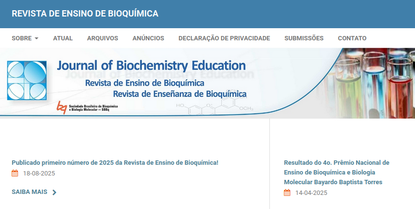
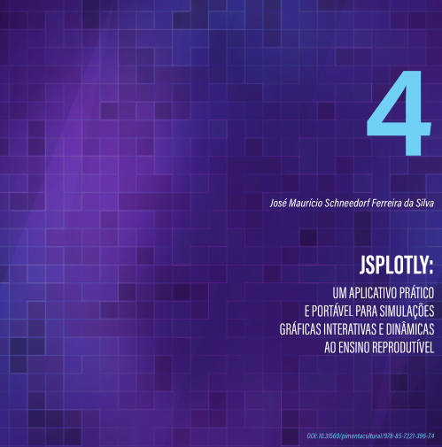
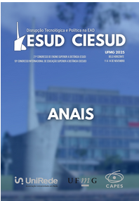
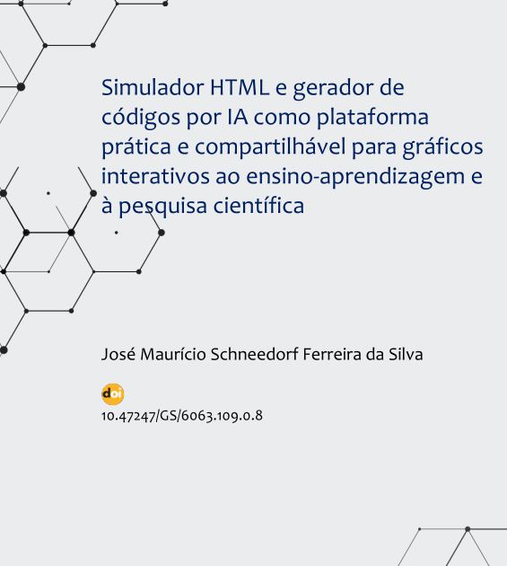
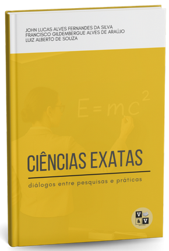
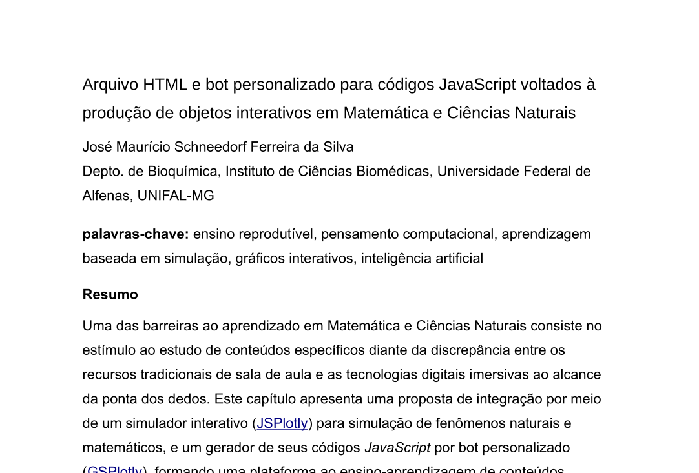
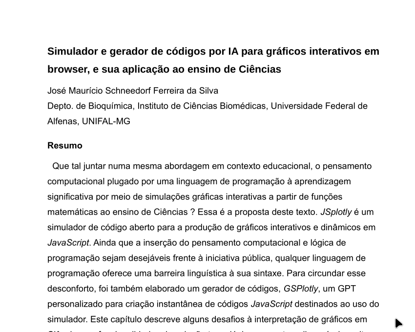

## JSPlotly — Características e Potencialidades {.unnumbered}

<div class="reminder-item">

### Acesso, simplicidade e portabilidade {.unnumbered}

1. É gratuito;
2. Não requer instalação;
3. Não requer conexão de rede;
4. Não requer configuração de máquina ou requisitos mínimos de hardware;
5. Não requer dependências externas (ex: .NET, Java);
6. Pode ser executado diretamente em navegadores como Firefox, Google Chrome, Microsoft Edge e Safari;
7. Pode ser utilizado em computadores, smartphones ou via dispositivos removíveis (pendrive);
8. Possibilidade de uso offline (*Plotly.js* carregado previamente ou no corpo editado do aplicativo);
9. É distribuído como arquivo único HTML leve (< 30 kB);
10. Pode ser aberto em qualquer visualizador HTML simples;
11. Não requer treinamento prévio para uso inicial.
    
</div>

### Estrutura tecnológica e arquitetura {.unnumbered}

<div class="reminder-item">

1. Baseado em linguagens amplamente utilizadas: JavaScript (programação), HTML (estrutura), e CSS (estilo);
2.  Integra a biblioteca Plotly.js (40+ tipos de gráficos e mapas);
3.  Código-fonte e saída gráfica coexistem em um único arquivo;
4.  Não requer motor externo para compilação, sendo interpretado em browsers modernos;
5.  Interpretado a partir de texto simples, com consumo mínimo de memória;
6.  Permite integração com outras bibliotecas JavaScript (ex: numjs, jStat, MathJax);
7.  Permite expansão modular e customização do ambiente;
8.  Independe de plataformas proprietárias;
9.  Integra desfazer ilimitado por editor de códigos.

</div>

### Visualização e interatividade {.unnumbered}

<div class="reminder-item">

1. Produz gráficos 2D e 3D interativos;
2. Permite geração de gráficos a partir de: equações, dados inseridos pelo usuário, ou mapas interativos;
3. Permite exportação em PNG, SVG, e HTML interativo;
4. Permite deslocamento e rotulagem de eixos diretamente no ecrã;
5. Permite arrastar e personalizar a legenda diretamente no ecrã;
6. Possui barra interativa inerente de `Plotly.js`(zoom, pan, autoescala, exportação);
7. Permite interação direta com gráficos: tooltip de dados, zoom com mouse, manipulação de eixos, inserção de rótulos;
8. Interface limpa e minimalista (editor + área gráfica + poucos botões);
9. Permite personalização visual (cores, estilos, layouts).

</div>

### Interatividade avançada {.unnumbered}

<div class="reminder-item">

1. Atualização em tempo real por eventos do usuário;
2. Suporte a animações;
3. Possibilidade de sonorização de dados;
4. Permite construção de interfaces reativas;
5. Permite integração com sensores e dispositivos físicos (celular, Arduino);
6. Permite comportamento exploratório e experimental (laboratório virtual);
7. Possui barra com inserção de ícones adicionais para manipulação do objeto criado (mudança de cor de linha, adição de texto, coordenadas de dados, desenho à mão);
8. Permite edição gráfica adicional diretamente no aplicativo web *Edit Chart Studio* do distribuidor de `Plotly.js` (ícone de barra);
9. Introduz elementos lúdicos (exploração por cliques, manipulação direta, desenho).

</div>

### Potencial pedagógico e metodológico {.unnumbered}

<div class="reminder-item">

1. Faculta o uso em múltiplas metodologias ativas: PBL (Problem-Based Learning), PjBL (Project-Based Learning), CBL (Case-Based Learning), GBL (Game-Based Learning), e SBL (Simulation-Based Learning, Scenario-Based Learning - SBL);
2. Favorece ensino reprodutível e pesquisa reprodutível;
3. Insere o aprendiz em pensamento computacional;
4. Facilita integração entre teoria e prática;
5. Permite desenvolvimento gradual em lógica e e linguagem de programação;
6. Conecta-se às competências digitais da Educação 4.0 e 5.0;
7. Facilita interdisciplinaridade (STEAM);
8. Pode ser usado em qualquer nível ou modalidade de ensino;
9. Criação de “apps científicos portáteis” em HTML;
10. Capacidade de sonificação de dados (didática inclusiva);
11. Suporte a aprendizagem baseada em erro e tentativa (heurística);
12. Potencial para acessibilidade (visual + auditiva);
13. Uso como ferramenta de avaliação formativa interativa;
14. Baixíssima barreira de distribuição (arquivo único);
15. Possibilidade de versionamento simples (Git);
16. Permite integração com Web Serial (cabo) / Web Bluetooth (IoT) para interfaceamento.


</div>

### Tipos de objetos didáticos {.unnumbered}

<div class="reminder-item">

1. Gráficos interativos (2D e 3D);
2. Mapas interativos;
3. Simulações científicas;
4. Animações (objetos, gráficos, mapas);
5. Paineis (dashboards);
6. Experimentos virtuais;
7. Sonorização;
8. Jogos educativos;
9. Instrumentos musicais digitais;
10. Objetos multimídia interativos;
11. Games;
12. Visualizadores de dados;
13. Treinadores de programação;
15. Interfaceamento com hardware (Arduino, sensores).

</div>
    

<div class="reminder-item">

### Compartilhamento e reprodutibilidade {.unnumbered}

1. Arquivos autossuficientes e portáveis;
2. Compartilhamento irrestrito do código (licença aberta);
3. Pode ser incorporado em sites, materiais didáticos, e AVAs
4. Compatível com ensino presencial, remoto e híbrido;
5. Permite distribuição por redes sociais, e-mail, e plataformas educacionais;
6. Facilita replicação de experimentos e objetos didáticos por envolver códigos de programação. 

</div>

<div class="reminder-item">

### Integração com IA e automação {.unnumbered}

1. Permite geração de código via assistentes de IA (ex: *GSPlotly*);
2. Pode ser usado com qualquer IA generativa;
3. Facilita criação rápida de protótipos;
4. Permite evolução incremental de scripts;
5. Reduz barreira de entrada para programação.

</div>

<div class="reminder-item">

### Licenciamento e filosofia aberta {.unnumbered}

1. Licença CC BY-NC-SA 4.0;
2. Código-fonte aberto;
3. Compartilhamento irrestrito para fins educacionais;
4. Alinhado com ciência aberta e educação abertas;
5. Incentiva colaboração e remix.

</div>

<div class="reminder-item">

### Alcance e versatilidade {.unnumbered}

1. Independe de área do conhecimento;
2. Aplicável do ensino básico à pós-graduação;
3. Utilizável em pesquisa científica;
4. Permite criação de aplicações autônomas;
5. Não limitado a matemática — aplicável em: ciências naturais, engenharias, saúde, humanidades (com mapas e dados).

</div>

<div class="reminder-item">

### Ecossistema e suporte {.unnumbered}

1. Possui repositório aberto de exemplos ([Bioquanti](https://bioquanti.netlify.app/));
2. Disponibiliza tutoriais e “livros vivos” (Bioquanti);
3. Permite construção de objetos reutilizáveis;
4. Favorece formação contínua do usuário.

</div>

<!---

```{r, eval = FALSE}
1. É grátis;
2. Não requer instalação;
3. Possui licença CC-BY-NC-SA e código-fonte aberto;
4. Não requer requisitos complementares (ex: bibliotecas *.NET Microsoft*, Java*);
5. Não requer conexão de rede;
6. Não requer configuração de máquina e tampouco desempenho mínimo (ex: memória RAM);
7. Pode ser carregado a partir de um simples visualizador de HTML (*Firefox*, *Edge*, *Safari*, *Chrome*);
8. Não requer um editor específico para construção, podendo ser elaborado a partir de um simples bloco de notas;
9. Possui código-fonte e produto gráfico contidos em um mesmo arquivo, facilitando armazenamento e compartilhament
10. Utiliza linguagens de ponta utilizada no meio acadêmico e industrial, bem como para construção de páginas na web (JavaScript-programação, HTML-marcação, CSS-estilo);
11. Incorpora a biblioteca *Plotly.js*, com mais de 40 tipos de gráficos e de mapas;
12. Pode ser carregado a partir de computador, dispositivos móveis (smartphone) ou removíveis (pendrive);
13. É interpretado a partir de um código de texto simples, utilizando memória física desprezível (20kB), ainda que permita a elaboração de gráficos sofisticados, interativos e dinâmicos (atualização por evento de usuário ou em tempo real);
14. Possui compartilhamento irrestrito de seu código-fonte (licença CC BY-NC-SA 4.0);
15. É capaz de produzir gráficos 2D e 3D interativos instantaneamente, e tanto a partir de equações, como de dados inseridos pelo usuário;
16. É capaz de produzir mapas interativos, elevando a extensão de uso para aplicações não matemáticas;
17. Possui visual limpo (apenas uma janela com ecrã gráfico e editor) e apenas 6 botões, para adicionar, remover e limpar a área gráfica, bem como para salvar o script, limpar o editor, e salvar o gráfico;
18. O gráfico é opcionalmente exportado como PNG, SVG, ou HTML, esse último permitindo interatividade do arquivo salvo;
19. Possui barra superior para mudança de cor da curva, exportação, zoom, span, autoescala, e acesso para editor online do desenvolvedor da biblioteca (Plotly Chart Studio);
20. Possui diversas opções de interatividade por mouse na área gráfica (tooltip de dados, alteração de cor da curva, deslocamento individual de eixos, zoom com botão central, e inserção de rótulos em título e eixos; 
21. Correlaciona-se diretamente ao uso de linguagens de programação, tal como requerido pela *4a. e 5a. Revolução Industrial*, e respectivamente  espelhados nas competências digitais da *Educação 4 e 5.0*; 
22. Por sua simplicidade como arquivo único em HTML, pode ser incorporado em páginas da web ou ambientes virtuais, permitindo seu uso para qualquer modalidade de ensino-aprendizagem (ex: presencial, híbrido, remoto, EaD);
23. É compartilhável como um pequeno arquivo HTML (< 30kB);
24. Faculta seu uso a qualquer modalidade de ensino, sendo passível de incorporação direta em AVAs;
25. Permite que se trabalhe com funções ou dados introduzidos pelo usuário;
26. Insere-se nos conceitos de "pesquisa reproduzível" bem como de "ensino reprodutível", alicerçados pelo acesso e compartilhamento abertos, facilitados e documentados, para ferramentas digitais direcionadas a conteúdos científico, bem como das matrizes curriculares;
27. Permite que se incorpore no código-fonte outras bibliotecas em *JavaScript*, complementares à produção e manejo gráficos (ex: *numjs* para computação numérica e álgebra linear, *jsmath* para notações matemáticas complexas, *jStat* para computação estatística);
28. Possui diversas ações interativas por cliques de mouse, e que pontuam um grau lúdico à experimentação de funções matemáticas em ciências naturais;
29. Renderiza gráficos a partir de linguagem de programação moderna e largamente utilizada, o que também permite ao aprendiz sua inserção paulatina em técnicas de programação contidos em outras linguagens recorrentes (*Python*, *R*), e do mundo *geek* (Arduino - *C/C++*);
30. Integra desfazer infinito no editor de códigos;
31. Permite a construção de um grande número de objetos didáticos interativos, incluindo "gráficos 2D e 3D, mapas, diagramas, cálculos, animações, treinamento em JS, mapas com animação, simulação, experimentação simulada, paineis (dashboard), sonorização, jogos, inclusão e acessibilidade, multimídia interativa (game, instrumentos musicais), e interfaceamento com dispositivos físicos (sensores de celular, placas microcontroladoras)";
32. Possibilita a entrada ou aprimoramento de competências digitais associadas a plataformas STEAM e ao interfaceamento físico do mundo *geek*;
33. Pela gama de objetos interativos potenciais, oportuniza diversas abordagens em metodologias ativas de ensino e aprendizagem, como "aprendizagem baseada em casos (CBL), em problemas (PBL), em projetos (PjBL), em jogos (GBL), e em simulações (SBL)";
34. Renderiza códigos instantâneos opcionalmente por GPT personalizado (GSPlotly) ou outro assistente de Ia de posse de um *script*-modelo.
35. Permite armazenamento opcional de objetos produzidos, dos scripts, e mesmo do aplicativo personalizado ao objeto;
36. Permite compartilhamento dos produtos por qualquer meio físico ou digital, incluindo redes sociais;
37. É inespecífica no que se refere à área de conhecimento ou nível de ensino;
38. É integrada a bot personalizado para criação de códigos, mas facultada ao uso de qualquer outro assistente de IA;
39. Permite trabalhar-se com gráficos, mapas, simulação, animação, jogos, sonorização, multimídia, e prototipagem;
40. Permite gerar aplicativos autônomos;
41. Faculta seu uso para para pesquisa científica;
42. Não requer treinamento específico para usabilidade plena;
43. Possui tutoriais, “livros vivos” e repositório aberto de objetos didáticos com funcionalidades diversas como referência (site Bioquanti).
```
--->


## ...Em Suma... {.unnumbered}

<div class="text-item">

1. **Simplicidade**: tamanho reduzido, design para usabilidade facilitada, e edição facultada em bloco de notas;

2. **Agilidade**: compilação rápida de códigos elaborados por bot de IA personalizado;

3. **Praticidade**: independência de especificações de hardware, de sistema operacional, e dispositivos tecnológicos;

4. **Comodidade**: ausência de instalações, tanto da ferramenta como de módulos acessórios;

5. **Aplicabilidade**: construção de objetos interativos para multiletramento e apropriação do pensamento computacional e programação diretamente em conteúdos curriculares;

6. **Compartilhamento**: licença ampla para reprodução, distribuição e modificação
livres do código-fonte e de seus produtos, bem como atributo de arquivo
permissivo para tráfego online (email, redes sociais);

7. **Flexibilidade**: possibilidade de personalização do código-fonte e do objeto
interativo resultante, bem como para o uso de assistentes de IA variados;

8. **Abrangência**: uso em qualquer área ou temática do conhecimento, bem como para
qualquer nível ou modalidade de ensino, e com extensão para pesquisa científica;

9. **Escalabilidade**: potencial para  disseminação do aplicativo e de seus objetos por 
professores, alunos e gestores, em qualquer ambiente educacional ou domiciliar
</div>


## Produtos 

::: {layout-ncol=2}

[](https://www.bioquimica.org.br/index.php/REB/article/view/1111/866){target="_blank"}


[](https://www.bioquimica.org.br/index.php/REB/announcement/view/57){target="_blank"}

:::

::: {layout-ncol=3}

[](https://www.pimentacultural.com/livro/recursos-educacionais/){target="_blank"}


[](https://submissoes.netel.ufabc.edu.br/index.php/esud2025/issue/view/2/1){target="_blank"}

[](https://www.vveditora.com/product-page/rob%C3%B3tica-inova%C3%A7%C3%A3o-e-educa%C3%A7%C3%A3o-conex%C3%B5es-para-o-futuro){target="_blank"}

:::

### No prelo... {.unnumbered}


::: {layout-ncol=2}


:::

::: {layout-ncol=2}





:::

::: {layout-ncol=2}




:::


