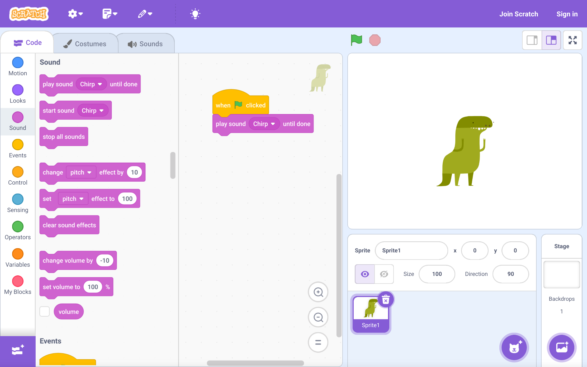
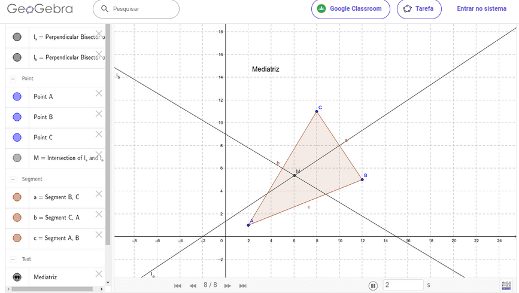
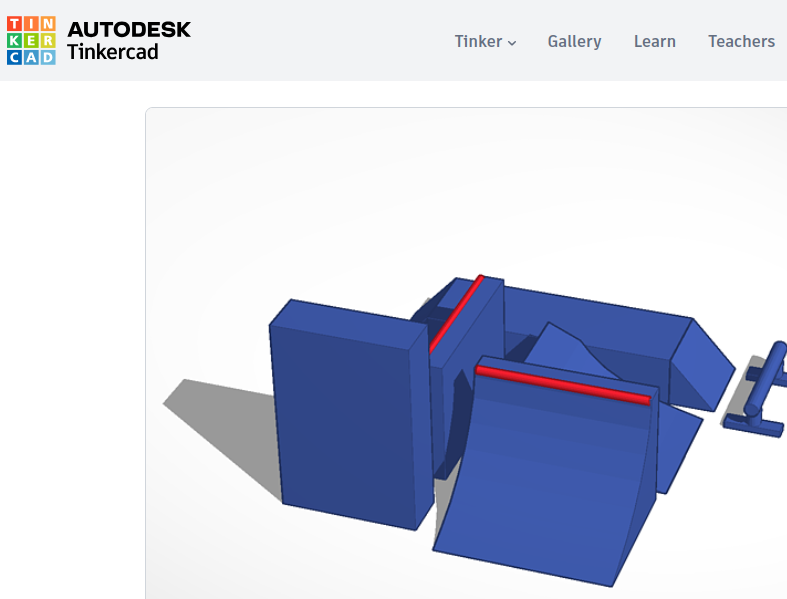
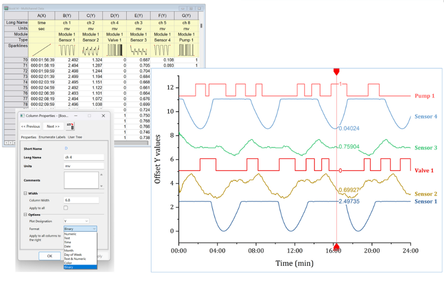
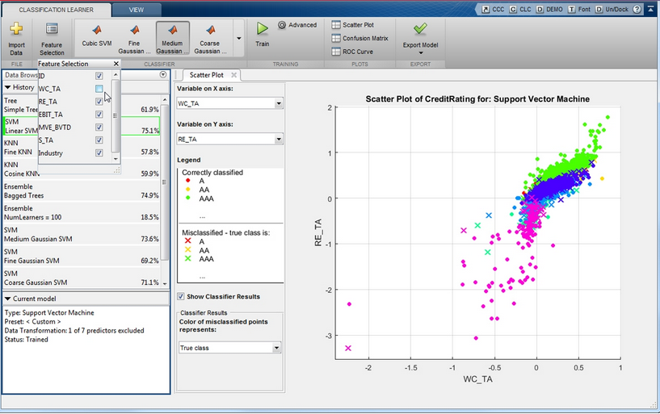
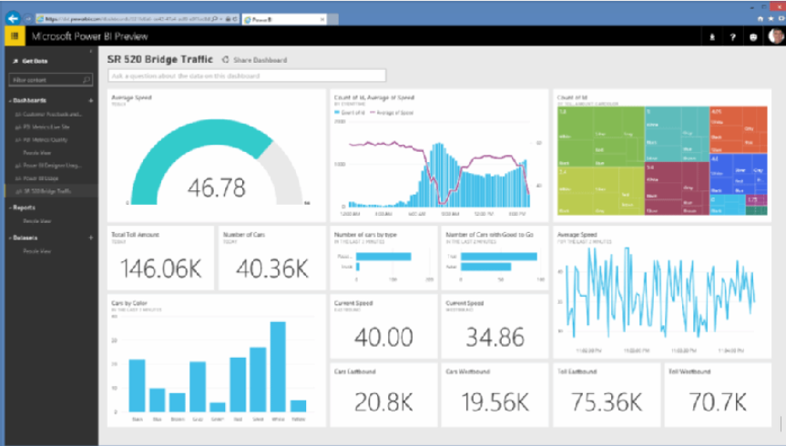

|   Por suas características, *JSPlotly* pode ser utilizado para um conjunto robusto de metodologias ativas, e dentre as quais a *aprendizagem baseada em simulação (SBL)* desponta-se ao ensino e aprendizagem.
\

## Características de Simulações

1. A observação direta das mudanças entre variável(eis) preditora(s) e a variável resposta do modelo;
2. O acompanhamento de covariação da resposta ao longo de uma variável preditora (ex: tendências
sigmoidais, exponenciais, hiperbólicas);
3. A observação de limites da natureza própria do fenômeno, ou de seu sentido físico, quando
contrastado ao modelo matemático (ex: eixo com valores negativos);
4. A visualização do resultado de uma mudança num parâmetro do modelo (“exploração ou
manipulação paramétrica”);
5. A visualização do resultado de mudanças sucessivas em um parâmetro, por sobreposição das
tendências gráficas da variável resposta (curvas sobrepostas);
6. Um rearranjo para alteração nos membros da equação, visando obter-se uma variável preditora
distinta da inicialmente proposta e, nesse sentido, aprimorando-se também as noções matemáticas;
7. Uma apropriação gradual da informação contida em gráficos de funções para situações-problema
em conteúdos didáticos de Matemática e Ciências;
8. Uma compreensão progressiva do fenômeno modelado;
9. A possibilidade de conduzir "experimentos virtuais", com simulações sequenciais para uma dada
proposta, e com conseguente economia múltipla de infraestrutura, equipe, instrumentação, e tempo;
10. Atividades de maior complexidade, possibilitando uma aprendizagem baseada em problemas e
em projetos;
11. Uma aprendizagem mais dinâmica e mesmo lúdica, complementando as imagens fixas de livros
didáticos;
12. A possibilidade de serem aplicadas diretamente em conteúdos temáticos da grade curricular;
13. Seu potencial para uso em qualquer modalidade de ensino (presencial, remoto, EaD);
14. Uma apropriação mais efetiva e significativa do tema abordado.

\

## Vantagens de Simulações

1. Infraestrutura dispensável para as atividades (basta um desktop ou dispositivo móvel);
2. Ausência de treinamento técnico requerido ao uso de instrumentação física;
3. Dispensa de mão-de-obra especializada em paralelo ao treinamento do usuário;
4. Tempo exíguo e mesmo instantâneo para consolidação da simulação;
5. Possibilidade de se trabalhar com situações não reproduzíveis em experimentação (ex: fissão
nuclear, observações astronômicas);
6. Dispensa de recursos financeiros para consolidar a simulação (insumos, utensílios, equipamentos);
7. Desnecessidade de proteção contra incidentes e descarte de resíduos;
8. Modificação do objeto em simulação e feedback imediato do sistema por manipulação do código
(exploração paramétrica);
9. Possibilidade de inserção do aprendiz em pensamento computacional;
10. Possibilidade de inserção do aprendiz em lógica e linguagens de programação diretamente para
conteúdos curriculares;
11. Contribuição para um ensino reprodutível de códigos para conteúdos curriculares.

\

|       Há um sem número de ferramentas digitais visando gráficos, cálculos, simulações, e outros objetos técnico-científicos, e tanto para o **ensino básico** como para o **ensino superior**. Elenca-se a seguir apenas alguns poucos exemplos . 
\

## Ensino Básico

{target="_blank"}

---

\

{target="_blank"}

---

\

{target="_blank"}

\

---

{target="_blank"}

---

\

## Ensino Superior

{target="_blank"}

\

---

{target="_blank"}

\

---

{target="_blank"}

\

---

{target="_blank"}

\

---

{target="_blank"}

---

\

{target="_blank"}

\

---
## As ferramentas & algumas limitações

|       Não obstante JSPlotly seja constrito à criação de objetos interativos em navegador, quando comparado às outras suites e softwares acima , o aplicativo diferencia-se do conjunto de soluções elencadas acima (vide também @sec-compara), por não se limitar às características apresentadas individualmente por aquelas, tais como:

1. Necessidade de instalação ou acesso credenciado em nuvem para programa/pacotes;
3. Dependência de hardware de bom desempenho;
4. Dependência de sistema operacional;
6. Dependência de tipo de dispositivo (desktop/notebook, dispositivos móveis);
7. Preços altos ou versões de demonstração limitadas para os programas pagos;
8. Dependência de licença para uso, ainda que temporária;
9. Limitação de instalação, configuração e uso de programas;
10. Uso restrito ao uso de mouse para acesso e edição do objetos produzidos;
11. Limitação de compartilhamento para o arquivo original do objeto a quem não possua o mesmo programa;
12. Limitação para personalização do objeto a quem não possua o mesmo programa;
13. Compartilhamento do objeto produzido como arquivo de imagem, ou como arquivo compilável especificamente no programa;
14. Limitação de modelos matemáticos propostos (embora o conhecimento da sintaxe de cada programa permita a inserção de equações pelo usuário);
15. Produção e compartilhamento de objetos estáticos, sem interatividade;
16. Usabilidade dependente de janelas, menus e abas específicas de cada suíte;
17. Limitação para inserção do pensamento computacional, lógica e linguagem de programação;
18. Impossibilidade de abertura para mais de uma sessão do programa;
19. Vasta coleção de funcionalidades de cada suíte, muito além da necessidade específica do aprendiz;
20. Caminho detalhado e único entre janelas e abas, para se buscar uma funcionalidade específica;
21. Limitação de objetos gerados (ex: gráfico, animação, ou simulação);
22. Níveis restritos para ações de “desfazer/refazer”;
23. Programas que usualmente operam por cliques de mouse não permitem ao aprendiz a inserção em pensamento computacional envolvido em linguagens de programação (por exemplo, Prism, Geogebra, Origin e Sigma Plot);
24. Programas que não trabalham com linhas de comando produzem os resultados gráficos em janelas diferentes, exigindo alternância à sua usabilidade;
25. Limitação de uso em ambientes virtuais de aprendizagem (instalação de programas no portal, por exemplo) e, por conseguinte, para algumas modalidades de ensino (por exemplo, híbrido e EaD).

