|       Esta seção busca ilustrar o emprego da plataforma JSPlotly para alguns exemplos em ensino e pesquisa com abordagem *STEAM* (*"Science, Technology, Engineering, Arts, and Mathematics"*), um cordão tecnológico que integra desenho artístico e pensamento criativo em disciplinas tradicionais de Ciências, Tecnologia, Engenharia e Matemática. 

|       Seguem alguns exemplos em STEAM, apresentando o contexto, equações envolvidas (quando couber), e sugestões para alteração do objeto. Esses exemplos são facilmente acompanhados clicando-se com o mouse nas imagens. Para diversos outros objetos interativos, consulte o site *Bioquanti*, nas áreas de [Biofísico-química](https://bioquanti.netlify.app/pt/nivel/superior/jsplotly/jsplt_bioq) voltada ao *ensino superior*, bem como [Escola](https://bioquanti.netlify.app/pt/nivel/basico/jsplotly/jsplotly_bas), voltada ao *ensino básico*.

|       Outros exemplos para STEAM com JSPlotly, voltados ao interfaceamento do aplicativo com dispositivos móveis e placa Arduino, estão ilustrados na próxima seção.
\

## Equação de van der Waals para gases ideais {#sec-virtual}

### Contexto: {.unnumbered}

| Uma adaptação que relaciona as quantidades termodinâmicas de pressão, volume e temperatura para gases ideais, é a _equação de van der Waals_. Nessa são computados coeficientes que estimam a existência de um volume e de interações inter-partículas. Dessa forma, a equação de van der Waals corrije a de gases ideais considerando um termo para compensação de forças intermoleculares (a/V$^{2}$) e o volume disponível, esse descontando o volume ocupado pelas próprias moléculas do gás.

| Na simulação é oferecida uma interatividade adicional pela presença de _sliders_ (controles deslizantes) para temperatura, e para os coeficientes de volume finito (_b_) e interação entre partículas (_a_).

### Equação: {.unnumbered}

$$
P = \frac{RT}{V - b} - \frac{a}{V^2}
$$

- P = pressão do gás (atm);
- V = volume molar (L);
- T = temperatura (K);
- R = 0,0821 = constante dos gases ideais (L·atm/mol·K);
- a = constante de atração intermolecular (L$^{2}$·atm/mol$^{2})
- b = constante de volume excluído (L/mol)

[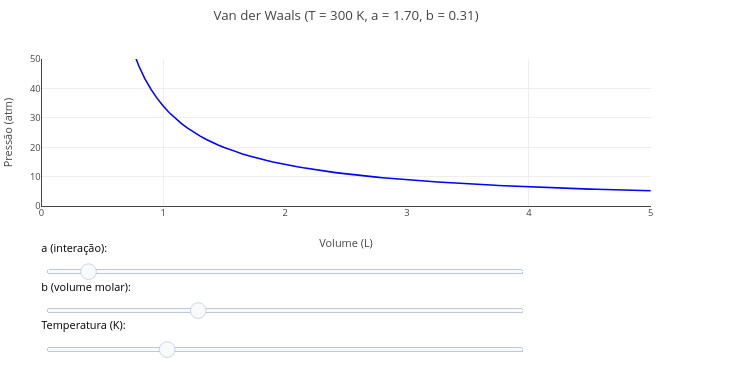](bioquanti/jsp_vanderWaals.html){target="\_blank"}

### Sugestão: {.unnumbered}

```{r, eval=FALSE}

1. Experimente variar os parâmetros da equação por meio do "slider" para temperatura, bem como para os coeficientes "a e b".
2. Discorra sobre qual dos coeficientes possui maior efeito no perfil da curva, e a razão para isso.
```

## Consumo de Oxigênio por mitocôndria

### Contexto: {.unnumbered}

| _Oxígrafos_ são equipamentos que monitoram o teor de oxigênio dissolvido em solução. Diferente de _oxímetros_, baseados na medição de oxigenação de hemoglobina por _clip_ direto na ponta de um dedo, oxígrafos são largamente utilizados em estudos de células vivas e suspensão de mitocôndrias.

| O exemplo que segue ilustra uma _animação_ para o teor de $O_{2}$ medido em oxígrafo para uma suspensão de mitocôndrias, e cujas taxas de consumo são variadas pelo uso de metabólitos modificadores (ex: piruvato, ADP, azida).
\

[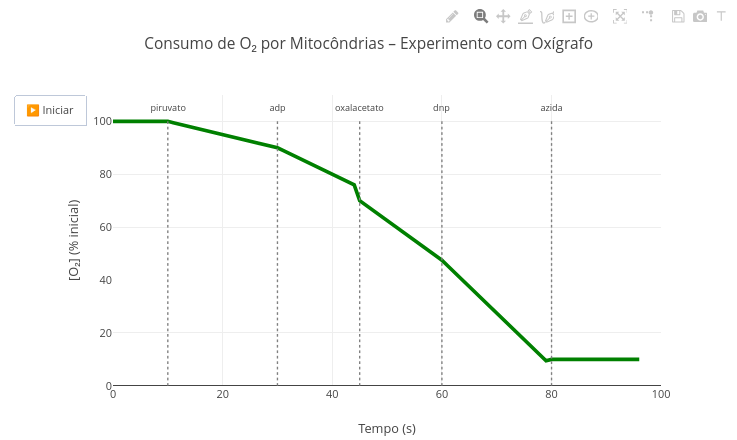](bioquanti/jsp_O2_mitocondria.html){target="\_blank"}
\

### Sugestão: {.unnumbered}

```{r, eval=FALSE}
1. Observe que o surgimento de metabólitos e as taxas de consumo de oxigênio decorrentes são definidas pela função "oxigenio". Experimente alterá-las e observe o efeito na animação;
2. Perceba que os metabólitos e sua atuação, bem como o sinal medido, teor de O2, são facilmente adaptados para qualquer outra medição metabólica no código. Experimente, por exemplo, como ficaria o gráfico numa simulação para a via glicolítica;
3. Esse código foi desenhado para uma animação. Vá até a seção de "Aplicativos" abaixo, e experimente o "FlowForces" para uma finalidade semelhante, embora com plena adaptação interativa.
```
\

## Cinética de reação química

### BNCC: EF09CI07, EM13CNT204, EM13CNT205 {.unnumbered}

|       Um tópico de assimilação desconfortável ao estudante refere-se à abstração necessária para se descortinar as relações matemáticas que se apresentam na cinética de reações químicas. Ao tratar da conversão de reagentes em produtos, por exemplo, é inerente certa barreira à aprendizagem referente à taxas de reação, inibição e ativação. Para reduzir o impacto dessa abstração, segue um exemplo para uma animação para cinética de reação, e cujo objeto altera-se em função de opções de taxas e moduladores à reação.
\

### Equação: {.unnumbered}

$$
R(t)=\frac{R_0}{1+k_{efetiva}​t}
$$

$$
P(t)=R_0​−R(t)
$$

*Onde*,

- $R(t)$ = quantidade de reagente R no instante $t$ (unidades arbitrárias);
- $P(t)$ = quantidade de produto P no instante $t$ (unidades arbitrárias);
- $R_{0}$ = quantidade inicial de reagente no tempo $t=0$;
- $t$ = tempo (em segundos);
- $k_{\text{cinética}}$ = constante de velocidade de base (em $s^{-1}$);
- $k_{\text{efetiva}}$ = constante efetiva após considerar catalisador e/ou inibidor:

$$
k_{\text{efetiva}} \;=\;
k_{\text{cinética}} \times
\begin{cases}
f_{\text{cat}}, & \text{se catalisador ligado}\\[6pt]
1, & \text{se catalisador desligado}
\end{cases}
\times
\begin{cases}
\dfrac{1}{f_{\text{inh}}}, & \text{se inibidor ligado}\\[6pt]
1, & \text{se inibidor desligado}
\end{cases}
$$

\

[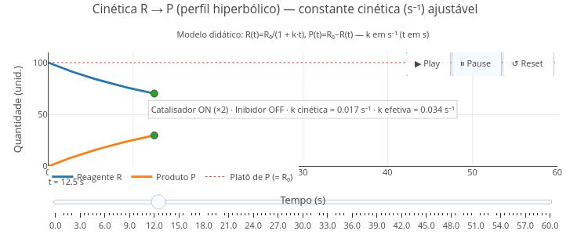](bioquanti/cineticaRP.html){target="_blank"}
\

### Sugestão {.unnumbered}

```{r, eval=FALSE}
1. Experimente alterar a constante "k_cinetica" no topo do código (ex.: 0.008, 0.017, 0.05) e use Play/Reset para comparar;
2. Experimente incluir/retirar inibidor e catalisador;
3. Experimente alterar o potencial dos moduladores acima editando suas constantes:
  a. const fator_catalise  = 2.0;
  b. const fator_inibicao  = 3.0;
```

\

##  Vaso de torno de olaria (STEAM)

### BNCC: EM13MAT101, EM13MAT403, EM13CNT204, EM13AR01, EM13AR02  {.unnumbered}

|   Segue um exemplo de simulação para torneamento cerâmico e moldagem manual de argila, e que permite experimentar formas simétricas e arredondadas, como vasos, tigelas e potes, por ajuste em alguns parâmetros e nas funções trigonométricas do código.

[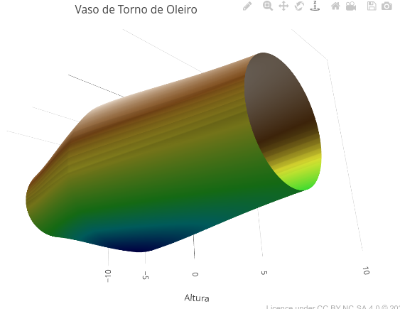](bioquanti//jsp_steam2.html){target="_blank"}

```{r, eval=FALSE}
1. Altere a altura do vaso, seu formato, e suas cores, editando o código nos campos específicos.
```
\


```{r, eval=FALSE}
1. Experimente alterar os parâmetros base, altura e curvatura do código, variando também o sinal dos valores (positivo, negativo);
2. Altere alguma função trigonométrica (linhaX ou linhaY, seno para tangente, por exemplo), e sobreponha ao plot;
3. Sobreponha figuras geométricas com paleta de cores distintas.
4. Crie figuras simétricas sobrepondo uma curva com parâmetro positivo a uma com mesmo parâmetro negativo.
```


\


## ANAVA e teste de Tukey-HSD

### Contexto: {.unnumbered}

| Em pesquisa é comum proceder a análise de um conjunto de dados comparando-se a variância entre grupos com a obtida dentro de cada grupo, ou _Análise de Variância (ANAVA)_. Uma vez obtida a informação estatística de que há diferença entre os grupos superior à interna, procede-se um teste _pos-hoc_ para comparação de médias, como o _teste de Tukey-HSD_ (_Honest Significant Difference_).

### Equação: {.unnumbered}

| A equação que caracteriza um teste de Tukeu-HSD é fornecida abaixo (correção para grupos desbalanceados):

$$
\text{HSD}_{ij} = q_{\alpha} \cdot \sqrt{\frac{\text{MS}_{\text{within}}}{2} \left( \frac{1}{n_i} + \frac{1}{n_j} \right)}
$$

_Onde:_

- HSD = valor mínimo da diferença entre duas médias para que ela seja considerada significativa;
- q$_{\alpha}$ = valor crítico da distribuição studentizada _q_ (distribuição de Tukey), dependendo do número de grupos e do nível de significância $\alpha$;
- MS$_{within}$ = quadrado médio dentro dos grupos (erro) obtido da ANAVA;
- n: número de observações por grupo (_i_ e _j_ se houver grupos de tamanhos diferentes).
  \

[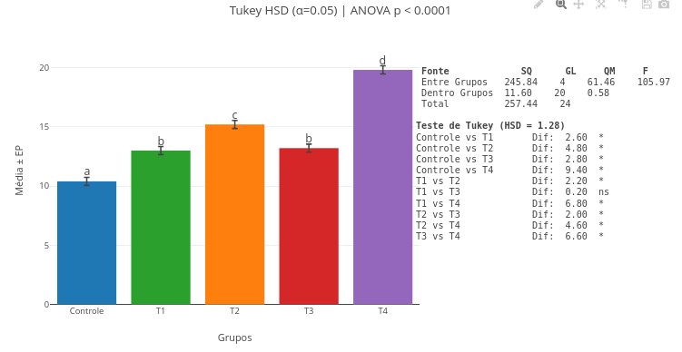](bioquanti/jsp_tukey.html){target="\_blank"}

### Sugestão: {.unnumbered}

```{r, eval=FALSE}
1. Você pode clicar e arrastar os marcadores de mínima diferença (a,b,etc) acima do gráfico, para melhor ajuste visual, bem como a tabela de ANAVA e o resultado do teste estatístico;
2. Altere os valores dos vetores, refaça a análise e o gráfico simultâneos, e perceba a diferença nos valores obtidos. Observe que, como informado na borda inferior, é necessário atualizar a página do site para anular dados anteriores retidos em memória cache;
3. Insira outros dados nos vetores respectivos, seus ou de outra fonte;
4. Insira novos vetores de dados, ou delete algum, para um cálculo e gráfico personalizado.

```

## Ajuste não linear de dados

| Modelagem é uma área de emprego comum nas ciências naturais, quando se deseja previsão ou correlação matemática de dados experimentais. Modelos podem constituir-se lineares ou não. Quando não lineares, podem ser aplicados de forma empírica para os dados (ex: funções quadráticas, logarítmicas, exponenciais ou de potência), ou a partir de uma função matemática explanatória do modelo.

| Nesse caso são empregadas técnicas para ajuste não linear dos dados ao modelo, como _Simplex_, _Gauss_, _Newton-Raphson_, _Levenberg-Marquadt_, ou _mínimos quadrados_ por exemplo. Seja qual for o método, o ajuste não linear difere-se do linear em pressupostos e tratamento dos dados (veja uma rápida explicação [aqui](https://bioquanti.netlify.app/pt/nivel/superior/r/enzimas#ajuste-n%C3%A3o-linear).

### Contexto: Interação ligante-proteína (algoritmo de _grid search_) {.unnumbered}

| O exemplo a seguir ilustra a aplicação de um ajuste não linear de dados de interação molecular por modelo de Langmuir, e tratamento por _minimização do erro quadrático por varredura manual_. Nesse tratamento, calcula-se a _soma dos erros quadráticos (RMSE)_ para combinações de _a_ e _b_, selecionando-se o par com menor erro calculado. Nesse caso, por simplificação, apesar do _JSPlotly_ trabalhar com bibliotecas mais específicas, a regressão não linear dá-se por mínimos quadrados, mas realizada por _grid search_, e não por métodos iterativos clássicos. Assim, um conjunto de valores é testado para o par (a, b) em uma malha definida previamente (tabela de combinações), permitindo a identificação dos parâmetros que melhor descrevem os dados experimentais segundo o critério de erro mínimo.
\

### Equação: {.unnumbered}

| A equação de Langmuir é representada abaixo:

$$
Y = \frac{aX}{K_d + X}
$$

_Onde:_

- Y = fração de sítios ocupados;
- X = concentração do ligante livre;
- _a_ = valor de saturação (sítios de mesma afinidade completamente ocupados);
- _Kd_ = constante de equilíbrio de dissociação do complexo.

| Nesse caso, a função de mínimos quadrados não linear fica:

$$
SSR(a, K_d) = \sum_{i=1}^n \left( y_i - \frac{a x_i}{K_d + x_i} \right)^2
$$

_Onde:_

_SSR_ = soma dos quadrados dos resíduos (inversamente propocional à qualidade do ajuste)
\

[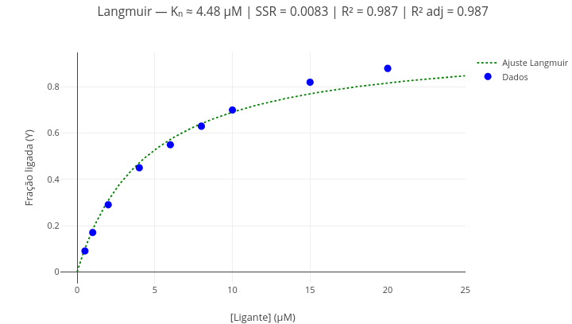](bioquanti/jsp_ajNonLin.html){target="\_blank"}

### Sugestão: {.unnumbered}

```{r, eval=FALSE}
1. Como no exemplo anterior, apresente alternativamente os pontos e a curva de ajuste pela operação "booleana" ("mostrarPontos = true/false"; "mostrarCurva = true/false");
2. Altere os dados e realize novo ajuste, para obtenção de outros parâmetros da equação (Kd, SSR, R², R² ajustado). Obs: R² adj corresponde ao valor de R² corrigido para o número de parâmetros do modelo (no caso, "2"), incidindo diretamente nos "graus de liberdade" para o ajuste.
```

\


## prot.Id - Experimentação simulada para caracterização de aminoácidos e cadeias

### Contexto: {.unnumbered}

| O _JSPlotly_ permite se trabalhar com um conjunto de interações não necessariamente atreladas à equações e suas representações gráficas. O exemplo a seguir ilustra seu potencial para uma simulação de um experimento clássico em Bioquímica: _a caracterização de aminoácidos, peptídios, e proteínas, por reações cromogênicas em tubos de ensaio_. Como o escopo deste material é apresentar e facultar o uso de _OIERs_ variados (_objetos interativos de ensino reprodutível_), recomenda-se ao usuário a busca de fontes de informação tangentes às reações descritas brevemente a seguir.

### Instruções do simulador {.unnumbered}

| O simulador permite duas opções: a) descobrir a natureza de uma amostra ou b) descobrir o padrão de cores de reações para uma amostra escolhida.
\

**Opção A: descobrir a natureza de uma amostra:**

| Aqui é possível _"jogar"_ para verificar se está diante de uma amostra de proteína/peptídio (cadeia), de um aminoácido (AA), de uma mistura específica de AAs, ou de de AA(s) presente numa cadeia. Para isso:

1. Clique na imagem abaixo e dê um _"add"_. Será gerado um conjunto de 7 barras coloridas, representando as cores obtidas em tubos de ensaio para 7 reações distintas para caracterização proteica: ninhidrina, biureto, Pauly, xantoproteica, Sakagushi, Millon, e enxofre (Cys);

2. Descubra o tipo de amostra em função do padrão de cores dos tubos apresentado, fornecendo um palpite. O palpite deve ser por tipo (no menu _"Palpite (tipo)"_ - AA, cadeia, ou mistura de AAs) e por perfil (no menu _"Palpite (perfil)"_ - aleatório, AA(s) específico(s) ou mistura específica);

3. Após a seleção nos 2 menus, clique em _"Conferir"_. Se tiver acertado, um _"Placar"_ logo abaixo irá computar o número de acertos/número de amostras _"jogadas"_;

4. Se errar, tente de novo ou busque a explicação do padrão de cores em _"Explicar"_;

5) Existem duas outras possibilidades: _"Modo difícil"_, que esconde o nome das reações, embora mantendo sua sequência, e _"Embaralhar"_, que altera a ordem dos tubos;

6) Para uma nova amostra, basta clicar em _"Nova amostra"_;

**Opção B: descobrir o padrão de cores de uma reação para uma amostra selecionada:**

1. Selecione uma amostra em _"Gerar"_, e clique em _"Nova amostra"_. Será gerado um conjunto de tubos com o padrão de reações esperado para a amostra.

[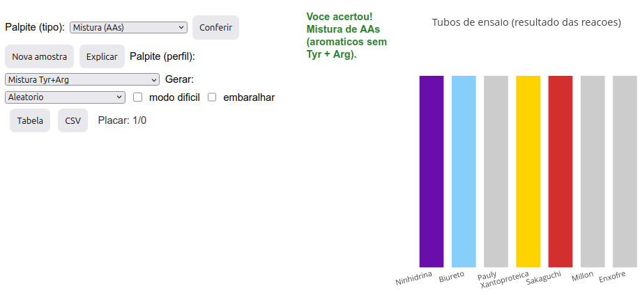](bioquanti/jsp_Id-Prot-7.html){target="\_blank"}

### Sugestão: {.unnumbered}

```{r eval =FALSE}
1. Experimente clicar em "Nova amostra" para verificar a frequência de possibilidades;
2. Experimente as duas opções de operação do "jogo" (sim, é um jogo...afinal, tem um placar!);
3. Experimente o "modo difícil" (sem referência às reações em sequência) ou "embaralhar" (permuta da ordem das reações). Por óbvio, contudo, evite os dois simultaneamente !
```

\

## ZeMol - Visualizador 3D para modelos moleculares

### Contexto: {.unnumbered}

| Pelas características combinadas do uso de _JavaScript_ e da biblioteca _Plotly.js_, é possível extender o potencial de aplicação do _JSPlotly_ para a construção de verdadeiros aplicativos HTML. Um claro exemplo desse alcance é ilustrado abaixo, para um visualizador molecular de natureza similar a alguns pré-existentes e empregados em ensino e pesquisa (_Jmol_, _Pymol_, etc).

| Embora seja obviamente bem menor na extensão de suas funcionalidades quando comparado a outros aplicativos, o assim alcunhado _"ZeMol"_ possui menos de 70 kB de memória, e apresenta funcionalidades como:

- modelos carregados online do site [PDB](https://www.rcsb.org/) ou [PubChem](https://pubchem.ncbi.nlm.nih.gov/);
- modelos carregados da memória física do dispositivo (formatos PDB, MOL, SDF, XYZ, TXT);
- informações de identificação do arquivo PDB (ou nome do arquivo PubChem);
- cabeçalho contendo quantitativo de cadeias, ligantes, íons, e ligações dissulfeto;
- identificação apenas dos carbonos $\alpha$ de cada resíduo do esqueleto polipetídico, facilitando a visualização do modelo;
- visualização automática de ligações dissulfeto;
- identificação de resíduos, ligantes, e íons, por _hover_ de mouse sobre o modelo;
- _checkbox_ para visualização de estrutura secundária de proteínas (hélice, folha-$\beta$);
- _checkbox_ para índice de polaridade dos resíduos;
- _sliders_ para tamanho do carbono CA (PDB) ou átomos no geral, e opacidade do modelo (útil pra destaque de fendas, estrutura 2a., cadeia carbônica, ligantes, íons);
- ocultar/mostrar partes distintas do modelo, clicando-se em sua legenda (cadeia, íons, hélice/folhas, ligantes);
- Destaque de AAs (individual, sequência, todos de um tipo, grupos pré-definidos no _script_);
- HTML autosuficiente no salvamento, _"congelando"_ o modelo nas características que se deseja apresentar;
- _Zoom_ em dispositivos móveis (um dedo fixo na tela e outro arrastando o modelo) e _Pan_ (deslocamento do modelo com 2 dedos na tela) - ações também presentes nos ícones acima do modelo;
- ajustes facultativos no próprio _script_ (tamanhos, cores, espessuras, grupos de AAs, tipo e espessura de traços, por ex).

[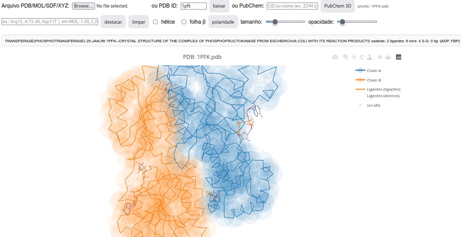](bioquanti/ZeMol.html){target="\_blank"}

### Sugestão: {.unnumbered}

```{r, eval=FALSE}
1. Carregue um modelo com código PDB, ou uma molécula do site PubChem;
2. Se proteína, experimente os efeitos separados e combinados dos "sliders" para tamanho do CA e opacidade;
3. Observe a polaridade dos resíduos proteicos no "checkbox" homônimo;
4. Experimente ampliar/reduzir ou deslocá-lo na tela com auxílio do mouse, ou fazê-lo num smartphone conforme a instrução dada acima;
5. Mostre ou esconda alternativamente cada cadeia ou todas, ligantes e íons, clicando-se nos termos respectivos da legenda;
6. Selecione resíduos de interesse do modelo, como sítio catalítico, de ligação a coenzimas, ou de regulação da atividade. Para isso, digite no campo correlato e clique em "destacar". Algumas Sugestão:
  a. Individuais: Arg15, ASP117, 15, A:15, A:ARG15;
  b. Faixas: 15-30, A:15-30, Arg15-Asp30;
  c. Múltiplos separados por vírgula: "Arg15, Asp117";
  d. Grupos: "aromatico", "polar", "apolar", "basico", "acido", "small".

```

\


## LeadHunt-Toolkit

| O exemplo que se apresenta refere-se ao uso do _JSPlotly_ como um painel (_dashboard_) para prospecção simulada do potencial de uma molécula fictícia em triagem, visando a seleção de composto líder (_lead compound_) como inibidor a um alvo enzimático.
\

[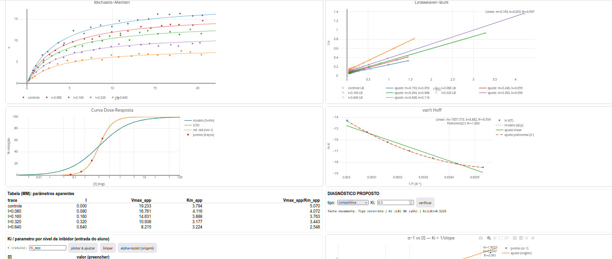](bioquanti/lh-toolkit.js){download="lh-toolkit.js"}

**Instruções gerais**

1. No campo superior do app há 4 botões:

- _reset_ - renova a simulação para outros dados e gráficos;
- _html_ - salva os gráficos e dados em arquivo interativo;
- _diagnóstico_ - abre janela _popup_ para o diagnóstico do modelo de inibição e valores de parâmetros;
- _parâmetros_ - abre janela para simulação gráfica frente a parâmetros do usuário.

2. Há dois modos para estudo para uso do _LeadHunt_: inserindo-se parâmetros cinéticos e termodinâmicos para observar os resultados expressos em gráficos (botão _parâmetros_), ou caracterizar os parâmetros a partir dos gráficos (botão _diagnóstico_).

| Os gráficos simulam os resultados obtidos para as _representações de Michaelis-Mentem, Lineweaver-Burk, curva dose-reposta, e gráfico de van't Hoff._
\

### Parâmetros {.unnumbered}

| Seja qual for o modo experimentado, se para identificar o potencial do composto , os parâmetros são:

- _Ki_, constante de equilíbrio de dissociação do inibidor (desejável < 10$\mu$M);
- Vmax, velocidade limite da reação enzimática;
- Km, constante de Michaelis-Mentem;
- $\Delta$H, variação de entalpia de ligação com inibidor;
- $\Delta$S, variação de entropia de ligação com inibidor;
- $\Delta$Cp, variação de capacidade calorífica da ligação com inibidor;

| Além desses parâmetros, a molécula fictícia conta com alguns _descritores_, a saber:

- MW, peso molecular;
- HAC, número de átomos pesados (todos, exceto hidrogênio);
- HBD, número de doadores de ligação de H;
- HBA, número de aceptores de ligação de H;
- logP, logaritmo do coeficiente de partição da molécula

| Esses descritores permitem o cálculo para outros critérios visando a seleção de líder:

- LE, eficiência de ligante (_ligand efficiency_):
  \
  $$
  LE = \frac{\Delta G}{HAC};
  $$
  \

$$
LE = 1.37 \frac{pIC_{50}}{HAC}
$$

\

_Onde_ pIC$_{50}$ = -log(IC$_{50}$);

- LLE, eficiência lipofílica do ligante (_lipophilic ligand efficiency_; valores >5 são considerados bons),

$$
LLE=pIC_{50}-logP
$$

- BEI, índice de eficiência da ligação (_binding efficiency index_),

$$
BEI=\frac{pIC_{50}}{MW}
$$

\
_Onde:_ MW, kDa; faixas típicas pela _regra de Lipinski_ (regra dos 5): MW<=500, HBD<=5, HBA<=10, cLogP<=5. E também LE >= 0.3; LLE >= 5.

| Já a curva dose-reposta do inibidor permite a determinação de:

- IC$_{50}$, concentração do inibidor que confere 50% de resposta (adequado quando < 10$\mu$M);
- nH, constante de Hill (índice de cooperatividade)
  \

### Uso do LeadHunt para identificação de um composto líder {.unnumbered}

| A partir da visualização de gráficos e descritores da molécula fictícia, é possível se determinar:

1. O tipo de inibição reversível (competitiva, incompetitiva, não competitiva pura, não competitiva mista);

2. O valor de _Ki_ por construção de gráficos secundários variados a partir da tabela de preenchimento de parâmetros (_Tabela para Ki_) - plota-se a concentração _I_ do inibidor _versus_ Km, Vm, ou Km/Vm aparentes. Alternativamente, plota-se _I_ contra o valor de _($\alpha$-1)_, onde $\alpha$ representa _"1+I/Ki"_;

3. O valor de IC$_{50}$ e de _nH_ (inclinação do ponto médio) pela curva de dose-resposta do inibidor (estimativa de cooperatividade na ligação);

4. O valor de $\Delta$H e $\Delta$S para o plot de Van't Hoff. No caso em que o gráfico apresentar-se curvilinear, também o valor valor de $\Delta$Cp;

5. Os valores de _LE_ e _LLE_;

6. Avaliar o candidato junto às regras de Lipinski.

| Dessa forma, pode-se utilizar o _LeadHunt_ para uma simulação significativa à triagem de um inibidor como _lead compound_ à uma enzima-alvo.

### Sugestão {.unnumbered}

```{r, eval=FALSE}
1. Compare os tipos de inibição enzimática por inspeção visual dos gráficos de Michaelis-Mentem e de Lineweaver-Burk, dando ênfase às variações ou não de "Km" e "Vmax" entre esses;

2. Calcule o valor de "Ki" por métodos distintos utilizando-se o campo de preenchimento para "replot" por nível de inibidor (tabela de "Parâmetros aparentes"):
    a) obtendo-se o valor de "1/Ki" para plot de I x (alfa-1) do botão "alfa-replot" (inclinação da reta);
  b) por intercepto "-Ki" a partir de plots de I x Vm_app, Km_app, ou Km/Vm_app (dependendo do modelo de inibição);
  c) por "inclinação" ou "intercepto" de replots de Lineweaver-Burk contra I

3. Experimente o modo "parâmetros" com valor de "nH" diferente de 1 (ex: 2,8), para avaliar o comportamento da curva dose-reposta sob efeitos de cooperatividade;

4. Experimente o modo "parâmetros" com valor para capacidade calorífica diferente de zero (ex: -2000), para avaliar a possibilidade de efeitos secundários na ligação em função da temperatura, como transição conformacional da enzima;

5. Teste a curvatura do plot de Van´t Hoff para variação de capacidade calorífica da interação, fornecendo valores positivos (ex: 2000) e negativos (ex: -2000): se concavidade para cima, valor negativo da variação de capacidade calorífica; se concavidade para baixo, valor positivo.
```

### Referências: {.unnumbered}

1. Marangoni, Alejandro G. Enzyme kinetics: a modern approach. John Wiley & Sons, 2003.
2. Copeland, Robert A. Evaluation of enzyme inhibitors in drug discovery: a guide for medicinal chemists and pharmacologists. John Wiley & Sons, 2013.
3. Copeland, Robert A. Enzymes: a practical introduction to structure, mechanism, and data analysis. John Wiley & Sons, 2023.
4. Leone, Francisco A. Fundamentos de cinética enzimática. Editora Appris, 2021.
   \


## Gizz - Lousa Digital

### Contexto: {.unnumbered}

| A natureza do objeto abaixo dispensa apresentações. Trata-se mais um entre os muitos aplicativos para simular uma lousa, ou quadro de giz/caneta digital. Diferente de seus concorrentes, contudo:

1. Pode ser exportada como arquivo autossuficiente HTML em botão da própria lousa, e permitindo compartilhamento da imagem gerada, bem como continuidade de sua edição;
2. Faculta a personalização do código que o produz, permitindo inserir/alterar canetas, espessuras, e ações distintas não previstas no código-fonte.
   \

[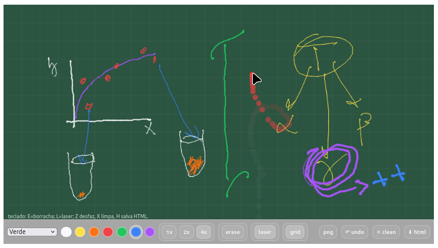](bioquanti/lousa.html){target="\_blank"}
\

| Tangente à suas facilidades, a lousa digital permite:

- Escrever com 7 cores e 3 espessuras distintas;
- Acessar 4 planos de fundo de coloração diferente;
- Sobrepor o plano com um _grid_;
- Utilizar um apagador (_erase_);
- Utilizar um _apontador laser_ para localização transiente do que se pretende assinalar;
- Salvar a imagem como PNG, indicando data e hora;
- Comandos para desfazer (_undo_) e de limpeza (_clean_) do quadro;
- Atalhos de teclado: E=borracha; L=laser; Z desfaz, X limpa, H salva HTML

### Sugestão: {.unnumbered}

```{r, eval=FALSE}
1. Pode-se alterar a espessura das canetas em "var baseWidth = 1;" ;
2. Os botões 1x, 2x, 4x são multiplicadores; edite as linhas de criação dos botões pra trocar rótulo/multiplicador (ex.: "addSize('3x', 3, true)").
```
\

##  Jogo de Arco e Flecha

### BNCC: EF09CI09, EF09MA18, EM13MAT302, EM13CNT104, EM13LGG701 {.unnumbered}
\


[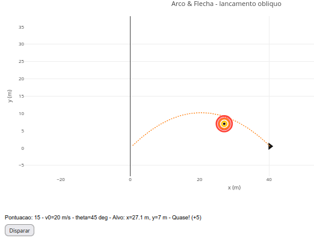](bioquanti/arcoFlecha.html){target="_blank"}
\

### Sugestão {.unnumbered}

```{r, eval=FALSE}
1. Altere o ângulo ("let theta_edit = 45") e/ou a velocidade inicial do disparo ("let v0_edit    = 20") para ajustar a parábola ao alvo;
2. Perceba que a pontuação é flexível: 5 pontos para proximidade do alvo, e 10 pontos quando o acerta.
```
\


##  Piano

### BNCC: F15AR05, EF69AR09, EM13LGG601, EM13LGG604, EM13LGG701 {.unnumbered}
\


[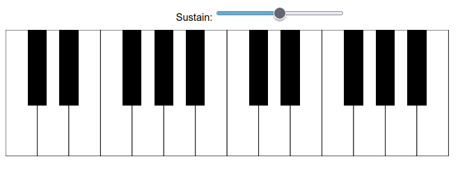](bioquanti/piano.html){target="_blank"}
\

### Sugestão {.unnumbered}

```{r, eval=FALSE}
1. É um piano pequeno, mas é um piano (2 oitavas) !! E como tal, você pode expressar sua aptidão musical com o instrumento polifônico;
2. Para prolongar o som das teclas eleve a barra de "sustentação";
3. Como parte do JSPlotly, o piano pode ser compartilhado sem o código, somente como instrumento para musicalização ou treino, já que é exportado pelo botão "html", preservando sua interatividade e sonorização por mouse ou toque de dedos num dispostivo móvel;
4. Também como parte do JSPlotly, é possível compartilhar o piano com os códigos para alteração junto ao botão "clone";
```

\

##  Game Pong

### BNCC: EF69AR09, EF06MA20, EM13LGG604, EM13LGG701 {.unnumbered}


|   Para a reprodução deste game clássico utilizou-se a biblioteca adicional *p5.js*, voltada para arte interativa, animações e visualizações de dados na web.

[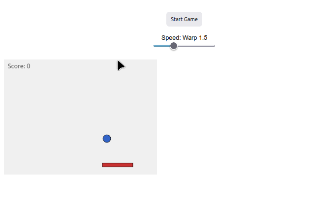](bioquanti/pong.html){target="_blank"}
\

### Sugestão: {.unnumbered}

```{r, eval=FALSE}
1. Se achar que o jogo está lento, mesmo na velocidade 'warp' máxima, é possível alterar seu valor em "var base = Math.pow(1.5, warp);";
2. Se achar que o jogo tá difícil ou fácil demais, é possível alterar o tamanho da raquete em "paddle = { w: 80, h: 10,...";
3. Se desejar aumentar a área do jogo, modifique na linha abaixo (largura, altura):
  "var cv = sk.createCanvas(400, 300).parent('jogoArea');"
```
\


