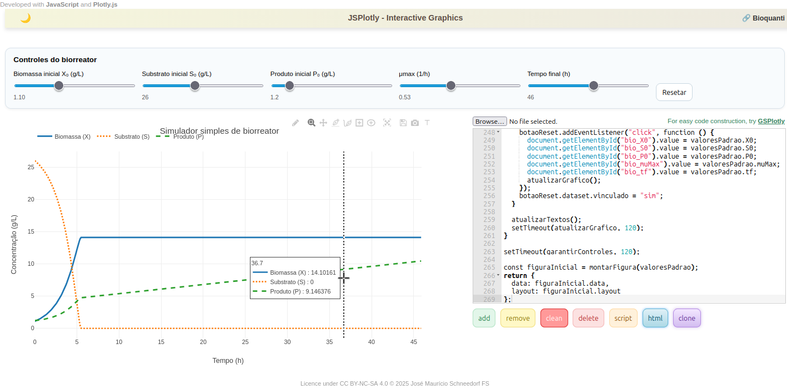

|       Construir um objeto didático-científico no JSPlotly não requer qualquer maestria: basta uma perguntinha ao [GSPlotly](https://chatgpt.com/g/g-6819fbb8d2d08191bf7d50a3dbeadb0d-gsplotly) !!

|    Por outro lado, se desejar algo mais elaborado, com propósito, entradas e saídas claras, com usabilidade otimizada ao usuário, além de componentes interativos que agreguem valor e estímulo às descobertas com o objeto criado...bom, então é melhor seguir um roteiro estruturado. Pode ser qualquer um. Para o momento, sugere-se o fluxo abaixo, e com ítens descritos na sequência.    
\

<div class="text-item">
Concepção --> Desenvolvimento --> Avaliação
</div>


## Matriz de concepção de objetos didáticos com JSPlotly (MCO)

::: {.reminder-item}
1. Ideia principal;
2. Objetivos;
3. Classe do objeto;
4. Tipo de objeto;
5. Nível de interatividade;
6. Conceitos prévios;
7. Grau de abstração;
8. Feedback ao usuário;
9.  Heurísticas;
10. Protótipo
:::

### Ideia principal

|       Apesar de autoexplicativo, sugere-se que uma ideia de objeto didático-científico para o JSPlotly deve levar em conta que:
\

::: text-item
|       ***"Um objeto = Uma pergunta" ***
:::
\

|       Assim, a concepção do objeto deverá exprimir uma situação-problema específica, e que auxilie o aprendiz/audiência na sua interpretação, reduzindo a *carga cognitiva* e mesmo computacional para validar o objeto.

::: text-exemp
**Exemplo:** simular um biorreator simples
:::


### Objetivos

|       Os objetivos podem refletir o que se deseja que o objeto *"faça"* para convergir à melhor compreensão da situação-problema. Nesse caso, sugere-se responder a si próprio....
\

::: text-item
***"se eu quisesse aprender sobre o tema, em que esse objeto me ajudaria ?"***
:::
\

::: text-exemp
**Exemplo:**\

1. Representar graficamente a variaçao de biomassa, substrato e proudto ao longo do tempo;
2. Permitir que o usuário altere os parâmetros iniciais, como teor de substrato, taxa de crescimento, e rendimento celular;
3. Favorecer a compreensão das relações entre consumo de nutrientes, crescimento celular, e formação de metabólitos;
4. Simular cenários simples de operação para comparar diferentes condições de cultivo;
5. Estimular a interpretação de curvas típicas de bioprocessos em contexto introdutório para Química e Biotecnologia.
:::
\

### Classes de objetos

|       São diversos os tipos de objetos didático-científicos que se pode empregar para auxílio em determinada situação-problema. Ilustrando-se, desde uma ferramenta de anaĺise de dados, um objeto multimidático, um mapa com animção, ou um simples gráfico. Independentemente do tipo de objeto que se deseja ilustrar, contudo, é interessante definir previamente a tipologia ou classe do mesmo. Nesse caso, sugere-se as seguintes classes: 
\


::: text-item
| Classes de objeto | Caracterização |
|---|---|
| Visualizador | Apresenta relações conceituais ou dados já definidos, permitindo observação interativa, em caráter predominantemente demonstrativo. |
| Simulador | Permite alterar parâmetros e observar efeitos em um modelo simplificado. |
| Calculadora interativa | Permite ao usuário inserir valores e obter resultados quantitativos. |
| Explorador de cenários | Permite comparar diferentes configurações, condições ou situações. |
| Jogo conceitual | Introduz desafios ou tarefas que exigem aplicação de conceitos científicos. |
:::

::: text-exemp
**Exemplo:**\

Um simulador (por óbvio).
:::
\

### Tipos de objetos

|       Aqui mora a diversão !!!!

|       Uma vez definida a classe de objeto (ou não), e a depender dos objetivos propostos e mesmo da área científica em que o objeto deverá inserir-se, pode-se optar por uma gama ampla de tipos, elencando-se:
\

::: text-item

1. Gráficos interativos (e subtipos);
2. Mapas interativos (e subtipos);
3. Simulações científicas;
4. Animações (objetos, gráficos, mapas);
5. Paineis (dashboards);
6. Experimentos virtuais;
7. Sonorização;
8. Jogos educativos;
9. Instrumentos musicais digitais;
10. Objetos multimídia interativos;
11. Games;
12. Visualizadores de dados;
13. Treinadores de programação;
15. Interfaceamento com hardware (celular, Arduino).

:::

::: text-exemp
**Exemplo:** \

Simulação baseada em gráfico interativos (2D), permitindo a visualização dinâmica das variáveis do biorreator ao longo do tempo.
:::
\


### Níveis de interatividade

| Nível | Características |
|---|---|
| Passivo | O usuário apenas observa resultados, animações ou representações. |
| Reativo | O usuário aciona comandos simples para visualizar respostas do sistema. |
| Manipulável | O usuário ajusta parâmetros ou variáveis do sistema. |
| Exploratório | O usuário formula hipóteses, constrói cenários próprios e investiga consequências. |
\

|   Em paralelo aos níveis propriamente ditos, pode-se complementar o quesito com a sugestão de *widgets* ou componentes variados para agregar valor ao objeto, tanto sob o aspecto de usabilidade, quanto pedagógico (vide seção anterior). 

\


::: text-exemp
**Exemplo:** 
\

Manipulável, com variações nos parâmetros por slider simples.
:::

### Conceitos prévios

|       Aqui é, no dizer dos apaixonados por games, um jogo aberto! Há que se ter em mente apenas quais são os pressupostos necessários para que o usuário agregue valor com o uso do objeto, para que não se perca em conceitos e definições inexistentes em sua *zona proximal de desenvolvimento*. Nesse caso, bastam poucos pressupostos, e não um conhecimento avançado sobre o que envolve a situação-problema.
\

::: text-exemp
**Exemplo:**  \ 
Assume-se que o aprendiz entende que microorganismos crescem ao longo do tempo consumindo substratos energéticos. Assume-se também que ele saiba interpretar relações em um plano cartesiano (letramento gráfico). Por outro lado, para uso do simulador de forma acessível, útil, e mesmo escalável num segundo momento, aceita-se que não é necessário o conhecimento da equação de Monod, de modelagem matemática avançada ou de balanços diferenciais de massa.
:::

### Grau de abstração

|       Indica o nível de representação do fenômeno observado, e pode representar:


|       Esse característica depende do nível de aprendizagem do usuário

| Nível | Caracterização |
|---|---|
| Concreto | Fenômenos ligados a situações cotidianas ou observáveis diretamente. |
| Intermediário | Relação entre grandezas físicas, químicas ou biológicas e modelos simplificados. |
| Abstrato | Interpretação conceitual, simbólica ou sistêmica de fenômenos. 
\


::: text-exemp
**Exemplo:** 

Intermediário.
:::


### Feedback ao usuário

|       Trata-se de incluir a forma de retorno fornecida pelo objeto. Essa pode concretizar-se por diversas indicações visuais, tais como as mediadas por:

::: text-item
1. Mensagens interpretativas;
2. Cor;
3. Gráfico;
4. Valor numérico;
5. Alerta;
6. Comparação com referência.
:::
\ 

::: text-exemp
**Exemplo:** \ 

Atualização dinâmica dos gráficos de biomassa, substrato e produto, permitindo ao usuário perceber diretamente os efeitos das alterações nos parâmetros do sistema.
:::


### Heurísticas 
\

<!-- |       Heurísticas constituem pressupostos para avaliação de usabilidade de um sistema, convergindo para que seja compreensível, previsível e fácil de usar. Os pressupostos mais comumente encontrados, e reportados para objetos midiáticos, como software e páginas de web, envolvem as *dez Heurísticas de Jacob Nielsen* para usabilidade e design de interfaces [@nielsen1994usability]. Essas heurísticas avaliam:

1. Visibilidade do estado do sistema
2. Correspondência entre sistema e mundo real;
3. Controle e liberdade do usuário;
4. Consistência e padrões;
5. Prevenção de erros;
6. Reconhecimento invés de memorização;
7. Flexibilidade e eficiência de uso;
8. Design estético e minimalista;
9. Ajuda para reconhecer e recuperar erros;
10. Ajuda e documentação.

|       Outras classificações heurísticas observam princípios distintos ou complementares aos de Nielsen, como as *regras de ouro para design de interfaces* (Shneiderman - interação humano-computador), os *princípios de design* de Norman (centrado no usuário), os *princípios de design para aprendizado multimídia (Mayer), os *princípios de design de interação* (Preece, Rogers e Sharp), e os *princípios de visualização da informação* de Ware. -->

|       Para a criação de objetos no JSPlotly buscou-se unificar as heurísticas mais relevantes. Em suma, pode-se validar um objeto didático ao JSPlotly para poucos pressupostos:

| Dimensão               | Objetivo                                      |
|-----------------------|-----------------------------------------------|
| Clareza conceitual    | Garantir compreensão do fenômeno representado |
| Usabilidade da interface | Facilitar manipulação e navegação          |
| Eficiência cognitiva  | Reduzir carga cognitiva desnecessária         |
| Percepção visual      | Facilitar interpretação de gráficos e dados   |
\

|       De forma ainda mais enxuta...
\

1. Visibilidade do estado do sistema;
2. Controle e liberdade do usuário;
3. Reconhecimento em vez de memorização;
4. Design minimalista e eficiência da interação.

<!-- |       Por outro lado, pode-se ampliar a avaliação  de heurísticas para cobrir um espectro maior de possibilidades, como descrito abaixo:


| Heurística | Caracterização |
|---|---|
| Visibilidade do estado do sistema | O sistema deve informar claramente ao usuário o que está acontecendo, por meio de respostas visíveis, saídas gráficas, mensagens ou indicadores. |
| Correspondência com o mundo real | A interface e os objetos devem dialogar com convenções, linguagem e situações familiares ao usuário. |
| Controle e liberdade do usuário | O usuário deve poder iniciar, interromper, ajustar, refazer ou limpar ações sem dificuldade. |
| Consistência e padrões | Botões, comandos, símbolos e comportamentos devem manter regularidade ao longo do objeto didático. |
| Prevenção de erros | A construção do objeto deve minimizar ações equivocadas e reduzir ambiguidade de uso. |
| Reconhecimento em vez de memorização | Elementos da interface devem ser facilmente identificáveis, dispensando lembrança prévia de comandos complexos. |
| Design minimalista | A interface deve evitar excesso de informação, mantendo foco nos elementos essenciais à atividade. |
| Ajuda para reconhecer erros | O sistema deve facilitar a identificação de falhas, inconsistências ou entradas inadequadas. |
| Ajuda e documentação | O objeto pode trazer instruções, exemplos, legendas, dicas ou materiais de apoio ao uso. |
| Eficiência da interação | O uso deve ser fluido, com poucos passos, respostas rápidas e boa relação entre esforço e resultado. | -->

::: text-item
**Exemplo:** \ 

1. Correspondência com o mundo real: termos reais utilizados em bioprocessos, unidades coerentes;
2. Visibilidade do estado do sistema: observação de curvas de crescimento microbiano;
3. Controle e liberdade do usuário: sliders e ajustes de parâmetros;
4. Reconhecimento ao invés de memorização: nomes claros para os termos técnicos (biomassa, substrato, etc);
5. Design minimalista: estrutura básica para ensino.
:::

### Protótipo

|       Para o exemplo de um biorreator simples, tal como ilustrado acima, segue uma sugestão para obtenção direta ou *engenharia de prompts* sequencial frente ao GSPlotly, e obtenção do código na sequência:

\

::: text-item
**Exemplo:** \ 

Fazer um simulador simples de biorreator. Mostrar em gráfico o crescimento da biomassa, a queda do substrato e a formação de produto. Colocar controles para mudar os valores iniciais e ver o resultado na hora. Deixar visual limpo e fácil de mexer.
:::


|       A Figura interativa que segue ilustra o resultado obtido numa única interação com *GSPlotly* utilizando-se o prompt acima. O script para o simulador de biorreator pode ser obtido diretamento clicando-se na imagem.

|       O código para o biorreator é dado na sequência. Observe que, à despeito da complexidade do código em suas 269 linhas de programação, bem como da relativa simplicidade de seu produto final, ambos agregam valores ímpares ao aprendiz. Dito dessa forma, o código pode ser melhorado, por um lado, ao mesmo tempo em que o aprendiz incrementa sua percepção e uso das linguagens envolvidas, capitaneando competências digitais com um mínimo esforço, mas com proeminente diversão !!
\ 

[](apps/biorreator.js){download="biorreator.js"}
\


## Código do biorreator

<div class="text-exemp">

```{javascript}
// Simulador simples de biorreator em batelada
// Biomassa (X), Substrato (S) e Produto (P)
// Com controles interativos para atualizar o gráfico em tempo real

const valoresPadrao = {
  X0: 0.2,      // g/L
  S0: 20,       // g/L
  P0: 0.0,      // g/L
  muMax: 0.45,  // 1/h
  Ks: 1.2,      // g/L
  Yxs: 0.5,     // gX/gS
  alpha: 0.25,  // gP/gX
  beta: 0.01,   // gP/(gX.h)
  tf: 30,       // h
  dt: 0.1       // h
};

function simularBiorreator(param) {
  const tempo = [];
  const biomassa = [];
  const substrato = [];
  const produto = [];

  let X = Number(param.X0);
  let S = Number(param.S0);
  let P = Number(param.P0);

  const tf = Number(param.tf);
  const dt = Number(param.dt);
  const muMax = Number(param.muMax);
  const Ks = Number(param.Ks);
  const Yxs = Number(param.Yxs);
  const alpha = Number(param.alpha);
  const beta = Number(param.beta);

  for (let t = 0; t <= tf; t += dt) {
    tempo.push(Number(t.toFixed(2)));
    biomassa.push(X);
    substrato.push(S);
    produto.push(P);

    const mu = muMax * S / (Ks + S + 1e-9);

    const dX = mu * X * dt;
    const dS = -(1 / Yxs) * dX;
    const dP = (alpha * mu * X + beta * X) * dt;

    X = Math.max(0, X + dX);
    S = Math.max(0, S + dS);
    P = Math.max(0, P + dP);

    if (S <= 0.0001) {
      S = 0;
    }
  }

  return { tempo, biomassa, substrato, produto };
}

function montarFigura(param) {
  const resultado = simularBiorreator(param);

  const data = [
    {
      x: resultado.tempo,
      y: resultado.biomassa,
      type: "scatter",
      mode: "lines",
      name: "Biomassa (X)",
      line: { width: 3 }
    },
    {
      x: resultado.tempo,
      y: resultado.substrato,
      type: "scatter",
      mode: "lines",
      name: "Substrato (S)",
      line: { width: 3, dash: "dot" }
    },
    {
      x: resultado.tempo,
      y: resultado.produto,
      type: "scatter",
      mode: "lines",
      name: "Produto (P)",
      line: { width: 3, dash: "dash" }
    }
  ];

  const layout = {
    title: "Simulador simples de biorreator",
    xaxis: {
      title: "Tempo (h)",
      zeroline: false
    },
    yaxis: {
      title: "Concentração (g/L)",
      zeroline: false
    },
    hovermode: "x unified",
    template: "plotly_white",
    legend: {
      orientation: "h",
      x: 0,
      y: 1.12
    },
    margin: {
      l: 60,
      r: 25,
      t: 70,
      b: 55
    },
    annotations: [
      {
        xref: "paper",
        yref: "paper",
        x: 1,
        y: -0.2,
        showarrow: false,
        text:
          "Modelo: μ = μmax·S/(Ks+S) | produção associada ao crescimento e manutenção",
        font: { size: 12, color: "#666" }
      }
    ]
  };

  return { data, layout };
}

function garantirControles() {
  const idPainel = "painel-biorreator-gsplotly";
  let painel = document.getElementById(idPainel);

  if (!painel) {
    const alvo = document.querySelector(".container");
    if (!alvo) return;

    alvo.insertAdjacentHTML(
      "beforebegin",
      `
      <div id="${idPainel}" style="
        margin: 10px 0 16px 0;
        padding: 14px 16px;
        border: 1px solid #d9e2ea;
        border-radius: 12px;
        background: #f8fbfd;
        font-family: Arial, sans-serif;
        box-shadow: 0 1px 4px rgba(0,0,0,0.05);
      ">
        <div style="font-weight: bold; margin-bottom: 12px; font-size: 15px;">
          Controles do biorreator
        </div>

        <div style="
          display: grid;
          grid-template-columns: repeat(auto-fit, minmax(180px, 1fr));
          gap: 12px 16px;
          align-items: end;
        ">
          <label style="display:block;">
            <div style="font-size:13px; margin-bottom:4px;">Biomassa inicial X₀ (g/L)</div>
            <input id="bio_X0" type="range" min="0.05" max="3" step="0.05" value="${valoresPadrao.X0}" style="width:100%;">
            <div id="bio_X0_val" style="font-size:12px; color:#555;"></div>
          </label>

          <label style="display:block;">
            <div style="font-size:13px; margin-bottom:4px;">Substrato inicial S₀ (g/L)</div>
            <input id="bio_S0" type="range" min="1" max="60" step="1" value="${valoresPadrao.S0}" style="width:100%;">
            <div id="bio_S0_val" style="font-size:12px; color:#555;"></div>
          </label>

          <label style="display:block;">
            <div style="font-size:13px; margin-bottom:4px;">Produto inicial P₀ (g/L)</div>
            <input id="bio_P0" type="range" min="0" max="10" step="0.1" value="${valoresPadrao.P0}" style="width:100%;">
            <div id="bio_P0_val" style="font-size:12px; color:#555;"></div>
          </label>

          <label style="display:block;">
            <div style="font-size:13px; margin-bottom:4px;">μmax (1/h)</div>
            <input id="bio_muMax" type="range" min="0.05" max="1.2" step="0.01" value="${valoresPadrao.muMax}" style="width:100%;">
            <div id="bio_muMax_val" style="font-size:12px; color:#555;"></div>
          </label>

          <label style="display:block;">
            <div style="font-size:13px; margin-bottom:4px;">Tempo final (h)</div>
            <input id="bio_tf" type="range" min="5" max="80" step="1" value="${valoresPadrao.tf}" style="width:100%;">
            <div id="bio_tf_val" style="font-size:12px; color:#555;"></div>
          </label>

          <div style="display:flex; gap:8px; align-items:end;">
            <button id="bio_reset" style="
              padding: 9px 12px;
              border: 1px solid #c9d7e1;
              border-radius: 8px;
              background: white;
              cursor: pointer;
            ">Resetar</button>
          </div>
        </div>
      </div>
      `
    );
  }

  const ids = ["bio_X0", "bio_S0", "bio_P0", "bio_muMax", "bio_tf"];

  function lerParametros() {
    return {
      X0: Number(document.getElementById("bio_X0").value),
      S0: Number(document.getElementById("bio_S0").value),
      P0: Number(document.getElementById("bio_P0").value),
      muMax: Number(document.getElementById("bio_muMax").value),
      tf: Number(document.getElementById("bio_tf").value),
      Ks: valoresPadrao.Ks,
      Yxs: valoresPadrao.Yxs,
      alpha: valoresPadrao.alpha,
      beta: valoresPadrao.beta,
      dt: valoresPadrao.dt
    };
  }

  function atualizarTextos() {
    document.getElementById("bio_X0_val").textContent = Number(document.getElementById("bio_X0").value).toFixed(2);
    document.getElementById("bio_S0_val").textContent = Number(document.getElementById("bio_S0").value).toFixed(0);
    document.getElementById("bio_P0_val").textContent = Number(document.getElementById("bio_P0").value).toFixed(1);
    document.getElementById("bio_muMax_val").textContent = Number(document.getElementById("bio_muMax").value).toFixed(2);
    document.getElementById("bio_tf_val").textContent = Number(document.getElementById("bio_tf").value).toFixed(0);
  }

  function atualizarGrafico() {
    atualizarTextos();
    const figura = montarFigura(lerParametros());
    if (window.Plotly && document.getElementById("grafico")) {
      Plotly.react("grafico", figura.data, figura.layout, config);
    }
  }

  ids.forEach((id) => {
    const el = document.getElementById(id);
    if (!el.dataset.vinculado) {
      el.addEventListener("input", atualizarGrafico);
      el.dataset.vinculado = "sim";
    }
  });

  const botaoReset = document.getElementById("bio_reset");
  if (botaoReset && !botaoReset.dataset.vinculado) {
    botaoReset.addEventListener("click", function () {
      document.getElementById("bio_X0").value = valoresPadrao.X0;
      document.getElementById("bio_S0").value = valoresPadrao.S0;
      document.getElementById("bio_P0").value = valoresPadrao.P0;
      document.getElementById("bio_muMax").value = valoresPadrao.muMax;
      document.getElementById("bio_tf").value = valoresPadrao.tf;
      atualizarGrafico();
    });
    botaoReset.dataset.vinculado = "sim";
  }

  atualizarTextos();
  setTimeout(atualizarGrafico, 120);
}

setTimeout(garantirControles, 120);

const figuraInicial = montarFigura(valoresPadrao);
return {
  data: figuraInicial.data,
  layout: figuraInicial.layout
};

```

</div>


## Resumo & Ficha técnica proposta para criação de objeto interativo no JSPlotly

|   A partir das considerações acima, pode-se resumir os pressupostos organizados para convergência a um *"objeto JSPlotly"* numa Ficha Técnica de criação. Para tanto, sugere-se a Ficha abaixo:
\

::: text-item

1. Objeto:
2. Tema:
3. Classe:
4. Tipo:
5. Nível de interatividade:
6. Pressupostos de conhecimento:
7. Objetivo pedagógico:
8. Variáveis manipuladas:
9. Tipo de feedback:
:::

|   Dessa forma, o fluxo metodológico proposto pode ser resumido nas seguintes etapas:


1. Definição do problema de aprendizagem
2. Classificação do objeto na matriz de concepção
3. Planejamento da interação e do feedback ao usuário
4. Desenvolvimento do protótipo mínimo em JSPlotly
5. Avaliação de usabilidade e clareza conceitual
6. Revisão e refinamento do objeto didático

<!-- ### Síntese da estratégia

|   Essa matriz proposta permite integrar três dimensões essenciais no desenvolvimento de objetos educacionais interativos:

1. conteúdo científico (currículo e conceitos físicos)
2. Estratégia pedagógica (objetivos e abordagem didática)
3. Design de interação (usabilidade e experiência do usuário) -->

<!-- 
|   Ampliando um pouco mais, pode-se considerar um *pipeline* de trabalho como:

|   Dessa forma, pode-se considerar um fluxograma final para a criação do objeto como:

<div class="text-item">

conteúdo científico\
↓\
conceito central\
↓\
matriz de concepção\
↓\
design de interação\
↓\
protótipo JSPlotly\
↓\
avaliação pedagógica + usabilidade\
↓\
objeto didático validado\

</div> -->