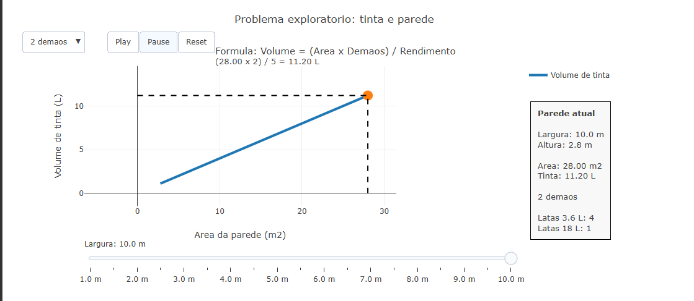

---
title: Problema exploratorio: tinta e parede
---

Este objeto interativo aborda o conceito de area de superficies planas por meio de um problema cotidiano: a quantidade de tinta necessaria para pintar uma parede. O usuario pode investigar como a variacao das dimensoes da parede e do numero de demaos influencia diretamente o volume de tinta requerido.

A proposta do objeto e permitir uma exploracao visual da relacao entre area e consumo de tinta. O grafico apresenta o crescimento do volume necessario em funcao da area da parede, enquanto um painel lateral exibe informacoes numericas atualizadas, incluindo area calculada, litros estimados e numero aproximado de latas de tinta comerciais necessarias.

## Equação:

A quantidade de tinta necessaria pode ser modelada pela relacao:

V = \frac{A \cdot d}{r}

Onde:

- $V$ = volume de tinta necessario (L)
- $A$ = area da parede (m²)
- $d$ = numero de demaos
- $r$ = rendimento da tinta (m²/L)

A area da parede e determinada por:

A = b \cdot h

Onde:

- A = area da parede (m²)
- b = largura da parede (m)
- h = altura da parede (m)

## Download e Uso:

{target="_blank"}
\

Para utilizar o objeto:

1. Clique no botao **Play** para iniciar a animacao e observar como o volume de tinta varia conforme a largura da parede aumenta.

2. Utilize o **slider de largura** para selecionar manualmente diferentes tamanhos de parede e observar os valores correspondentes no grafico.

3. Selecione o numero de **demaos** no menu suspenso para comparar diferentes cenarios de pintura.

4. Consulte o **painel lateral** para visualizar:
   - largura e altura da parede;
   - area calculada;
   - volume estimado de tinta;
   - quantidade aproximada de latas de 3.6 L e 18 L.

::: {.callout-warning}

## Sugestão:

1. Investigue como o consumo de tinta muda quando a largura da parede dobra. O volume de tinta tambem dobra?

2. Compare os resultados para uma mesma parede usando 1, 2 e 3 demaos. O crescimento ocorre de forma proporcional?

3. Verifique quantos metros quadrados podem ser pintados com apenas uma lata de 18 L.

4. Observe como as linhas horizontal e vertical auxiliam na leitura do grafico, relacionando area da parede e volume de tinta.

## Lógica de código

O objeto foi desenvolvido utilizando o Plotly.js em ambiente JSPlotly. O grafico principal representa a relacao entre area da parede e volume de tinta necessario. Um ponto dinamico destaca o estado atual da simulacao, enquanto linhas auxiliares horizontais e verticais facilitam a leitura dos valores no plano cartesiano.

A interatividade e controlada por `frames` do Plotly, permitindo animacoes com os botoes de reproducao, pausa e reinicio. O numero de demaos pode ser alterado por meio de um menu suspenso, modificando os calculos exibidos. Um painel lateral externo ao grafico apresenta os resultados numericos atualizados durante a exploracao.

:::

### Autor: {.unnumbered}

Samuel S. Dias - Escola Estadual Professora Maria Olímpia

<!--- Código

--->