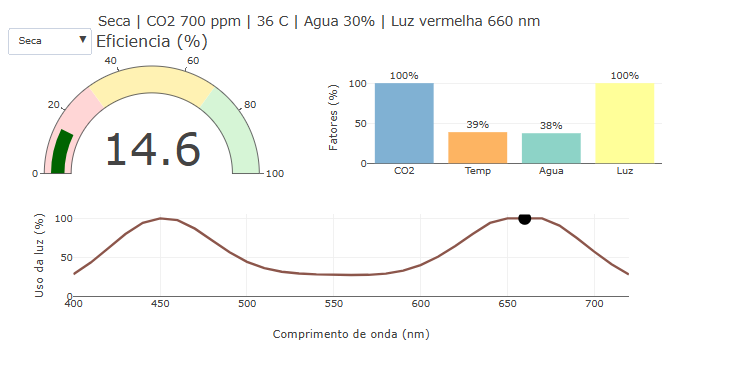

::: {.callout-note}

A fotossíntese é muito importante para as plantas, porque é assim que elas produzem seu próprio alimento. Ela também ajuda na liberação de oxigênio e no equilíbrio do ambiente. Para esse processo acontecer bem, a planta precisa de água, luz, temperatura adequada e gás carbônico.

Nesse objeto interativo, a ideia é mostrar esse conteúdo de um jeito mais fácil de entender. Pelo gráfico, dá para comparar diferentes situações e ver o que acontece quando falta água, tem pouco CO2, a temperatura não está boa ou a luz não é tão bem aproveitada pela planta.
## Equação: 

$$
E = 100 \cdot f_{CO2} \cdot f_T \cdot f_{H2O} \cdot f_L
$$

$$
f_T = e^{-\frac{(T - T_{ideal})^2}{2\sigma^2}}
$$

Onde:

E = eficiência geral da fotossintese

f_{CO2} = fator relacionado a quantidade de gás carbônico

f_T = fator relacionado a temperatura

f_{H2O} = fator relacionado a disponibilidade de água

f_L = fator relacionado a luz absorvida pela planta

T = temperatura do ambiente

T_{ideal} = temperatura ideal para maior eficiência

\sigma = largura da faixa de tolerância a temperatura

## Download e Uso:

{target="_blank"}

::: {.text-center}
Simulador dos fatores que afetam a fotossintese
:::
\

1. Cole  o  código  no  editor  do  JSPlotly  e  clique  em  add.
2. Observe  o  velocímetro  de  eficiência  geral  da  fotossíntese.
3. Compare as barras de CO2, Temp, Água e Luz para identificar qual fator está reduzindo a eficiência..
4. Use  o  menu  de  situações  para  alternar  entre  condição  ideal , pouco  CO2 , frio , seca , luz verde  e  luz azul.
5. Observe  no  gráfico  inferior  como  diferentes  comprimentos  de  onda  da  luz  são  mais  ou  menos aproveitados  pela  planta.
:::

::: {.callout-warning}

## Sugestão: 

1. Compare  a  condição  ideal  com  a situação  de  CO2  baixo  e  observe  qual  barra  diminui.
2. Selecione  Frio  e  veja  como  a  temperatura  afeta  a  eficiência  geral.
3. Escolha  Seca  e  observe  o  impacto  da  pouca água  na  fotossíntese.
4. Compare  Luz  verde, Luz azul e Luz vermelha  para  perceber  que  algumas  cores  são  mais  aproveitadas  pelas  plantas.

## Lógica de código

O  código  simula  a  fotossíntese  a  partir  de  quatro  fatores  principais:  CO2,  temperatura ,  água  e  luz.  Cada  fator  recebe  um  valor entre  0 e  100%,  indicando  se  aquela  condição  está  mais  ou  menos  favorável  para  a  planta.

Depois  disso,  os  fatores  são  combinados  para  calcular  a  eficiência  geral.  Quando  um  deles  está  muito  baixo,  o  resultado  final  também  diminui.  Isso  representa  a  ideia  de  fator  limitante,  ou seja ,  mesmo  que  os  outros  fatores  estejam  bons,  um  único  fator  em  baixa  quantidade  pode  reduzir  o  desempenho  da  fotossíntese.
:::

<!-- **Autor:**

Maria Eduarda Jerônimo Miranda - Curso de Bacharelado em Biomedicina - Universidade Federal de Alfenas (UNIFAL-MG) -->

<!--- Código 

BIO-CEL-FOTO-01

--->