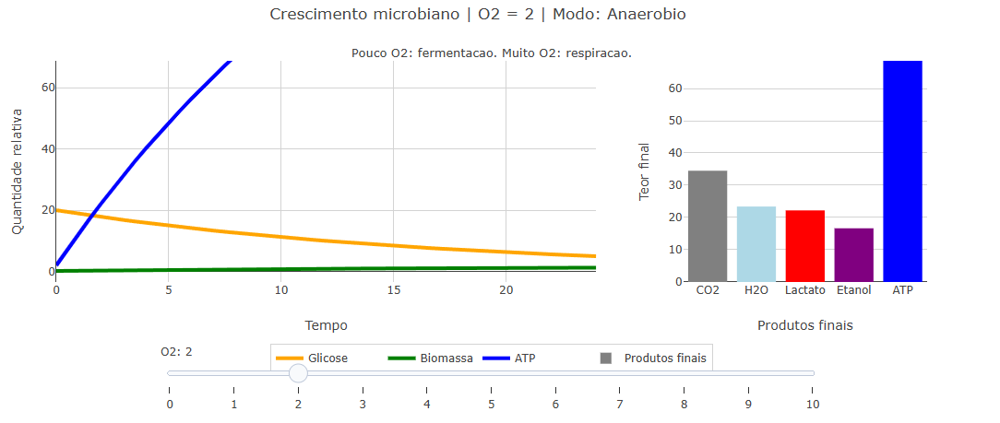

::: {.callout-note}
O crescimento dos microrganismos depende do alimento e das condições do ambiente. Nesta atividade, vamos comparar dois tipos de metabolismo: o aeróbio, que acontece quando há oxigênio, e o anaeróbio, que acontece quando há pouco ou nenhum oxigênio.

O objeto interativo mostra como a quantidade de O2 muda o consumo de glicose, o crescimento dos microrganismos, a produção de ATP e os produtos formados. O gráfico da esquerda mostra o que acontece com o passar do tempo. O gráfico da direita mostra o resultado final da simulação.

## Equação: 

$$G(t)=G_0 e^{-kt}$$

$$ATP(t)=ATP_0+\left[G_0-G(t)\right]\cdot Y_{ATP}$$

Onde:

G(t) = quantidade de glicose restante no tempo t

G0 = quantidade inicial de glicose

k = velocidade relativa de crescimento microbiano

t = tempo

ATP(t) = quantidade de ATP no tempo t

ATP0 = quantidade inicial de ATP

YATP = rendimento de ATP por glicose consumida

## Download e Uso:

{target="_blank"}

::: {.text-center}

No modelo, o rendimento de ATP depende da presença de oxigênio. Com pouco O2, predomina a fermentação, gerando menos ATP. Com muito O2, predomina a respiração aeróbia, gerando mais ATP.
:::

1. Clique no botão add para carregar o objeto interativo.
2. Observe o gráfico da esquerda. Ele mostra, ao longo do tempo, a glicose diminuindo, a biomassa aumentando e o ATP sendo produzido.
3. Observe o gráfico da direita. Ele mostra os produtos finais gerados pela simulação, como CO2, H2O, lactato, etanol e ATP.
4. Use o controle de O2, de 0 a 10, para comparar situações com pouco oxigênio e muito oxigênio.
5. Compare como os dois gráficos mudam juntos. A mudança no O2 altera o tipo de metabolismo e, por isso, modifica tanto as curvas ao longo do tempo quanto os produtos finais.
:::

::: {.callout-warning}

## Sugestão: 

1. Coloque o O2 próximo de 0 e observe o aumento de produtos associados ao metabolismo anaeróbio, como lactato e etanol.
2. Coloque o O2 próximo de 10 e observe o aumento da produção de ATP, CO2 e H2O, caracterizando o metabolismo aeróbio.
3. Compare os valores intermediários de O2 para perceber que a célula pode apresentar comportamento misto, com características aeróbias e anaeróbias.
4. Edite no início do código os valores de glicose inicial, temperatura, ATP inicial, água ou citrato, depois clique novamente em add para observar como essas entradas afetam a simulação.

## Lógica de código

O código usa o valor de O2 para definir se o microrganismo fará mais fermentação ou mais respiração.
Depois, ele calcula quanto de glicose é consumido ao longo do tempo.

Com esse consumo, o modelo estima o crescimento, a produção de ATP e os produtos finais.
Assim, ao mudar o O2, os dois gráficos mudam juntos.

**Estudante**: Curso de Bacharelado em Biomedicina - Universidade Federal de Alfenas (UNIFAL-MG)

:::

**Estudante:** Curso de Bacharelado em Biomedicina - Universidade Federal de Alfenas (UNIFAL-MG).
<!--
**Autor:** 
 
Maria Eduarda Jerônimo Miranda - Curso de Bacharelado em Biomedicina - Universidade Federal de Alfenas (UNIFAL-MG) -->

<!--- Código 

BIO-MIC-BAC-02

---> 