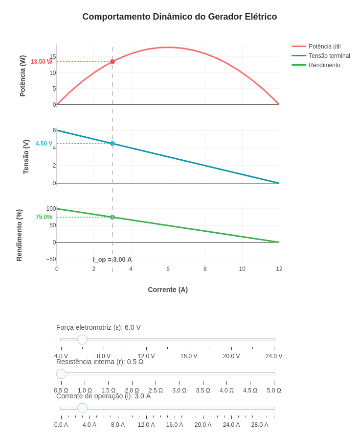

---
title: "Comportamento de um gerador elétrico: potência, tensão e rendimento"
---

::: {.callout-note}

Potência é uma grandeza que relaciona a quantidade de energia transformada com o intervalo de tempo em que a transformação ocorre. No gerador elétrico, ocorre a transformação de determinado tipo de energia (total) em elétrica (útil) e térmica (dissipada). Devido a essa conversão, o rendimento do gerador é sempre menor que 100%, e a tensão terminal (útil) é sempre menor que a força eletromotriz (energia total) fornecida pelo dispositivo.

O objeto interativo a seguir ilustra o comportamento de um gerador real, permitindo a visualização de potência útil, tensão terminal e rendimento em função da corrente elétrica exigida pelo circuito.

## Equações:

O comportamento do gerador real é descrito pelas seguintes expressões fundamentais:

**Potência útil entregue:**
$$
P(i) = i \cdot U(i) = \epsilon \cdot i - r \cdot i^2
$$

**Tensão terminal (Equação do gerador):**
$$
U(i) = \epsilon - r \cdot i
$$

**Rendimento elétrico:**
$$
\eta(i) = 100 \cdot \left(\frac{U(i)}{\epsilon}\right)
$$

Onde:

| Símbolo | Significado |
|:--|:--|
| $\epsilon$ | força eletromotriz (f.e.m.) do gerador |
| $r$ | resistência interna do gerador |
| $i$ | corrente elétrica exigida pelo circuito |
| $P(i)$ | potência útil aproveitada pelo circuito |
| $U(i)$ | tensão terminal (útil) entre os polos |
| $\eta(i)$ | rendimento percentual do gerador |

Considerando, por exemplo, os parâmetros iniciais de uma f.e.m. de $12\text{ V}$, resistência interna de $1.5\ \Omega$ e uma corrente de operação de $4\text{ A}$, temos:

$$
P(4) = 4 \times 6 = 24\text{ W}
$$

$$
U(4) = 12 - (1.5 \times 4) = 6\text{ V}
$$

$$
\eta(4) = 100 \times \left(\frac{6}{12}\right) = 50\%
$$

Ou seja, nestas condições, a tensão terminal cai pela metade e o rendimento do gerador é de exatamente 50%.

## Download e Uso:

{target="_blank"}
:::

::: {.callout-tip}

## Como usar:

1. Clique na imagem para abrir o objeto interativo em uma nova aba.
2. Clique no botão **add** para carregar os gráficos.
3. Use os sliders para ajustar os parâmetros do gerador (f.e.m., resistência interna e corrente de operação) e observe as mudanças nos gráficos.
4. Passe o mouse sobre os gráficos para inspecionar os valores de forma unificada através da linha guia vertical.

:::

::: {.callout-warning}

## Sugestões:

1. Ajuste o terceiro slider para encontrar o ponto de máxima transferência de potência. Note que  isso ocorre exatamente quando o rendimento é de 50%.
2. Diminua a resistência interna ($r$) para valores próximos de zero e observe como o gerador se aproxima de um comportamento ideal, mantendo a tensão terminal e o rendimento altos mesmo para correntes elevadas.
3. Deixe a corrente de operação fixa e mude a força eletromotriz ($\epsilon$). Repare como o pontos marcados se deslocam para aconpanhar o redimensionamento dos gráficos.

## Lógica de código

> 1. Delimita o domínio do gráfico calculando a corrente máxima de curto-circuito ($i_{max} = \epsilon / r$).
> 2. Mapeia as curvas de potência útil ($P$), tensão terminal ($U$) e rendimento ($\eta$) usando valores de corrente de 0 a $i_{max}$.
> 3. Captura o valor da corrente de trabalho definida pelo usuário e calcula as coordenadas exatas do ponto de operação do gerador.

:::

<!-- **Autor:**

Thallysson Luis Teixeira Carvalho - Curso de Bacharelado em Ciência da Computação - Universidade Federal de Alfenas (UNIFAL-MG) -->

<!--- Código 
FIS-ELEC-MAG-01
--->
