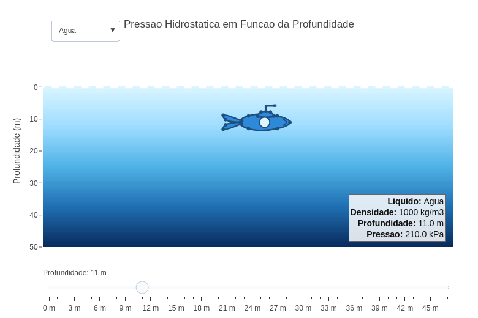

---
title: "Pressão hidrostática em submarino: influência da profundidade e do tipo de fluido"
---

::: {.callout-tip}

À medida que um corpo se submerge em um fluido, a pressão que o envolve aumenta. Esse fenômeno se decorre do fato de que quanto maior a profundidade, maior é a coluna de flúido que o pressiona, aumentando assim a pressão exercida sobre sua superfície.
O objeto interativo a seguir representa um submarino submerso em diferentes líquidos e permite visualizar como a pressão varia ao longo da profundidade. Você pode ajustar a profundidade do submarino e comparar os efeitos em diferentes fluidos.

## Equação:

A pressão hidrostática total é calculada pela expressão:

$$
P(h) = P_0 + \rho g h
$$

Onde:

| Símbolo | Significado |
|:--|:--|
| $P(h)$ | pressão total na profundidade $h$ |
| $P_0$ | pressão atmosférica na superfície |
| $\rho$ | densidade do fluido |
| $g$ | aceleração da gravidade |
| $h$ | profundidade |

Considerando, por exemplo, pressão atmosférica de $1 \ atm = 100000 \, Pa$, água com densidade de $1000 \, kg/m^3$, gravidade igual a $10 \, m/s^2$ e profundidade de $20 \, m$:

$$
P(20) = 100000 + (1000 \times 10 \times 20)
$$

$$
P(20) = 300000 \, Pa
$$

Ou seja, a pressão total a 20 metros de profundidade é igual a $300 \, kPa$.

## Download e Uso:

{target="_blank"}
:::

::: {.callout-note}

## Como usar:

1. Clique na imagem para abrir o objeto interativo em uma nova aba.
2. Clique no botão "add".
2. Utilize o controle deslizante para alterar a profundidade do submarino.
3. Selecione diferentes líquidos no menu suspenso.

:::

::: {.callout-warning}

## Sugestões:

1. Compare o crescimento da pressão em água, óleo e mercúrio.
2. Observe como líquidos mais densos produzem maiores pressões para a mesma profundidade.
3. Analise o comportamento linear da pressão em função da profundidade.

## Lógica de código

> 1. Define os parâmetros físicos do problema, como gravidade, pressão atmosférica e densidade dos fluidos (Constantes: $g = 10 \, m/s^2$, $P_0 = 100000 \, Pa$).
> 2. Calcula a pressão hidrostática usando a equação $P(h)=P_0+\rho gh$.
> 3. Atualiza dinamicamente a posição do submarino conforme a profundidade escolhida.
> 4. Altera automaticamente o gradiente visual ao selecionar diferentes líquidos.
> 5. Atualiza os valores numéricos de profundidade, densidade e pressão em tempo real.

:::

<!-- **Autor:** 

Thallysson Luis Teixeira Carvalho - Curso de Bacharelado em Ciência da Computação - Universidade Federal de Alfenas (UNIFAL-MG) -->

<!--- Código 
FIS-FLU-HIDRO-01
--->
