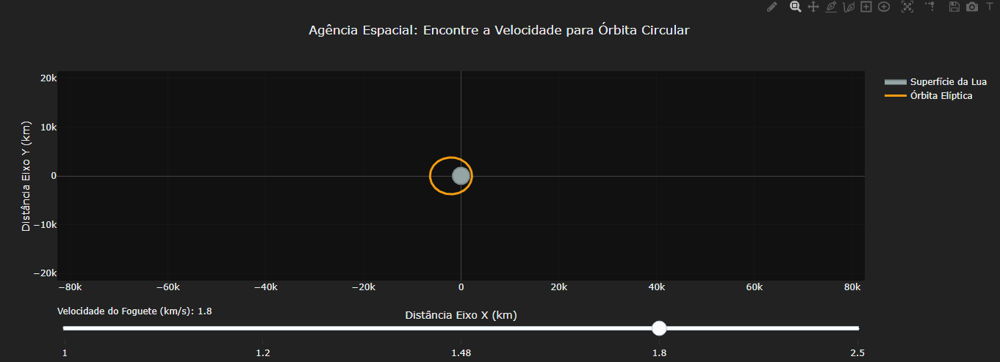

::: {.callout-note}

O objetivo desse código é criar um jogo conceitual interativo de física orbital. Em vez de decorar leis de Newton, o usuário manipula a velocidade de lançamento de um satélite para visualizar de forma dinâmica como a força gravitacional e a inércia determinam a trajetória: uma colisão, uma órbita elíptica estável ou a fuga definitiva para o espaço.

## Equações: 

$$F_c = F_g \implies \frac{m \cdot v^2}{r} = \frac{G \cdot M \cdot m}{r^2}$$

$$v_{\text{circular}} = \sqrt{\frac{\mu}{r}}$$

$$\epsilon = \frac{v^2}{2} - \frac{\mu}{r}$$

$F_c$: Força centrípeta (necessária para manter a trajetória em curva).
$F_g$: Força gravitacional exercida pelo corpo celeste (Lua).
$v_{\text{circular}}$: Velocidade exata para manter uma órbita perfeitamente redonda, onde a gravidade e a inércia se equilibram.
$\mu$: O Parâmetro Gravitacional Padrão ($G \cdot M$). Para a Lua, é aproximadamente $4902 \text{ km}^3/\text{s}^2$.
$\epsilon$: Energia orbital específica. Se $\epsilon < 0$, a órbita é fechada (estável ou colisão). Se $\epsilon \ge 0$, o satélite escapa (parábola/hipérbole).

## Como utilizar:

{target="_blank"}

1. Clique no gráfico acima.
2. Clique em "add" e arraste a barra de velocidade para tentar encontrar a órbita perfeitamente circular (linha verde).
3. Para achar outros resultados: altere os valores de: "mu_lua" e "raio_lua" para simular a Terra, ou modifique o array "velocidades" dentro da seção de layout para testar novos cenários de velocidade tangencial.
:::

::: {.callout-tip}

## Sugestão: 
1: Introduzir a massa do satélite e custo de combustível. É possível criar um cálculo que mostre o gasto de propelente com base na velocidade exigida, premiando a órbita "mais eficiente".
2: Múltiplos Corpos: Adicione um grande círculo representando a "Terra" em coordenadas distantes no gráfico para que as rotas de "Fuga" da Lua se tornem rotas de inserção na órbita terrestre.

## Lógica do código

1. Estabelecimento da "Verdade Absoluta", ou seja, valores inalteráveis. Neste caso, o raio da Lua, o seu parâmetro gravitacional padrão e a altitude estática de partida do satélite ($500\text{km}$).
2. Processamento: A lógica matemática não tem imagens prontas. Ela recebe a velocidade do slider e calcula a energia específica e a excentricidade orbital. Com base nisso, um laço de repetição gera iterativamente as coordenadas X e Y, desenhando passo a passo uma elipse, círculo ou parábola usando funções trigonométricas (Seno e Cosseno).
3. O Empacotamento Visual: O Plotly.js só entende coordenadas. A lógica traduz a física para a linguagem visual criando dois "pacotes" principais (traces). O primeiro pacote preenche a área central em cinza, formando a Lua. O segundo pacote recebe as coordenadas da trajetória calculada para o satélite e recebe uma cor baseada no resultado (ex: Vermelho = Fuga, Roxo = Colisão, Verde = Circular).
4. Sliders: A interface fica "escutando" as interações do usuário na barra de velocidade.
A Lógica de Gatilho: Quando o usuário move o controle de "Velocidade", o slider dispara um comando interno de atualização (`method: "update"`). Esse comando orienta o gráfico: "Descarte as coordenadas antigas do satélite. Insira o novo valor de velocidade no motor de cálculo, pegue os novos dados de X, Y e cor da nova trajetória e substitua imediatamente o traço exibido na tela".
:::

**Estudante:** Curso de Bacharelado em Ciência da Computação - Universidade Federal de Alfenas (UNIFAL-MG).

<!-- **Autor:** 
Luiz Gabriel da Silva Cabrera, Ciência da Computação, Unifal-MG

#### Código {.unnumbered}
FIS-GRAV-ORB-01 -->