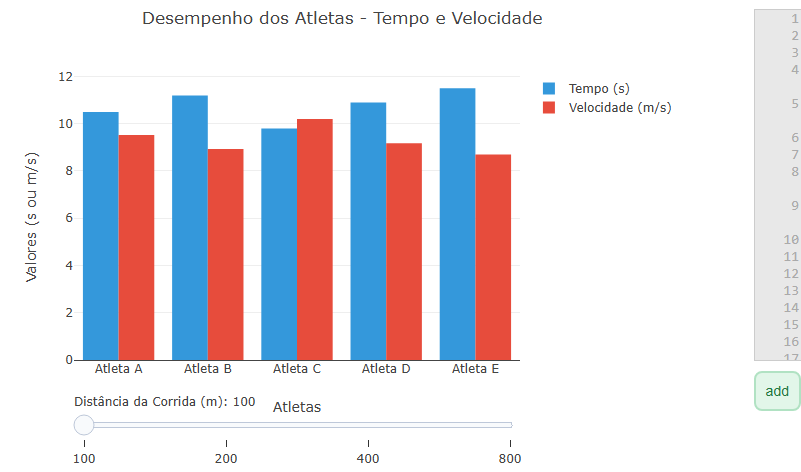

---
title: "Relação entre massa,energia e velocidade em colisões"
---

::: {.callout-tip}

O objeto interativo tem como objetivo calcular a relação entre massa,velocidade e energia para entender os efeitos em diferentes colisões.Onde pequenos aumentos na velocidade podem gerar impactos muito intensos.A energia envolvida em colisões pode causar deformações , sendo assim, veículos e objetos maiores tendem a ter consequências mais severas.

Sendo assim, o objeto interativo permite explorar diferentes cenários, com os objetos de diferentes massas , e velociades diferentes.Essa experiência pode ser praticada com poucos cliques através do menu suspenso escolhendo as opções(humano, bike, moto, carro, onibus ou trem) e até mesmo a velocidade.

## Equação: 

A análise deste objeto interativo é baseada em duas equações fundamentais :

$$
E = \frac{1}{2}mv^2
$$

$$
F = \frac{E}{d}
$$

Onde:

E = energia cinética (J)
m = massa do veículo (kg)
v = velocidade (m/s)
F = força média de impacto (N)
d = distância de parada ou deformação durante a colisão (m)

## Download e Uso:

{target="_blank"}
\

1-Clique no botão add no ambiente do JSPlotly para executar o script.
2-Observe o gráfico inicial, que exibe a relação entre velocidade, energia e força para um veículo padrão.
3-Utilize o menu suspenso  para selecionar o tipo de veículo .
4-Use o controle deslizante para ajustar a distância de colisão.
:::

::: {.callout-caution}

## Sugestão: 

* Compare diferentes veículos na mesma velocidade para perceber como a massa influência o impacto.

* Mantenha o veículo fixo e aumente a velocidade para observar como a energia cresce.

* Varie a distância de parada para entender como sistemas de segurança  reduzem a força do impacto. 

## Lógica de código

O código define massas para diferentes veículos e gera uma lista de velocidades. Em seguida, calcula a energia cinética e a força de impacto para cada velocidade.
Esses valores são usados para construir um gráfico com duas curvas (energia e força). A interatividade permite alterar o veículo  e a distância de colisão, mudando assim os resultados exibidos.

:::

<!-- **Autor:**

Guilherme Oliveira Araujo - Curso de Bacharelado em Ciência da Computação - Universidade Federal de Alfenas (UNIFAL-MG) -->

<!--- Código 
FIS-MEC-CIN-02
--->

