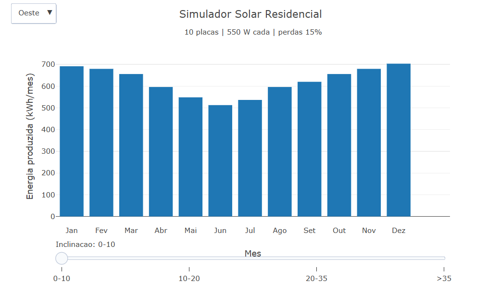

---
title: "Simulador Solar Residencial"
---

::: {.callout}
Este objeto interativo processa a relação entre variáveis geográficas e parâmetros de engenharia para calcular a geração de energia fotovoltaica projetada. 
O sistema utiliza valores de insolação base mensal e coeficientes de correção baseados na orientação e inclinação dos módulos para determinar o potencial energético ao longo do ano. 
Através da manipulação de variáveis como a quantidade de placas, potência nominal e perdas estruturais, o modelo gera uma projeção do comportamento de produção individualizado. 
A estrutura do simulador fundamenta-se em um modelo matemático que aplica fatores multiplicativos de atenuação para simular a eficiência real do sistema em um ciclo de 12 meses. 
O processamento dos dados resulta em gráficos de barras que correlacionam a sazonalidade mensal com o volume de quilowatts-hora (kWh) gerado, permitindo a análise técnica de diferentes configurações de instalação. 
A interface possibilita a transição entre orientações cardeais e ângulos de inclinação por meio de menus interativos e controles deslizantes, fornecendo dados quantitativos sobre o rendimento estimado em cada cenário configurado.
:::

::: {.callout-important}
## Lógica de código
1. O funcionamento do sistema baseia-se em uma arquitetura reativa parametrizada por matrizes de dados estruturados, controlados por listeners da interface gráfica. O fluxo lógico opera através do mapeamento sequencial de índices temporais correspondentes aos meses do ano, que alteram dinamicamente os valores de saída no vetor bidimensional do gráfico.
2. Ao disparar a simulação, o algoritmo executa primeiramente uma função de cálculo que intercepta as chaves de entrada para orientação e inclinação através de arrays de coeficientes. Ao atingir o índice selecionado, o sistema interrompe o estado anterior da renderização, recupera o vetor de insolação diária e aplica um operador multiplicativo contínuo para converter parâmetros nominais e perdas estruturais em volume real de energia.
3. Nas etapas finais, a lógica de plotagem mapeia os resultados gerados por meio do método de iteração map e reconstrói dinamicamente os eixos cartesianos da aplicação. Este bloco injeta as matrizes atualizadas no array de dados do Plotly, insere anotações técnicas no cabeçalho do layout e atualiza as strings de renderização interativa (hover) para exibir de forma estática o volume de quilowatts-hora por ciclo mensal configurado.

## Equação: 

$$E_{\text{m}}(m, o, i) = \frac{N \cdot P \cdot H(m) \cdot \Delta t \cdot \eta \cdot [f_{\text{ori}}(o) \cdot f_{\text{inc}}(i)]}{1000}$$
$E_{\text{m}}(m, o, i)$ = Energia mensal estimada gerada no mês $m$ (em $\text{kWh/mês}$, com $m$ de 0 a 11).

$H(m)$ = Média de insolação diária do mês $m$ (horas de sol pleno, conforme vetor histórico).

$f_{\text{ori}}(o)$ = Fator de correção para a orientação $o$ ($[0.7, 0.85, 1.0, 0.9]$ para Leste, Oeste, Norte e Sul).

$f_{\text{inc}}(i)$ = Fator de correção para a inclinação $i$ ($[0.85, 0.95, 1.0, 0.9]$ para as faixas de $0^\circ$ a $>35^\circ$).

$N$ = Quantidade de módulos fotovoltaicos utilizados ($N = 10$).

$P$ = Potência nominal de cada placa ($P = 550 \text{ W}$).

$\Delta t$ = Período de tempo considerado para o cálculo padrão ($\Delta t = 30 \text{ dias}$).

$\eta$ = Rendimento líquido do sistema após perdas estruturais ($\eta = 0.85$, equivalente a $15\%$ de perdas).
:::

::: {.callout-note} 
## Download e Uso:
{target="_blank"}
1. Clique no botão “add” para carregar o simulador fotovoltaico e a interface gráfica no JSPlotly.
2. Utilize o menu suspenso de orientação cardeal para alternar entre as opções Leste, Oeste, Norte e Sul, modificando o fator de captação solar.
3. Ajuste o controle deslizante de inclinação para navegar manualmente pelas diferentes faixas angulares dos módulos, observando o impacto direto na eficiência do sistema.
4. Observe a transição dinâmica das barras no gráfico, identificando as variações sazonais da produção de energia em quilowatts-hora (kWh) ao longo dos 12 meses do ano sob o cenário configurado.
:::

::: {.callout-caution}

## Sugestão: 
1. Avance manualmente o slider de inclinação até a faixa máxima ">35" para observar como o modelo matemático altera instantaneamente o perfil das barras, simulando a perda de rendimento por desvio angular severo.
2. Interaja com os botões de orientação e foque nos meses de Junho e Julho para analisar o comportamento da curva de geração fotovoltaica durante o período de menor insolação base.
3. Fixe a configuração na etapa ideal "Norte" e inclinação "20-35" para correlacionar visualmente o pico de produção no gráfico de barras com o indicador fixo de potência nominal e atenuação sistêmica de 15%.
4. Alterne rapidamente entre os botões "Leste" e "Oeste" para avaliar a simetria dos fatores multiplicativos de atenuação no arranjo e o retorno dos valores de quilowatts-hora (kWh) às suas respectivas linhas de base.

:::

<!-- **Autor:**

Thalles Henrique Gonzaga Rosa Pereira - Ciência da Computação (UNIFAL-MG) -->

<!--- Código 
FIS-MEC-EN-01
--->

