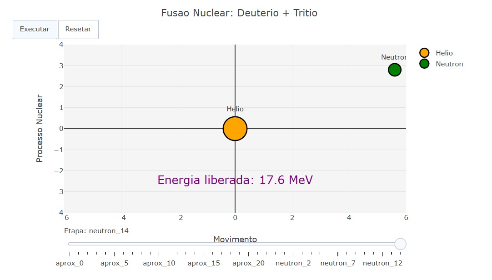

---
title: "Animação de Fusão Nuclear"
---

::: {.callout}
Este objeto interativo processa a simulação visual e temporal do processo de fusão nuclear entre os isótopos de Deutério e Trítio para modelar a dinâmica de uma reação nuclear. O sistema utiliza uma estrutura de dados sequencial baseada em quadros para gerenciar a transição de estados das partículas, controlando propriedades de visibilidade, posicionamento cartesiano e escala dos marcadores em tempo real. Através de eixos bidimensionais parametrizados, o modelo renderiza de forma cronológica as etapas de aproximação vetorial, o ponto crítico de colisão e a subsequente separação dos produtos resultantes da reação.

A estrutura do simulador fundamenta-se em uma linha do tempo dinâmica que aplica deslocamentos lineares iterativos para simular a trajetória das partículas e a dispersão do Nêutron e do Hélio gerados. O processamento dos dados resulta em um gráfico animado interativo controlado por botões de execução e um controle deslizante, permitindo a análise técnica do comportamento e da liberação energética de 17.6 MeV associada ao protocolo físico. A interface possibilita o controle direto sobre o fluxo da animação e o reajuste instantâneo dos estados, fornecendo uma representação visual quantitativa e didática sobre a mecânica da fusão configurada.
:::

::: {.callout-important}
## Lógica de código
1. O funcionamento do sistema baseia-se em uma linha do tempo segmentada em fases de execução, controladas pelo motor de animação. O fluxo lógico opera através da renderização sequencial de quadros (frames), que alteram dinamicamente os estados, posições e visibilidade dos elementos na tela.
2. Ao disparar a animação, o motor executa primeiro um laço que translada os reagentes em sentidos opostos até a origem através de um decremento linear de posição. Ao atingir o ponto de convergência, o algoritmo interrompe o estado anterior, oculta as partículas iniciais e ativa momentaneamente um marcador de grande escala para simular o ápice físico da colisão.
3. Nas etapas finais, a lógica estabiliza o núcleo de Hélio gerado na origem e inicia um segundo laço de repetição. Este laço aplica funções paramétricas para deslocar o Nêutron em uma trajetória diagonal contínua e atualiza a string de texto para exibir a liberação constante

## Equação: 

$$X_{d}(i) = -5 + 0.25 \cdot i \quad \text{e} \quad X_{t}(i) = 5 - 0.25 \cdot i$$
$$X_{n}(j) = 0.4 \cdot j \quad \text{e} \quad Y_{n}(j) = 0.2 \cdot j$$
$$E_{\text{liberada}} = 17.6 \text{ MeV}$$

$X_{d}(i)$ = Posição cartesiana no eixo x do isótopo de Deutério no frame $i$ ($i$ variando de 0 a 20)
$X_{t}(i)$ = Posição cartesiana no eixo x do isótopo de Trítio no frame $i$ ($i$ variando de 0 a 20)
$X_{n}(j)$ = Posição cartesiana no eixo x do Nêutron livre no frame de dispersão $j$ ($j$ variando de 0 a 14)
$Y_{n}(j)$ = Posição cartesiana no eixo y do Nêutron livre no frame de dispersão $j$ ($j$ variando de 0 a 14)
$E_{\text{liberada}}$ = Magnitude da energia cinética resultante liberada pelo processo de fusão exotérmica
:::
 

::: {.callout-note}
## Download e Uso:
.html){target="_blank"}

1. Clique no botão “add” para carregar o simulador e a interface gráfica no JSPlotly.
2. Utilize os controles de play, pause e reset para iniciar, pausar ou reiniciar a animação da reação de fusão.
3. Ajuste o controle deslizante para navegar manualmente pelos frames da simulação, observando as posições relativas dos isótopos e dos produtos ao longo do tempo.
4. Observe a transição dinâmica dos estados físicos, identificando o ponto exato da reação de fusão, a formação do Hélio e a vetorização de escape do Nêutron com a respectiva liberação de energia.
:::

::: {.callout-caution}

## Sugestão: 
1. Avance manualmente o slider até o ponto de "colisão" para observar como o sistema altera instantaneamente o tamanho e a opacidade dos marcadores, simulando o instante crítico da fusão.
2. Execute a animação continuamente e foque no quadrante superior direito para analisar a trajetória paramétrica e a velocidade vetorial de escape do Nêutron após a reação.
3. Congele a animação na etapa final "neutron_14" para correlacionar visualmente o Hélio formado na origem com o indicador de energia cinética liberada.
4. Alterne rapidamente entre os botões "Executar" e "Resetar" para avaliar a consistência do modelo cinemático e o retorno das partículas de Deutério e Trítio às suas coordenadas cartesianas iniciais.

:::

<!-- **Autor:** 

Thalles Henrique Gonzaga Rosa Pereira - Ciência da Computação (UNIFAL-MG) -->

<!--- Código 
FIS-MOD-NUCL-01
--->

