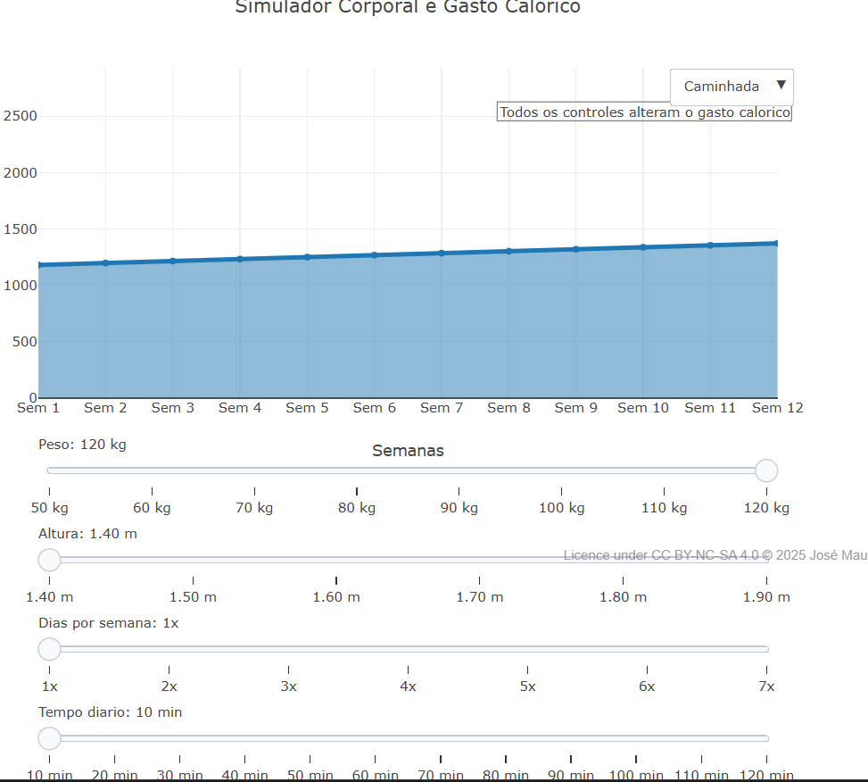

---
title: "Simulador Corporal de Gasto Calórico"
---

::: {.callout-note}

Este objeto interativo processa a relação entre variáveis antropométricas e parâmetros de treinamento para calcular o gasto calórico projetado. O sistema utiliza valores de Equivalente Metabólico (MET) e ajustes de eficiência baseados na estatura para determinar a energia despendida em diferentes modalidades esportivas. Através da manipulação de variáveis como peso, altura, frequência semanal e tempo de execução, o modelo gera uma projeção do comportamento energético individual.

A estrutura do simulador fundamenta-se em um modelo matemático que aplica um coeficiente de adaptação linear ao longo de um período de 12 semanas. O processamento dos dados resulta em gráficos de dispersão que correlacionam o tempo de prática com o volume calórico, permitindo a análise técnica de diferentes protocolos de exercício. A interface possibilita a transição entre estados físicos e atividades, fornecendo dados quantitativos sobre a demanda metabólica estimada em cada cenário configurado.
:::

::: {.callout-important}
## Lógica de código
1. O código inicializa uma interface interativa com sliders para variáveis antropométricas e um menu para modalidades esportivas. Cada controle ajusta dinamicamente parâmetros como peso, altura, frequência e duração do treino, que alimentam o cálculo de gasto energético.
2. Ao manipular os controles, a função calcularSerie executa uma simulação baseada no Equivalente Metabólico. O algoritmo aplica um ajuste de eficiência pela estatura e um coeficiente de adaptação que incrementa o gasto calórico linearmente ao longo de 12 semanas.
3. Os resultados são armazenados em vetores e processados para gerar um gráfico de dispersão com área, permitindo a visualização da evolução do gasto calórico ao longo do tempo.
4. ao final, o sistema apresenta uma análise detalhada do gasto calórico semanal, considerando as variáveis individuais e a intensidade da atividade física selecionada.

## Equação: 
  $$Kcal_{i} = MET \cdot P \cdot T \cdot D \cdot F_h \cdot A_i$$
  $$F_h = 1 + ((1.75 - H) \cdot 0.15)$$
  $$A_i = 1 + (i \cdot 0.015)$$
  $$IMC = \frac{P}{H^2}$$
  Onde:$Kcal_i$ = Gasto calórico previsto para a semana 
  $i$$MET$ = Equivalente Metabólico da tarefa (intensidade da atividade)
  $P$ = Peso corporal (kg)
  $H$ = Altura (m)
  $T$ = Tempo de treino convertido em horas
  $D$ = Frequência (dias por semana)
  $F_h$ = Fator de eficiência baseado na altura
  $A_i$ = Coeficiente de adaptação para a semana 
  $i$ ($i$ variando de 1 a 12)
  $IMC$ = Índice de Massa Corporal
:::

::: {.callout-note}
## Download e Uso:
{target="_blank"}

1. Clique no botão “add” para carregar o simulador e a interface gráfica no JSPlotly.

2. Utilize os sliders para configurar os parâmetros individuais de Peso, Altura, Frequência semanal e Tempo diário de treino.

3. Selecione a atividade física no menu dropdown para alternar entre diferentes intensidades metabólicas  e observar o impacto no gráfico.

4. Interaja com os controles para atualizar as projeções de queima energética de forma dinâmica através dos frames de animação.

5. Observe a variação semanal das calorias previstas ao longo de 12 semanas, identificando como o fator de adaptação e as características corporais influenciam o gasto energético total.

:::

::: {.callout-caution}

## Sugestão: 
1. Aumente o peso e reduza a altura para observar como o fator de eficiência corporal eleva a projeção de queima calórica.
2. Alterne entre "Caminhada" e "Corrida" no menu de atividades para comparar o impacto do equivalente metabólico no volume total de energia despendida.
3. Ajuste o tempo diário e a frequência semanal simultaneamente para identificar qual variável possui maior peso na variação da curva calórica ao longo das semanas.
4. Compare os resultados entre a Semana 1 e a Semana 12 para analisar o efeito acumulado do coeficiente de adaptação progressiva no sistema.

## Lógica de código
O código inicializa uma interface interativa com sliders para variáveis  e um menu para modalidades esportivas. Cada controle ajusta dinamicamente parâmetros como peso, altura, frequência e duração do treino, que alimentam o cálculo de gasto energético.

Ao manipular os controles, a função calcularSerie executa uma simulação baseada no Equivalente Metabólico. O algoritmo aplica um ajuste de eficiência pela estatura e um coeficiente de adaptação que incrementa o gasto calórico linearmente ao longo de 12 semanas.

Os resultados são armazenados em vetores e processados para gerar um gráfico de dispersão com área.

:::

<!-- **Autor:** 

Thalles Henrique Gonzaga Rosa Pereira - Ciência da Computação (UNIFAL-MG) -->

:::

<!--- Código 
MAT-ALG-MATR-01
--->
