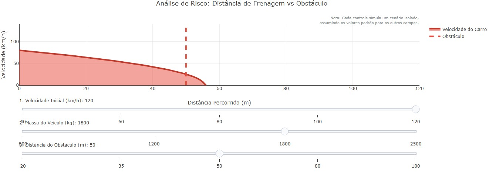

::: {.callout-tip}

O objetivo desse código é criar um simulador interativo de segurança viária baseado nas leis da física clássica. Em vez de decorar o Teorema do Trabalho e Energia Cinética, o usuário manipula variáveis reais (Massa do carro, Velocidade Inicial e Distância de um Obstáculo) para visualizar de forma dinâmica a curva de desaceleração. O gráfico revela visualmente se o veículo conseguirá parar a tempo ou se a inércia resultará em uma colisão.

## Equações: 

$$E_k = \frac{m \cdot v^2}{2}$$

$$W = F_{\text{freio}} \cdot d$$

$$d_{\text{frenagem}} = \frac{m \cdot v^2}{2 \cdot F_{\text{freio}}}$$

$E_k$: Energia Cinética acumulada pelo veículo em movimento.
$W$: Trabalho realizado pelo sistema de freios para dissipar a energia.
$m$: Massa do veículo em quilogramas (kg).
$v$: Velocidade do veículo em metros por segundo (m/s).
$F_{\text{freio}}$: Força constante de frenagem aplicada pelos pneus contra o asfalto (N).
$d_{\text{frenagem}}$: A variável dependente. A distância total em metros percorrida até a parada completa ($v = 0$).

## Como utilizar:

{target="_blank"}
\

1. Clique no gráfico acima;
2. Clique em "add" e arraste as barras (sliders) para alterar os cenários; 3. Observe se a curva azul de velocidade cruza a linha tracejada vermelha (Obstáculo) antes de chegar a zero (Colisão!).
4. Para achar outros resultados: altere a constante "forca_freio" no início do código. Valores menores simulam uma pista molhada ou pneus carecas, aumentando drasticamente a distância de parada.
:::

::: {.callout-warning}

## Sugestão: 
1: Introduzir o "Tempo de Reação". Antes do motorista pisar no freio, o carro percorre uma distância em velocidade constante ($d = v \cdot t$). Você pode adicionar 1 a 2 segundos de atraso antes da curva de frenagem começar a cair.
2: Limites de Via: Adicione áreas de preenchimento verdes e vermelhas no fundo do gráfico para sinalizar os limites de velocidade urbana (ex: 60 km/h) e rodoviária.
3: Inverter a lógica: Em vez de calcular a distância, fixe a distância do obstáculo e calcule qual a velocidade máxima permitida para não bater.

### Lógica do código

1. Estabelecimento da "Verdade Absoluta", ou seja, valores inalteráveis. Neste caso, a capacidade máxima de frenagem do carro (força de atrito estipulada em 8000 Newtons) e os valores base para os controles deslizantes.

2. Processamento: A função matemática converte a velocidade de km/h para m/s, calcula a distância total de parada usando o Teorema do Trabalho e gera iterativamente uma curva decrescente (raiz quadrada) que representa a perda de velocidade a cada metro avançado.

3. O Empacotamento Visual: O Plotly.js desenha dois elementos gráficos principais (traces). O primeiro é a curva de frenagem do carro, preenchida em azul, que mostra a velocidade caindo até tocar o eixo horizontal. O segundo é uma barreira visual (linha tracejada vermelha) que representa o obstáculo na pista.

4. Sliders (Eventos Declarativos): Foram criados três controles deslizantes independentes (Velocidade, Massa e Distância do Obstáculo). 
A Lógica de Gatilho: Como o ambiente do JSPlotly usa atualização declarativa pura, cada slider recalcula o cenário assumindo as variáveis base para as demais opções. Quando você move a "Velocidade", ele injeta os novos vetores de coordenadas na curva azul e verifica instantaneamente se o espaço necessário excede o espaço disponível.
:::

**Estudante:** Curso de Bacharelado em Ciência da Computação - Universidade Federal de Alfenas (UNIFAL-MG).

<!-- **Autor:**
Luiz Gabriel da Silva Cabrera, Ciência da Computação, Unifal-MG

#### Código {.unnumbered}
MAT-CALC-DERIV-01 -->
