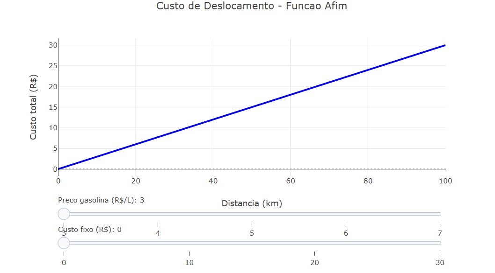

---
title: "Distância percorrida e tarifa"
---

::: {.callout}
A gestão financeira pessoal e empresarial muitas vezes esbarra na dificuldade de prever gastos variáveis, como o custo de deslocamento logístico ou viagens cotidianas. O problema central que essa lógica resolve é a visualização da previsibilidade de gastos através da função afim, ou função do primeiro grau. Ao cruzar variáveis como o preço oscilante dos combustíveis e a eficiência do veículo, conseguimos transformar dados abstratos em uma projeção real de custo por quilômetro rodado. Isso permite que uma pessoa ou empresa entenda exatamente como pequenos aumentos no posto de gasolina impactam o orçamento final de uma rota de 100 km, facilitando a tomada de decisão sobre qual veículo utilizar ou se o frete cobrado é realmente lucrativo.

O material didático focado na função afim utiliza dois componentes principais: o coeficiente angular e o coeficiente linear. No contexto de transporte, o custo fixo (como uma taxa de despacho ou manutenção básica) representa o coeficiente linear — o ponto de partida no gráfico onde o gasto começa antes mesmo de o carro se mover. Já o custo variável por quilômetro representa o coeficiente angular, que determina a inclinação da reta; quanto mais caro o combustível, mais íngreme é a subida dos custos. Compreender essa estrutura matemática é essencial para dominar o planejamento financeiro, pois revela que, embora a distância seja constante, o custo total é uma balança dinâmica entre taxas obrigatórias e a eficiência operacional do consumo.

:::

::: {.callout-important}
## Lógica de código
A lógica do objeto organiza a simulação financeira de uma viagem através de uma estrutura matemática de função afim  seguindo este passo a passo:

1.  O objeto estabelece primeiro a amplitude da simulação (uma distância de 0 a 100 km) e a performance do veículo (quantos quilômetros ele percorre com um único litro de combustível).
2. Calcula-se o custo por quilômetro rodado dividindo o preço atual do combustível pela eficiência do carro; esse valor será a inclinação da reta no gráfico (coeficiente angular).
3. Para cada quilômetro da rota, o sistema soma o custo variável (distância vezes custo por km) a um valor fixo inicial (coeficiente linear), gerando o custo total do deslocamento.
4. Por meio de seletores (sliders), o código permite alterar instantaneamente o preço do combustível ou o custo fixo, atualizando a linha do gráfico para mostrar como essas mudanças afetam o bolso em tempo real.

## Equação: {.unnumbered}
A equação principal que rege o código é uma função afim :
$$ C_{total} = \left( \frac{P_{combustivel}}{E_{veiculo}} \right) \cdot d + C_{fixo}
$$
Onde:$C_{total}$: Custo total da viagem em reais.

$P_{combustivel}$: Preço do combustível por litro (R$/L).

$E_{veiculo}$: Eficiência do carro (km/L).

$d$: Distância percorrida (km).

$C_{fixo}$: Valor inicial que não depende da distância (R$).
:::

::: {.callout-note}
## Download e Uso:
 
{target="_blank"}  

1. Copie o código JavaScript fornecido para criar o modelo interativo de custos.
2. Abra o <a href="https://bioquanti.netlify.app/pt/nivel/superior/jsplotly/jsplotly2" target="_blank">JsPlotly</a> e importe os arquivos para visualizar o objeto.
3. Clique no botão "Add" no JSPlotly, cole o código e execute para gerar o gráfico de "Custo de Deslocamento".
4. Utilize o primeiro slider (Preço gasolina) para observar como a inclinação da reta aumenta ou diminui. Note que, quanto mais caro o combustível, mais rápido o custo total sobe conforme a distância aumenta.
5. Utilize o segundo slider (Custo fixo) para simular taxas de saída ou fretes base. Observe que isso desloca a reta inteira para cima ou para baixo no eixo vertical (Y), alterando o ponto de partida do gasto.
6. Passe o mouse sobre a linha para ver o valor exato em reais para cada quilômetro específico dentro do intervalo de 0 a 100 km.
:::

::: {.callout-caution}
## Sugestão: 

1. Coloque o custo fixo em 0 e observe como a reta parte exatamente da origem (0,0), mostrando que não há gasto sem deslocamento.
2. Mantenha o custo fixo parado e alterne entre o menor e o maior preço de gasolina para ver como a inclinação da reta muda drasticamente.
3. Ajuste o custo fixo para o valor máximo (30) e veja como, mesmo para uma distância de 0 km, o gráfico já indica um valor a ser pago.
4. Escolha um preço de combustível e verifique o custo para 50 km; depois, veja o valor para 100 km e analise como a parte variável do custo dobra de tamanho.

:::
<!-- **Autor:**

Thalles Henrique Gonzaga Rosa Pereira - Ciência da Computação (UNIFAL-MG) -->

<!--- Código 
MAT-FUN-AF-01
--->