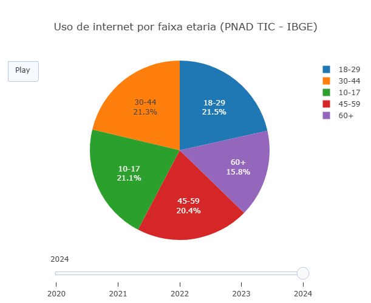

::: {.callout-tip}

Quando falamos sobre fake news não podemos esquecer a diferença da faixa etária que existe na população ao acessar esse tipo de conteúdo. Segundo os dados realizados em 2024 pelo PNAD Contínua (IBGE), o público sênior/idosos têm uma porcentagem de 69,8% que têm mais possibilidade de acessarem esse tipo de conteúdo, por conta da vulnerabilidade literacia digital, analfabetismo funcional e a exposição crescente a redes sociais. Em um outro estudo de 2023, mostra que 43% dos jovens não sabem checar se uma notícia ou informação é falsa, tendo como um resultado uma maior propagação dessa fake news. Em adultos, existe um consumo significativo de notícias online e um alto índice de compartilhamento que confirmam crenças pessoais, o que também contribui para a disseminação de desinformação.

## Equação: 
$$
a \in \{10\text{-}17,\; 18\text{-}29,\; 30\text{-}44,\; 45\text{-}59,\; 60+\}
t \in \{2020, \ldots, 2024\}
f(a,t) \in [0,100]
$$

Faixas etarias
const faixas = ["10-17", "18-29", "30-44", "45-59", "60+"];

Anos
const anos = ["2020", "2021", "2022", "2023", "2024"];

{target="\_blank"} 
\

1. aqui pode alterar a faixa etaria, anos 

 faixas etarias
const faixas = ["10-17", "18-29", "30-44", "45-59", "60+"];

 anos
const anos = ["2020", "2021", "2022", "2023", "2024"];

:::

::: {.callout-caution}

## Sugestão:
1.Trocar o tipo de gráfico
Altere em "type": "pie" para "bar" ou "scatter" para comparar valores absolutos em vez de proporções.

2.Normalizar os dados (pizza mais correta)
Divida cada valor pela soma do ano antes de plotar, para que os percentuais representem partes reais de 100%.

3.Filtrar faixas etárias
Remova ou selecione apenas algumas faixas (ex: só "60+" e "18-29") para analisar contrastes específicos.

## Lógica de código
A lógica principal é mostrar a evolução da introdução da internet no Brasil, dividida por faixas etárias, entre os anos de 2020 e 2024.
 

:::

<!-- **Autor:**

Leonardo Nogueira Alves, Biotecnologia/UNIFAL-MG.
 -->

<!--- Código 
// 1. faixas etarias
const faixas = ["10-17", "18-29", "30-44", "45-59", "60+"];

// anos
const anos = ["2020", "2021", "2022", "2023", "2024"];

// dados reais PNAD TIC (IBGE) + estimativa 2024
const valores = [
  [89, 96, 92, 84, 57],  // 2020
  [91, 97, 94, 87, 61],  // 2021
  [93, 98, 95, 89, 66],  // 2022
  [95, 98, 96, 91, 69],  // 2023
  [96, 98, 97, 93, 72]   // 2024 (tendencia)
];

// 2. grafico inicial
const data = [
  {
    labels: faixas,
    values: valores[0],
    type: "pie",
    textinfo: "label+percent"
  }
];

// 3. frames da animacao
const frames = anos.map((ano, i) => {
  return {
    name: ano,
    data: [
      {
        values: valores[i]
      }
    ]
  };
});

// 4. layout
const layout = {
  title: "Uso de internet por faixa etaria (PNAD TIC - IBGE)",
  updatemenus: [
    {
      type: "buttons",
      buttons: [
        {
          label: "Play",
          method: "animate",
          args: [null, { frame: { duration: 900, redraw: true }, transition: { duration: 300 } }]
        }
      ]
    }
  ],
  sliders: [
    {
      steps: anos.map((ano) => {
        return {
          label: ano,
          method: "animate",
          args: [[ano], { frame: { duration: 900, redraw: true }, transition: { duration: 300 } }]
        };
      })
    }
  ]
};

// 5. retorno final
return { data, layout, frames };

--->

