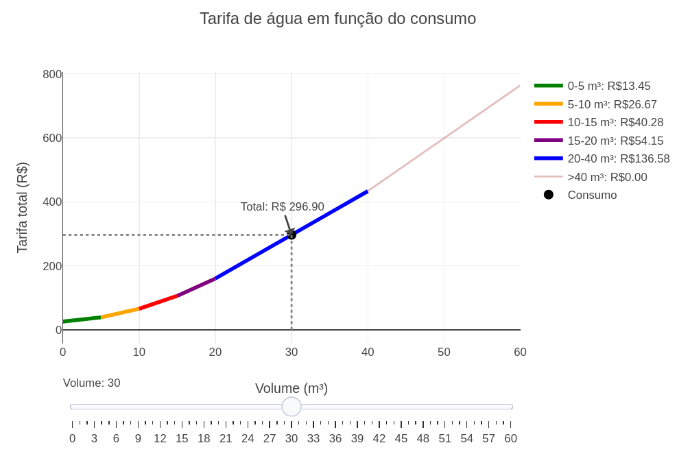

---
title: "Cálculo da Tarifa de Água por Blocos Crescentes"
---

::: {.callout-note}

O cálculo de tarifas de água não é linear em sua forma mais pura,
pois a taxa por m³ (1000 litros) de água cobrado pode variar conforme o consumo. Na prática, empresas de saneamento geralmente usam o modelo [Increasing Block Tariff (IBT)](https://hub.sivo.it.com/pricing-structure/what-is-increasing-block-rate-pricing/) (tarifa em blocos crescentes) para calcular a tarifa total. 

Neste modelo, o custo por $m^3$ é divido em faixas de consumo, onde cada faixa possui um preço correspondente. Quando um consumidor usa uma quantidade de água que ultrapassa uma faixa, o custo para o volume excedente é calculado usando a tarifa da próxima faixa.

## Equação: 
Como exemplo, considere a seguinte tabela de tarifas de água para a categoria residencial cobradas pela COPASA, conferida pela [Arsae-MG (2025)](https://amasbe.montesclaros.mg.gov.br/tabela-tarifaria), onde o custo por metro cúbico (1000 litros) varia conforme o volume consumido:

| Faixa        | Preço      | Unidade  |
|:-------------|:----------:|:--------:|
| Fixa         | $R\$ 25,77$   | $R\$/mês$   |
| $0 <= v <= 5$        | $R\$ 2,69$    | $R\$/m³$    |
| $5 < v <= 10$     | $R\$ 5,334$   | $R\$/m³$    |
| $10 < v <= 15$    | $R\$ 8,056$   | $R\$/m³$    |
| $15 < v <= 20$    | $R\$ 10,830$  | $R\$/m³$    |
| $20 < v <= 40$    | $R\$ 13,658$  | $R\$/m³$    |
| $v > 40$         | $R\$ 16,538$  | $R\$/m³$    |
: Tabela de Preços e Faixas {#tbl-precos}

Vamos supor que um consumidor tenha gastado 12 $m^3$ de água em um mês. O cálculo para a tarifa total segiria os seguintes passos:

- É cobrado o valor fixo de $R\$ 25,77$.
- Para os primeiros 5 $m^3$, o custo é: $5 \times R\$ 2,69 = R\$ 13,45$.
- Para os próximos 5 $m^3$ (de 5 a 10), o custo é: $5 \times R\$ 5,334 = R\$ 26,67$.
- Para os 2 $m^3$ restantes (de 10 a 12), o custo é: $2 \times R\$ 8,056 = R\$ 16,11$.

A tarifa total é a soma de todos esses valores:
$$\text{Tarifa Total} = R\$ 25,77 + R\$ 13,45 + R\$ 26,67 + R\$ 16,11 = R\$ 81,33$$

## Download e Uso:

{target="_blank"}

:::

::: {.callout-note}

## Como usar:

1. Clique na imagem para abrir o objeto interativo em uma nova aba.
2. Clique no botao "add" para carregar o gráfico.
3. Arraste o slider para definir o volume consumido.
4. Observe as faixas destacadas e os subtotais para cada faixa, bem como a tarifa total acumulada.
:::

::: {.callout-warning}

## Sugestao: 

1. Compare como o crescimento da tarifa muda ao ultrapassar cada faixa de consumo.
2. Identifique em quais intervalos o custo marginal aumenta mais rapidamente.
3. Analise a diferença entre crescimento linear por faixa e o comportamento acumulado total.

## Lógica de codigo

> 1. A função calcula a tarifa acumulando o custo em cada faixa.
> 2. O gráfico é construído por segmentos, cada um representando uma faixa.
> 3. As faixas ativas são identificadas e destacadas de acordo com o volume consumido.

:::

**Estudante:** Curso de Bacharelado em Ciência da Computação - Universidade Federal de Alfenas (UNIFAL-MG).

<!-- **Autor:** 

Thallysson Luis Teixeira Carvalho - Curso de Bacharelado em Ciência da Computação - Universidade Federal de Alfenas (UNIFAL-MG) -->

<!--- Código 
MAT-FUN-IN-01
--->
