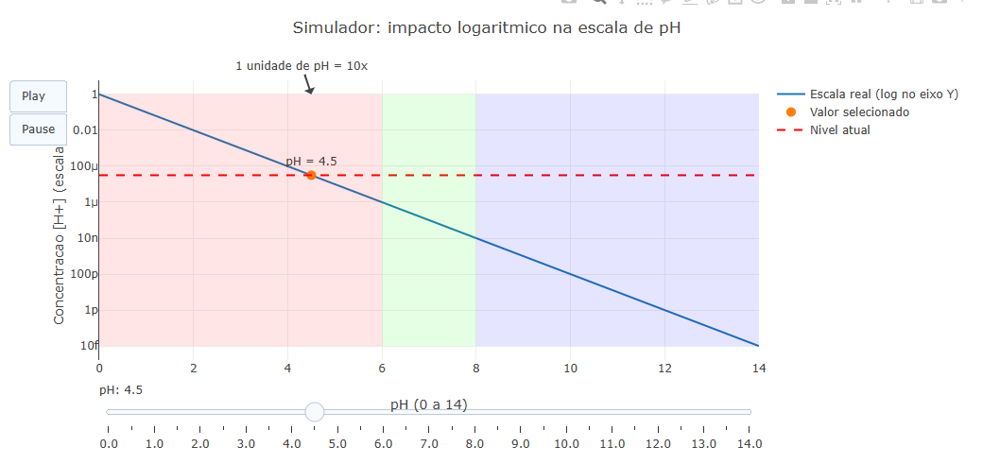

::: {.callout-note}

Quando a gente estuda pH, percebe que ele foi criado para facilitar a nossa vida. Em vez de lidar com valores enormes ou minúsculos da concentração de íons hidrogênio ([H+]), a escala de pH resume isso em números muito mais simples de interpretar. Assim, fica mais fácil entender se uma solução é ácida, neutra ou básica. O que muita gente não percebe de imediato é que uma mudança pequena no pH pode representar uma diferença muito grande na concentração real.

Neste objeto interativo, a proposta é justamente tornar isso mais fácil de enxergar. Ao mover o slider, o usuário consegue observar como o valor do pH interfere diretamente na concentração de H+, acompanhando essa mudança no gráfico em tempo real. Com isso, a relação entre pH e logaritmo fica mais visual, mais simples e muito mais intuitiva de compreender.

## Equação: 
$$
[H+]=10^−pH
$$

$$
pH=−log10([H+])
$$

Onde:

* $[H+]$ : significa a concentração de íons hidrogênio na solução
* $pH$ : significa potencial hidrogeniônico. Ele indica se uma solução é ácida, neutra ou básica.
:::

::: {.callout-tip}

## Download e Uso:

{target="_blank"}

::: {.text-center}
Visualizador da concentração de íons H⁺ em função do pH
:::
\

1. Clique no botão add para carregar o simulador no gráfico.
2. Utilize o slider de pH para variar os valores entre 0 e 14.
3. Observe o movimento do ponto no gráfico e como a concentração muda rapidamente.
4. Use os botões Play/Pause para visualizar a variação contínua do pH.
   
:::

::: {.callout-warning}

## Sugestão: 

1. Compare dois valores de pH (por exemplo, 3 e 4) e observe como a concentração muda por um fator de 10.
2. Explore as regiões coloridas para entender a diferença entre soluções ácidas, neutras e básicas.
3. Use a animação automática (Play) para perceber o comportamento global da curva.
4. Tente identificar em quais regiões a variação parece mais intensa ,visualmente.

## Lógica de código

O código calcula a relação entre pH e concentração por meio de uma função exponencial e a representa em um gráfico com escala logarítmica. Em seguida, utiliza frames e um slider para atualizar dinamicamente um ponto e uma linha, permitindo ao usuário explorar como variações no pH afetam a concentração em tempo real.
:::

<!-- **Autor:** 

Maria Eduarda Jerônimo Miranda - Curso de Bacharelado em Biomedicina - Universidade Federal de Alfenas (UNIFAL-MG) -->

<!--- Código 

MAT-FUN-LOG-01

--->