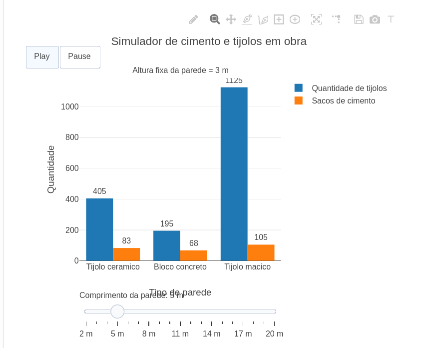

---
title: "Quantidade de cimento e tijolos para diferente tamanhos de paredes"
---

::: {.callout-tip}
O objeto interativo apresentado a seguir, tem como objetivo calcular a quantidade de sacos de cimento e tijolos para determinados tamanhos de paredes.Sendo importante em uma construção civíl que visa evitar desperdícios e tempo.
O controle deslizante permite variar o tamanho da parede,o botão play permite ver diferentes resultados em sequência de acordo com o tamanho da parede.O usuário obtém resultados em gráfico de acordo com o tipo de tijolo (tijolo cerâmico,bloco concreto,tijolo maciço).

## Equação: 

$$
Q_t = A \times T_m
$$

Onde:

Q_t = quantidade de tijolos necessários

A = areá da parede (m^2)

T_m = quantidade média de tijolos por metro quadrado

$$
Q_c = A \times C_m
$$

Onde:

Q_c = quantidade de cimento (sacos)

A = areá da parede (m^2)

C_m = consumo médio de cimento por metro quadrado

## Download e Uso:

{target="_blank"}
\
Como utilizar o objeto:

1.Aperte o botão play caso queira ver resultados para diferentes tamanhos de paredes em sequência.
2.Aperte em pause caso queira controlar o tamanho da parede manualmente através do slider.
3.Deslize o slider para diferentes tamanhos.
:::

::: {.callout-caution}
## Sugestão: 

1-Varie o tamanho da parede para ver como a quantidade de tijolos e cimentos aumentam proporcionalmente.
2-Compare os resultados entre os diferentes tipos de tijolos.

## Lógica de código

O codigo consiste em calcular a quantidade de tijolos e cimento necessários com base no tamanho da parede. O usuário pode variar o comprimento da parede por meio de um slider, enquanto a altura permanece fixa. O programa calcula a areá da parede e aplica equacões de proporcionalidade para estimar os materiais necessários. Em seguida, os resultados são exibidos em um gráfico de barras, permitindo comparar diferentes tipos de alvenaria. 

:::

<!-- **Autor:** {.unnumbered}
Guilherme Oliveira Araujo - Curso de Bacharelado em Ciência da Computação - Universidade Federal de Alfenas (UNIFAL-MG) -->

<!--- Código 
MAT-GEO-ESP-01
--->

