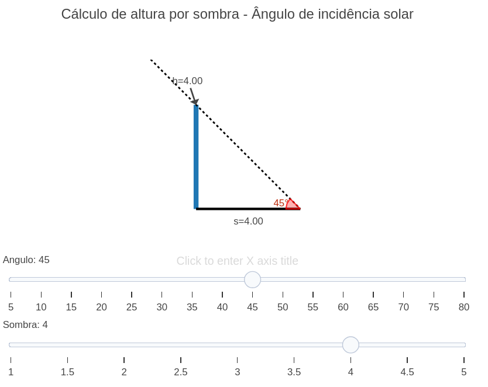

---
title: "Cálculo de altura de um objeto usando sombra e trigonometria"
---

::: {.callout-important}

Nem sempre é prático determinar a altura de um objeto usando apenas uma régua, especialmente quando ele é muito alto ou está em um local de difícil acesso. Em situações assim, métodos indiretos acabam sendo mais úteis e até mais seguros.

Neste material, será abordado um método indireto de medição que utiliza a altura solar (o ângulo de elevação do Sol acima do horizonte) e o comprimento da sombra de um objeto para determinar sua altura.

## Equação: 

A equacao utlizada para calcular a altura é:
$$
h = s \cdot \tan(\theta)
$$

Onde:

 - $\theta$: angulo da altura solar (angulo de incidencia da luz) 
 - $h$: altura calculada pelo metodo trigonometrico  
 - $s$: comprimento da sombra  

## Download e Uso:

{target="_blank"}

:::

::: {.callout-note}
## Como usar:

1. Clique na imagem para abrir uma aba do JSPlotly que contém o gráfico.
2. Clique no botao "add" para carregar o objeto.
3. Ajuste o ângulo e o tamanho da sombra e veja como a altura varia.

:::

::: {.callout-warning}
## Sugestão: 
 
1. Aumente a sombra e observe como a altura cresce no modelo.  
2. Diminua o ângulo e veja como a altura diminui.  

## Lógica de código
1. A altura é calculada usando a fórmula.
2. O código gera uma série de cenas (cada cena contendo objeto, sombra, raio de luz, entre outros) para diferentes combinações de ângulo e sombra, armazenando as anotações correspondentes a cada cena. 
3. As cenas são mostradas ou ocultadas com base nos sliders.

:::

**Estudante:** Curso de Bacharelado em Ciência da Computação - Universidade Federal de Alfenas (UNIFAL-MG).

<!-- **Autor:** 

Thallysson Luis Teixeira Carvalho - Curso de Bacharelado em Ciência da Computação - Universidade Federal de Minas Gerais (UNIFAL-MG) -->

<!--- Código 
MAT-GEO-PLAN-TRI-01
--->
