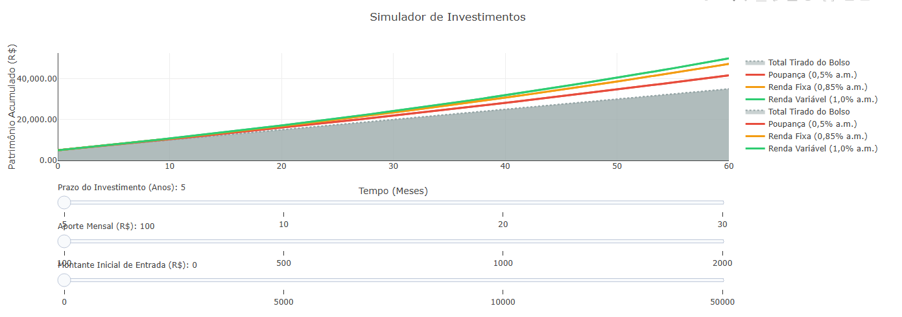

::: {.callout-important}

O objetivo desse código é criar uma ferramenta visual e interativa para comparar a evolução de patrimônio. Em vez de analisar planilhas complexas, o usuário tem um gráfico onde pode visualizar de forma clara o efeito dos juros compostos ao longo do tempo, comparando o valor "tirado do bolso" com diferentes perfis de rentabilidade.

## Equações: 

$$Total = P + (A \cdot n)$$

$$M = P(1+i)^n + A \left[ \frac{(1+i)^n - 1}{i} \right]$$

$P$: Montante inicial (Principal). O valor de entrada no investimento.
$A$: Aporte mensal. O valor adicionado periodicamente.
$i$: Taxa de juros mensal (rendimento constante do perfil escolhido).
$n$: Tempo em meses (prazo total do investimento).
$Total$: A variável dependente primária para controle. Representa o total bruto "tirado do bolso", sem a ação de juros.
$M$: A variável dependente secundária. O Montante final acumulado (Patrimônio total), calculado com base no prazo, aportes e taxas.

## Como utilizar:

{target="\_blank"}  

1. Clique no gráfico acima;
2. Clique em "add" e arraste as barras para diferentes combinações de prazo, aporte mensal e montante inicial;
3. Para achar outros resultados, altere os valores de: "const taxas" e os arrays dentro da chave "steps" nos slider.
:::

::: {.callout-tip}

## Sugestão: 
1: Introduzir variável de inflação (IPCA). É possível criar um parâmetro nas funções que desconte a inflação média mensal do montante, exibindo a curva de "ganho real" do poder de compra.
2: Inverter: Mude de "Quanto terei de patrimônio em X anos?" para "Quanto preciso aportar por mês para chegar a R$ 1 Milhão em X anos?".

## Lógica do código

1. Estabelecimento da "Verdade Absoluta", ou seja, valores inalteráveis. Neste caso, as estimativas das taxas mensais de rentabilidade de cada perfil de investimento.
2. Processamento: A lógica não guarda os dados de 10, 20 ou 30 anos estáticos na memória. Recebe os parâmetros definidos pelos sliders e gera uma lista baseada no eixo do tempo. Roda um laço de repetição que calcula e acumula o capital + rendimento mês a mês de acordo com as equações.
3. O Empacotamento Visual: O Plotly.js só entende coordenadas. A lógica neste passo é traduzir os cálculos para a linguagem do gráfico. O sistema cria quatro "pacotes" de dados usando linhas contínuas. Um pacote traça a área de base cinza. Os outros pacotes mapeiam a evolução da Poupança, Renda Fixa e Renda Variável no eixo Y, atrelando cores distintas a cada um.
4. Sliders: A interface não é estática; ela fica "escutando" o usuário em três frentes: Prazo, Aporte e Montante Inicial.
A Lógica de Gatilho: Quando o usuário move o controle de "Aporte Mensal", por exemplo, o slider dispara um comando interno de atualização. Esse comando orienta o gráfico: "Descarte as curvas atuais. Insira o novo valor de aporte no motor de cálculo, pegue as novas trajetórias de patrimônio e substitua imediatamente as linhas exibidas na tela".

:::

**Estudante:** Curso de Bacharelado em Ciência da Computação - Universidade Federal de Alfenas (UNIFAL-MG).

<!-- **Autor:**
Luiz Gabriel da Silva Cabrera, Ciência da Computação, Unifal-MG -->
<!-- 
#### Código {.unnumbered}
MAT-MOD-FIN-01 -->