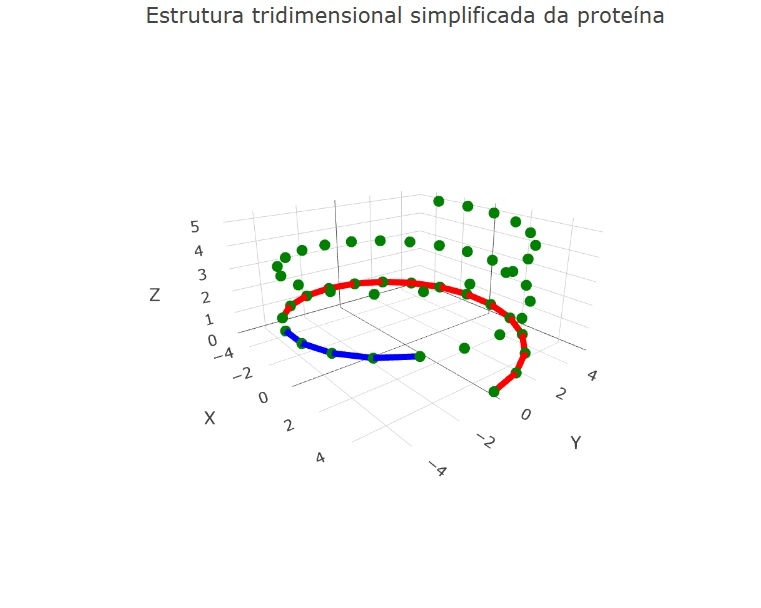

::: {.callout-tip}

As proteínas são macromoléculas formadas por cadeias de aminoácidos que desempenham funções fundamentais nos organismos vivos, como catálise de reações químicas, transporte de substâncias, defesa imunológica e suporte estrutural. A forma tridimensional de uma proteína está diretamente relacionada à sua função biológica, sendo influenciada pela sequência de aminoácidos e pela presença de estruturas secundárias, como α-hélices e folhas β.

Este objeto interativo permite ao usuário simular a montagem de uma proteína tridimensional simplificada. É possível modificar o número de aminoácidos, a quantidade de α-hélices, a quantidade de folhas β e o tipo de proteína (hidrofóbica, hidrofílica ou mista). O gráfico 3D é atualizado automaticamente, permitindo visualizar como essas características influenciam a organização espacial da molécula.

## Equação:

A construção da estrutura tridimensional utiliza funções trigonométricas para representar a disposição espacial dos aminoácidos.

$$
x = \cos(\theta)\cdot r
$$

$$
y = \sin(\theta)\cdot r
$$

$$
z = k \cdot i
$$

Onde:

- \(x\) = coordenada horizontal da estrutura.
- \(y\) = coordenada lateral da estrutura.
- \(z\) = coordenada vertical da estrutura.
- \(r\) = fator de compactação da proteína.
- \(\theta\) = posição angular do aminoácido na cadeia.
- \(i\) = posição do aminoácido na sequência.
- \(k\) = fator de alongamento da estrutura.

## Download e Uso:

{target="_blank"}
\

Obs: a imagem deve conter apenas a área gráfica do objeto.

1. Utilize o controle "Número de aminoácidos" para definir o tamanho da proteína.
2. Ajuste o número de α-hélices para aumentar regiões helicoidais da estrutura.
3. Ajuste o número de folhas β para aumentar regiões de folhas pregueadas.
4. Escolha o tipo de proteína (hidrofóbica, hidrofílica ou mista).
5. Clique em "Montar proteína".
6. Observe as alterações na estrutura tridimensional exibida no gráfico.
   
:::

::: {.callout-caution}

## Sugestão:

1. Compare proteínas com poucos e muitos aminoácidos para observar diferenças no tamanho da estrutura.
2. Aumente o número de α-hélices e observe o crescimento das regiões helicoidais em vermelho.
3. Aumente o número de folhas β e compare sua distribuição espacial com as α-hélices.
4. Compare os três tipos de proteína para verificar como a compactação da estrutura varia.

## Lógica de código

O código cria uma interface interativa utilizando controles deslizantes para definir características estruturais da proteína. Inicialmente, o usuário escolhe o número de aminoácidos, a quantidade de α-hélices, a quantidade de folhas β e o tipo de proteína.

Após o acionamento do botão de simulação, o algoritmo gera coordenadas tridimensionais para cada aminoácido. Dependendo do tipo selecionado, diferentes fatores de compactação e alongamento são aplicados à cadeia proteica. Proteínas hidrofóbicas tendem a apresentar estruturas mais compactas, proteínas hidrofílicas apresentam conformações mais abertas e proteínas mistas exibem comportamento intermediário.

As α-hélices são representadas por segmentos helicoidais construídos por funções trigonométricas, enquanto as folhas β são representadas por regiões mais lineares e organizadas. Os aminoácidos individuais são exibidos como marcadores verdes, as α-hélices como linhas vermelhas e as folhas β como linhas azuis.

Por fim, todas as coordenadas são enviadas ao Plotly, que gera um gráfico tridimensional interativo, permitindo a rotação e exploração visual da proteína construída pelo usuário.

:::

<!-- **Autor:** 

Maria Clara – Ciências Biológicas (UNIFAL-MG) -->

<!---
Código

QUI-BIO-PROT-01
--->