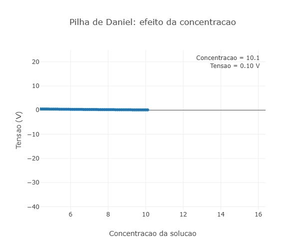

---
title: "Pilha de Daniell - potencial e íons"
---

 
::: {.callout-tip}
As pilhas, são objetos fundamentais para que podsamos ter a compreensão dos processos de conversão de energia quimica para uma energia elerica, e a pilha de Daniell é um dos exemplos mais ilustraivos desse processo. Esse sistema é composto por duas meias celulas onde ocorre a oxidação do zinco metálico no ânodo e a redução dos íons de cobre no cátodo, resultando na geração de uma corrente elétrica. E a ponte salina é essencial, ela permite o movimento de íons entre as soluções. Essa voltagem gerada pela pilha de Daniell é diretamente influenciada pela concentração dos íons presentes nas soluções.

No grafico de animação, é possivel obervar a relção entre a concentração dos íons e a tensão da pilha de Daniell, esse grafico começa com uma concentração muito baixa e uma tensão alta, conforme a concentração dos íons aumenta, a tensão da pilha cai, mostrando a relação inversa entre a concentração dos íons e a tensão da pilha, o que é explicado pela equação de Nernst, que relaciona a tensão da pilha com a concentração dos íons envolvidos na reação.

## Equação: 

## Equação simplificada para a tensão da pilha de Daniell:
$$
V = 1.1 \cdot \log_{10}\left(\frac{10}{c}\right) + 0.1
$$

-V: tensão da pilha (V).
-C: concentração da solução (mol/L).
-log10: logaritmo na base 10.
-10: valor de referência de concentração utilizado na simulação.
-1.1: fator que controla a sensibilidade da tensão à concentração.
-0.1: constante adicionada para ajustar o valor inicial da tensão.

## Equação de Nernst para a pilha de Daniell:
$$
E = E^\circ - \frac{0.0592}{2}
\log\left(
\frac{[Zn^{2+}]}
{[Cu^{2+}]}
\right)
$$

-E: potencial da pilha de Daniell (V).
-E∘: potencial padrão da pilha de Daniell (aproximadamente 1,10 V).
-0.0592: constante da Equação de Nernst para 25∘C.
-2: número de elétrons transferidos na reação global.
-[Zn2+]: concentração dos íons zinco na solução (mol/L).
-[Cu2+]: concentração dos íons cobre na solução (mol/L).
-log: logaritmo decimal.

## Download e Uso:

{target="_blank"}

1. Visualiza a animação: O grafico será desenhado automaticamete no seu navegador, exibindo o ponto de partida da simulaçõa com uma concentração baixa e uma tensão alta. Conforme a animação progride, a concentração dos íons aumenta e a tensão da pilha diminui, ilustrando a relação inversa entre esses dois parâmetros.
   
2. Interpreta os resultados: Observe como a tensão da pilha de Daniell varia em resposta às mudanças na concentração dos íons. A relação inversa é evidente, e isso pode ser explicado pela equação de Nernst, que relaciona a tensão da pilha com a concentração dos íons envolvidos na reação.
   
3. Explora diferentes cenários: Você pode modificar a equação ou os parâmetros para explorar como diferentes concentrações de íons afetam a tensão da pilha. Por exemplo, você pode ajustar o valor de referência de concentração ou o fator de sensibilidade para ver como isso influencia a curva da animação.
:::

::: {.callout-caution}

## Sugestão: 
 1. Controlar a concentração dos íons em uma pilha de Daniell, pode ser uma maneira eficaz de ajustar a tensão gerada pela pilha. Um exemplo, aumentando a concentração dos íons de cobre no cátodo ou diminuindo a concentração dos íons de zinco no ânodo, é possível aumentar a tensão da pilha. 
 
 2. Redefina a equação para incluir outros fatores como a temperatura ou a presença de outros íons na solução, isso pode fornecer uma compreensão mais completa do comportamento da pilha de Daniell.

## Lógica de código

1. definição das concentrações e tensões: O código começa definindo dois arrays, um para armazenar as concentrações dos íons e outro para armazenar as tensões correspondentes. Um loop é usado para calcular a tensão da pilha de Daniell para uma série de concentrações, usando a equação simplificada fornecida.
   
2. criação dos dados para a animação: Os dados iniciais para a animação são criados, começando com a primeira concentração e tensão calculada. A animação é configurada para mostrar tanto as linhas quanto os marcadores.

:::

<!-- **Autor:** 

Leonardo Nogueira Alves, Biotecnologia, Universidade Federal de Alfenas (UNIFAL-MG) -->

<!--- Código 
// Pilha de Daniel simplificada

const concentracao = [];
const tensao = [];

for (let i = 0; i <= 100; i++) {

  const c = 0.1 + i * 0.1;

  const V =
    1.1 * Math.log10(10 / c) + 0.1;

  concentracao.push(c);
  tensao.push(V);
}

const data = [
  {
    x: [concentracao[0]],
    y: [tensao[0]],
    mode: "lines+markers",
    name: "Tensao da pilha"
  }
];

const frames = [];

for (let i = 1; i < concentracao.length; i++) {

  frames.push({
    name: "f" + i,
    data: [
      {
        x: concentracao.slice(0, i + 1),
        y: tensao.slice(0, i + 1)
      }
    ],
    layout: {
      annotations: [
        {
          x: 0.98,
          y: 0.98,
          xref: "paper",
          yref: "paper",
          showarrow: false,
          align: "right",
          text:
            "Concentracao = " +
            concentracao[i].toFixed(1) +
            " Tensao = " +
            tensao[i].toFixed(2) +
            " V"
        }
      ]
    }
  });
}

const layout = {
  title: "Pilha de Daniel: efeito da concentracao",
  xaxis: {
    title: "Concentracao da solucao"
  },
  yaxis: {
    title: "Tensao (V)",
    range: [0, 2]
  }
};

return { data, layout, frames };

--->
