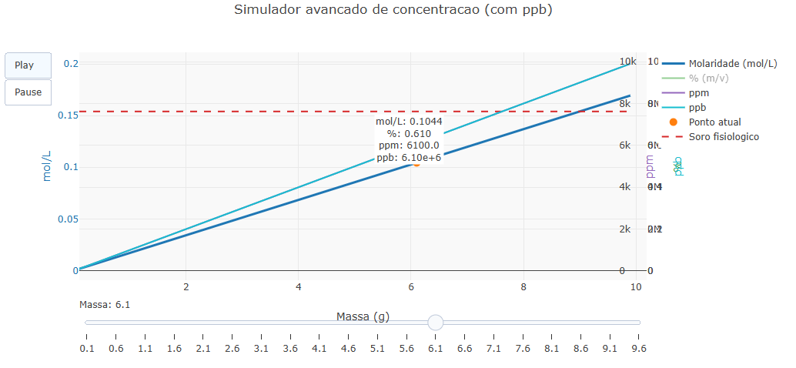

::: {.callout-tip}

A concentração é uma ideia central na química porque nos ajuda a entender “quanto” de uma substância existe dentro de uma certa quantidade de solução. No cotidiano e também na ciência, esse valor pode aparecer de várias formas — como molaridade, porcentagem, ppm ou ppb — e cada uma delas faz mais sentido dependendo da escala do problema que estamos analisando.

Pensando nisso, este objeto interativo foi criado para tornar essa relação mais visual e fácil de compreender. Ao mudar a massa do soluto, é possível ver, em tempo real, como a concentração se comporta em diferentes unidades ao mesmo tempo, o que ajuda a comparar essas escalas e a interpretar melhor situações que aparecem tanto em contextos acadêmicos quanto na vida real.

## Equação: 
$$
M = \frac{m}{MM \cdot V}
$$

$$
\% (m/v) = \frac{m}{V \cdot 1000} \times 100
$$

Onde:

* $M$ : Quantidade de matéria (mol) por litro de solução
* $m$ : Quantidade da substância em gramas (g)
* $MM$ : Massa de 1 mol da substância (g/mol)
* $V$ : Quantidade de solução em litros (L)
* $\% (m/v)$ : Gramas de soluto em 100 mL de solução

## Download e Uso:

{target="_blank"}

::: {.text-center}
Variação da concentração com a massa em diferentes unidades
:::
\
\
1- Utilize o slider na parte inferior do gráfico para variar a massa do soluto adicionada a solução. Observe como todas as unidades de concentração se alteram simultaneamente.

2- Compare as curvas apresentadas (mol/L, %, ppm e ppb) para entender como a mesma solução pode ser descrita em diferentes escalas.

3- Observe o ponto destacado no gráfico, que indica o valor atual selecionado, junto com a anotação que mostra os valores numéricos correspondentes.

4- Analise as linhas de referencia para relacionar os valores obtidos com situações reais, como limites ambientais ou soluções biológicas.
:::

::: {.callout-warning}

## Sugestão: 

1. Aumente gradualmente a massa do soluto e observe qual unidade cresce mais rapidamente, comparando principalmente ppm e ppb.
2. Escolha um valor de massa e analise como a mesma solução pode parecer “concentrada” ou “diluída”, dependendo da unidade utilizada.
3. Compare os valores obtidos com as linhas de referência do gráfico para identificar se a concentração está dentro de limites reais (ambientais ou biológicos).
4. Observe em quais faixas de massa a diferença entre as unidades se torna mais evidente, especialmente entre mol/L e ppm. 

## Lógica de código

O código gera uma faixa de valores de massa e, para cada um, calcula a concentração da solução em diferentes unidades (mol/L, %, ppm e ppb) com base nas relações entre massa, volume e massa molar, organizando esses resultados em curvas para visualização simultânea; em seguida, utiliza frames e um slider para atualizar dinamicamente um ponto no gráfico, permitindo ao usuário observar, de forma interativa, como a concentração varia em múltiplas escalas conforme a massa do soluto é modificada.
:::

**Estudante:** Curso de Bacharelado em Biomedicina - Universidade Federal de Alfenas (UNIFAL-MG).
<!-- **Autor:** 

Maria Eduarda Jerônimo Miranda - Curso de Bacharelado em Biomedicina - Universidade Federal de Alfenas (UNIFAL-MG)
 -->

<!--- Código 

QUI-FISQ-SOL-02

--->