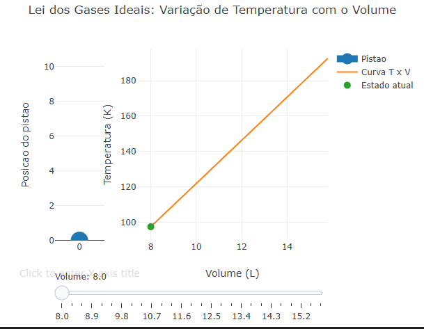

---
title: "Lei dos Gases Ideais: Variação de Temperatura com o Volume"
---

::: {.callout-tip}

  A Lei dos Gases Ideias, mostra o comportamento dos gases a partir de uma relação entre pressão, volume e temperatura, fazendo assim a equação PV=nRT. Nessa equação o P representa a pressão exercida por um gás, V é o volume ocupado, n é a quantidade de matéria, R é uma constante dos gases e o T é a temperatura absoluta dentro de um sistema. A equação mostra que as variáveis estão interligadas, de modo que, se houver alteração em uma delas, isso provoca mudança nas demais. Ao se analisar a variação da temperatura em função de temperatura por volume, num sistema em que há um aumento de energia, se observa que a temperatura tende a crescer à medida que o volume aumenta. Isso ocorre porque o aquecimento do gás eleva a energia cinética das moléculas, fazendo com que elas se movam a uma velocidade maior. Como consequência, há um número maior de colisões entre elas, gerando uma expansão no gás quanto ao aumento da pressão.  
	Em um gráfico que representa esse fenômeno, com o volume no eixo horizontal e a temperatura no eixo vertical, é possível visualizar uma curva ou reta crescente, indicando essa relação direta. Quando a pressão também aumenta gradativamente, o crescimento da temperatura se torna ainda mais acentuado, evidenciando o aumento da energia interna de um sistema, fazendo assim o pistão subir gradativamente. À medida que a temperatura e a pressão aumentam, o gás exerce uma força maior sobre o pistão, fazendo com que ele se desloque. Esse movimento ilustra de forma clara como as variáveis estão conectadas, como o aumento da temperatura intensifica o movimento das partículas, elevando a pressão e promovendo a variação do volume. Dessa forma, o conjunto gráfico e pistão facilita a compreensão do comportamento dos gases ideais, tornando mais intuitiva a visualização das transformações termodinâmicas envolvidas.

## Equação: 
1. Lei dos Gases Ideais
  $$
  PV = nRT
  $$

1. Temperatura isolada (para o gráfico)
  $$
  T = \frac{PV}{nR}
  $$
  
  P = pressão 
  V = volume 
  T = temperatura 
  n = quantidade de gás
  R = constante

## Download e Uso:

No gafico abaixo, mostra a expansão ou compressão de um gás em relção a temperatura com o volume, no eixo x está o volume e no eixo y a temperatura. Na esquerda está o pistão, como um exemplo prático desse fenômeno.
{target="QUI-FISQ-TERM-01-js.html" download="QUI-FISQ-TERM-01-js.html"}
\

1. Use o grafico para variar o volume do gas.

2. Observe que o pistao (lado esquerdo) sobe conforme o volume aumenta.
   
3. Ao mesmo tempo, veja o ponto na curva temperatura x Volume (lado direito) se mover.
   
4. A curva mostra todos os estados possiveis, enquanto o ponto mostra o estado atual.
   
5. Leia o valor no titulo do grafico para acompanhar:
volume atual (L)
temperatura correspondente (K)

1. Experimente mover o slider lentamente para entender a relacao linear entre T e V.
   
2. Compare visualmente:
aumento de volume → aumento de temperatura (processo isobarico)

::: {.callout-caution}

## Sugestão: 
1. Para simular no gráfico
2. Explicar logica do que foi obsevado no gráfico, relacionando com a teoria da lei dos gases ideais.
3. Explicar o que acontece com o pistão e a curva, relacionando com a teoria da lei dos gases ideais.
4. Relacionar os resultados observados com a equação dos gases ideais.
   
## Lógica de código

1. Definição das constantes físicas
O código começa definindo os valores fixos:
n (quantidade de gás)
R (constante dos gases)
P (pressão constante)

2. Criação dos valores de volume
É criado um conjunto de volumes (de 8 a 16 L).
Esses valores simulam o movimento do pistão (subindo e descendo).
Cálculo da temperatura
Para cada valor de volume, o código calcula a temperatura usando:

T = (P * V) / (n * R)

3. Escala visual do pistão
O volume real é convertido para uma escala menor (0 a 10).
Isso é feito apenas para melhorar a visualização do movimento do pistão no gráfico.

4. Um controle deslizante (slider) permite ao usuário escolher o volume.
Quando o slider muda:
o pistão sobe ou desce
o ponto se move no gráfico
o título atualiza com os valores
:::

### Autor: {.unnumbered}

leonardo Nogueira Alves, Biotecnologia/UNIFAL-MG.

:::

<!--- Código 
// parametros
const n = 1.0;
const R = 0.082;
const P = 1.0;

// volumes reais
const volumes = [];
for (let v = 8; v <= 16; v += 0.3) {
  volumes.push(v);
}

// escala visual do pistao
function escalaPistao(V) {
  return (V - 8) / (16 - 8) * 10;
}

// temperatura
function temperatura(V) {
  return (P * V) / (n * R);
}

// curva
const curva_TV = {
  x: volumes,
  y: volumes.map(v => temperatura(v)),
  mode: "lines",
  name: "Curva T x V",
  xaxis: "x2",
  yaxis: "y2"
};

// ponto
const ponto = {
  x: [volumes[0]],
  y: [temperatura(volumes[0])],
  mode: "markers",
  marker: { size: 10 },
  name: "Estado atual",
  xaxis: "x2",
  yaxis: "y2"
};

// pistao
const pistao = {
  x: [0],
  y: [escalaPistao(volumes[0])],
  mode: "markers+lines",
  marker: { size: 25 },
  line: { width: 12 },
  name: "Pistao"
};

const data = [pistao, curva_TV, ponto];

// slider
const steps = volumes.map(function(V) {
  return {
    label: V.toFixed(1),
    method: "update",
    args: [
      {
        y: [
          [escalaPistao(V)],
          volumes.map(v => temperatura(v)),
          [temperatura(V)]
        ],
        x: [
          [0],
          volumes,
          [V]
        ]
      },
      {
        title: "Volume = " + V.toFixed(1) + " L | Temperatura = " + temperatura(V).toFixed(1) + " K"
      }
    ]
  };
});

// layout
const layout = {
  title: "Simulacao de Pistao: Temperatura vs Volume",

  // eixo x do pistao FIXO em 0
  xaxis: { 
    domain: [0, 0.18],
    range: [-0.5, 0.5],
    tickvals: [0],
    ticktext: ["0"],
    showgrid: false,
    zeroline: false
  },

  yaxis: { 
    title: "Posicao do pistao",
    range: [0, 10]
  },

  xaxis2: { domain: [0.30, 1], title: "Volume (L)" },
  yaxis2: { title: "Temperatura (K)", anchor: "x2" },

  sliders: [{
    pad: { t: 40 },
    currentvalue: {
      prefix: "Volume: "
    },
    steps: steps
  }]
};

return { data, layout };

--->

