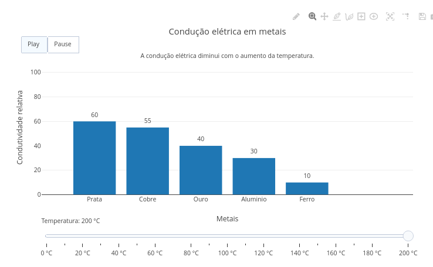

::: {.callout-tip}

A condução elétrica em metais ocorre devido à movimentação de elétrons livres presentes na estrutura metálica. Diferentes metais apresentam capacidades distintas de condução elétrica, influenciadas pelas propriedades físicas do material e pela temperatura do sistema. O aumento da temperatura intensifica a vibração dos átomos da rede cristalina, dificultando o deslocamento eletrônico e reduzindo a eficiência da condução elétrica.

Este objeto interativo simula a variação da condução elétrica em diferentes metais sob alterações de temperatura. O usuário pode selecionar materiais metálicos distintos e modificar a temperatura do sistema utilizando controles interativos. O gráfico principal apresenta a relação entre temperatura e condutividade relativa do metal escolhido.

## Equação:

$$
C = C_0 - (k \cdot T)
$$

Onde:

C = condutividade relativa

C₀ = condutividade inicial do metal

k = taxa de redução da condução elétrica

T = temperatura do sistema

## Download e Uso:

{target="_blank"}
\

Obs: a imagem deve conter apenas a área gráfica do objeto no JSPlotly.

1. Clique em “add” para carregar o objeto interativo.
2. Selecione um metal na lista disponível.
3. Ajuste a temperatura utilizando o controle deslizante.
4. Clique em “Simular” para atualizar o gráfico principal.
5. Observe a variação da condutividade relativa conforme o metal e a temperatura selecionados.

:::

::: {.callout-caution}

## Sugestão:

1. Compare a condução elétrica entre cobre, prata e ferro.
2. Observe como o aumento da temperatura reduz a condução elétrica.
3. Analise quais metais mantêm maior condução em temperaturas elevadas.
4. Compare o comportamento do mesmo metal em temperaturas baixas e altas.

## Lógica de código

O código cria uma interface interativa composta por um seletor de metais, um slider de temperatura e um gráfico dinâmico produzido com a biblioteca Plotly. Cada metal possui um valor-base de condutividade relativa utilizado nos cálculos da simulação.

Ao modificar a temperatura, o sistema recalcula automaticamente a condução elétrica utilizando uma relação linear simplificada entre temperatura e condutividade. O aumento da temperatura reduz progressivamente o valor de condução elétrica do material selecionado.

Após os cálculos, o código atualiza o gráfico principal exibindo a posição correspondente ao metal e à temperatura escolhidos. O sistema também apresenta o valor numérico da condutividade relativa calculada para o cenário selecionado.

:::

<!-- **Autor:** {.unnumbered}

Maria Clara — Ciências Biológicas (UNIFAL-MG) -->

<!---
QUI-LIG-MET-01
--->