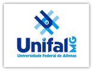

<!-- Google tag (gtag.js)--> 

  Página elaborada no intuito de contribuir para o ensino-aprendizagem de conteúdos de Bioquímica e áreas correlatas, e esboçada para um **Ensino Reproduzível (ER)**. O *material autoinstrucional* permite o estudo dos temas juntamente à execução de códigos de programas de livre distribuição para gráficos, análises e tabelas, simulações e animações ([R](https://cran.r-project.org/) & [RStudio](https://www.rstudio.com/), como para o estudo e visualização tridimensional de biomoléculas ([Jmol](http://jmol.sourceforge.net/)), e para a observação dinâmica de reações e redes metabólicas ([Sisma](https://bioquanti.netlify.app/uploads/sismabook), desenvolvido na UNIFAL-MG).
  
  <!---  --->
  
  A seleção dos programas baseia-se em suas características tangentes a um Ensino Reproduzível galgado na flexibilidade, expansibilidade,  rápida curva de aprendizado, boa useabilidade, interatividade, fácil instalação ou uso por navegadores de internete, e larga aplicabilidade, tanto para ensino (presencial, remoto, híbrido, ou EaD), como para pesquisa.
  
  Alternativamente, pode-se acessar um conteúdo sobre temas em *Bioquímica* extraído do livro [**Bioquímica básica, de gente, de bicho, e de planta**](https://bioquanti.netlify.app/uploads/textbook/index.html) (ISBN 978-65-00-90366-9), sobre diversos temas em *Bioquímica*.
  
  _____________________________________________________________________
  _____________________________________________________________________
  
  
  Atualmente, encontra-se desenvolvimento um [material](https://bioquanti.netlify.app/uploads/ERbook/index.html) para orientação à produção de textos e objetos didáticos, visando tangenciar um **Ensino Reproduzível (ER)** com auxílio do *R & RStudio*. Esta proposta baseia-se na elaboração de  **documentos dinâmicos** , criados a partir do conceito de [programação letrada](https://academic.oup.com/comjnl/article/27/2/97/343244?login=true). 
  